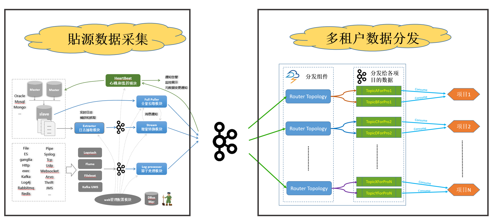
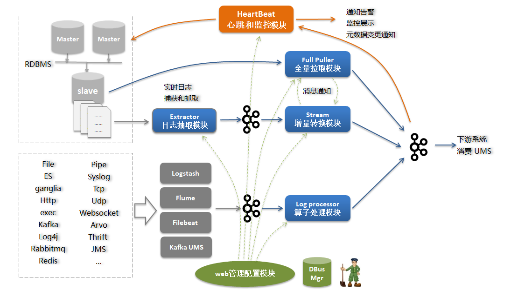
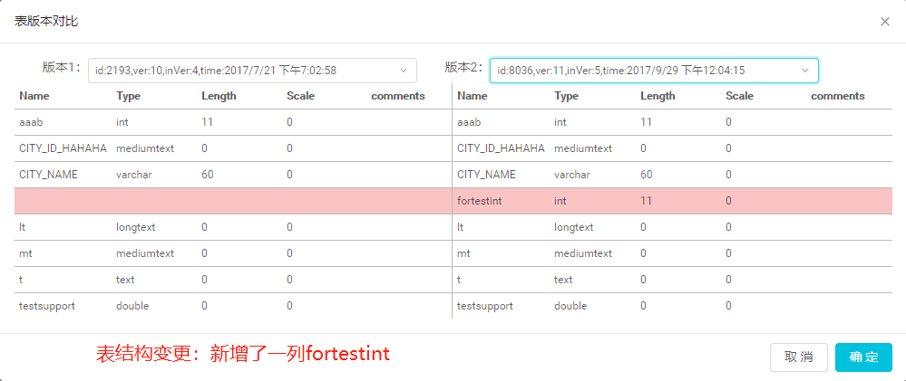
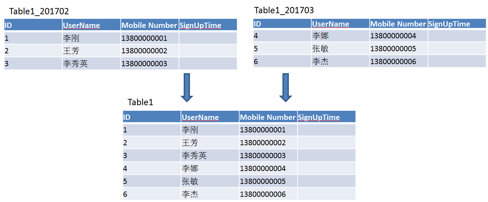

### 背景

企业中大量业务数据保存在各个业务系统数据库中，过去通常的同步数据的方法有很多种，比如：

- 各个数据使用方在业务低峰期各种抽取所需数据（缺点是存在重复抽取而且数据不一致）
- 由统一的数仓平台通过sqoop到各个系统中抽取数据（缺点是sqoop抽取方法时效性差，一般都是T+1的时效性）
- 基于trigger或时间戳的方式获得增量的变更（缺点是对业务方侵入性大，带来性能损失等）

这些方案都不能算完美，我们在了解和考虑了不同实现方式后，认为要想同时解决数据一致性和实时性，比较合理的方法应该是基于日志的解决方案，同时能够提供消息订阅的方式给下游系统使用。

DBus（数据总线）项目就是应这个需求而生的， DBus专注于数据的收集及实时数据流计算，通过简单灵活的配置，无侵入的方式对源端数据进行采集，采用高可用的流式计算框架，对公司各个IT系统在业务流程中产生的数据进行汇聚，经过处理后转换成统一JSON的数据格式UMS，提供给不同下游客户订阅和消费，充当报表数据源、大数据分析数据源等。 目前DBus在公司内部广泛使用，支持oracle，mysql，log, RocketMQ等数据源，这次开源版本支持mysql数据源。

DBus的主要潜在客户包括：

- 数仓平台和数据分析平台
- 实时营销决策
- 实时报表展示
- 异构数据实时同步
- 其他实时性要求高的系统

### 项目介绍

- 项目名称：DBus 数据总线
- 语言：java/js

专注于数据的收集及实时数据流计算，通过简单灵活的配置，以无侵入的方式对源端数据进行采集，采用高可用的流式计算框架，对公司各个IT系统在业务流程中产生的数据进行汇聚，经过转换处理后成为统一JSON的数据格式（UMS），提供给不同数据使用方订阅和消费，充当数仓平台、大数据分析平台、实时报表和实时营销等业务的数据源。

### 相关文档

详细介绍 DBus请参考 [wiki](https://bridata.github.io/DBus/index.html)

常见问题可参考 [FAQ](https://bridata.github.io/DBus/more-faq.html)

系统介绍参考 [system architecture](https://bridata.github.io/DBus/more-system-architecture.html)

### 系统架构和工作原理

DBUS主要分为两个部分：貼源数据采集和多租户数据分发。两个部分之间以Kafka为媒介进行衔接。无多租户资源、数据隔离需求的用户，可以直接消费源端数据采集这一级输出到kafka的数据，无需再配置多租户数据分发。

### **1 DBUS源端数据采集**

DBUS源端数据采集大体来说分为2部分：

- 读取RDBMS增量日志的方式来 实时获取增量数据日志，并支持全量拉取；
- 基于logtash，flume，filebeat等抓取工具来实时获得数据，以可视化的方式对数据进行结构化输出；

以下为具体实现原理 

主要模块如下：

- 日志抓取模块：从RDBMS的备库中读取增量日志，并实时同步到kafka中；
- 增量转换模块：将增量数据实时转换为UMS数据，处理schema变更，脱敏等；
- 全量抽取程序：将全量数据从RDBMS备库拉取并转换为UMS数据；
- 日志算子处理模块：将来自不同抓取端的日志数据按照算子规则进行结构化处理；
- 心跳监控模块：对于RDMS类源，定时向源端发送心跳数据，并在末端进行监控，发送预警通知；对于日志类，直接在末端监控预警。
- web管理模块：管理所有相关模块。

### **2 多租户数据分发**

对于不同租户对不同源端数据有不同访问权限、脱敏需求的情形，需要引入Router分发模块，将源端貼源数据，根据配置好的权限、用户有权获取的源端表、不同脱敏规则等，分发到分配给租户的Topic。这一级的引入，在DBUS管理系统中，涉及到用户管理、Sink管理、资源分配、脱敏配置等。不同项目消费分配给他的topic。

### 主要功能：

- **无侵入方式接入多种数据源**： 业务系统无需任何修改，以无侵入性读取数据库系统的日志获得增量数据实时变化。目前RDBMS支持mysql，oracle数据源（Oracle数据源请参考Oracle相关协议）， 日志方面支持基于logstash，flume和filebeat的多种数据日志抽取方案。
- **海量数据实时传输**： 使用基于Storm的流式计算框架，秒级延时，整体无单点保证高可用性。
- **多租户支持：** 提供用户管理、资源分配、Topology管理、租户表管理等丰富的功能，可根据需求，为不同租户分配不同的源端表数据访问权限，应用不同的脱敏规则，从而实现多租户资源隔离、差异化数据安全。

- **感知源端schema变更**： 当源端发生schema变更时，能自动感知schema变化，调整UMS版本号，并通过Kafka消息和邮件通知下游

- **数据实时脱敏**： 可根据需求对指定列数据进行实时脱敏。脱敏策略包括：直接替换、MD5、murmur等脱敏算法，脱敏加盐，正则表达式替换等。支持用户开发jar包实现DBUS未覆盖的个性化脱敏策略。 

- **初始化加载**： 支持高效的初始化加载和重新加载，支持任意指定输出topic，灵活应对客户需求。 

- **统一标准化消息传输协议**： 使用统一的UMS(JSON格式)消息schema格式输出便于消费，提供数据线级ums_id保证数据顺序性,输出insert,Update(before/after),Delete event数据。 

- **可靠多路消息订阅分发**： 使用Kafka存储和传递消息保证可靠性和便捷的多用户订阅

- **支持分区表/系列表数据汇集**： 支持分区表的数据汇集到一个“逻辑表” 。也可将用户自定义的系列表数据汇集到一个“逻辑表“。例：

   

- **实时监控&预警**： 可视化监控系统能随时查看各数据线实时流量和延时状况；当数据线发生异常时，根据配置策略自动发邮件或短信通知相关负责人 

  

# 其他

##### 编译打包代码

关于编译代码，参考 [compile](https://bridata.github.io/DBus/more-compile-code.html)

##### 版本相关:

建议版本：0.6.x

下载发布包：请参考：[downloads](https://github.com/BriData/DBus/releases)

##### 版权声明

DBus 自身使用 Apache v2.0 协议

关于DBus 自身协议，修改第三方包代码，以及三方包协议参考： [License](https://bridata.github.io/DBus/more-license.html)

##### 其他相关资料:

与开源项目 [Wormhole](https://github.com/edp963/wormhole) 项目搭配使用将是最佳选择。 

参考：[如何基于日志，同步实现数据的一致性和实时抽取?](http://dbaplus.cn/news-21-872-1.html)

参考： [基于可视化配置的日志结构化转换实现](http://dbaplus.cn/news-134-1860-1.html)

参考：[实时敏捷大数据在宜信的实践](http://server.51cto.com/News-576556.htm) 

##### 交流和问题反馈:

邮件交流： 

提交issue ： [issue](https://github.com/BriData/DBus/issues)

## Get Help

The fastest way to get response from our developers is to send email to our mail list [edp_support@groups.163.com](mailto:edp_support@groups.163.com) or [bridata@126.com](mailto:bridata@126.com)

and welcome to join our WeChat group for online discussion.

