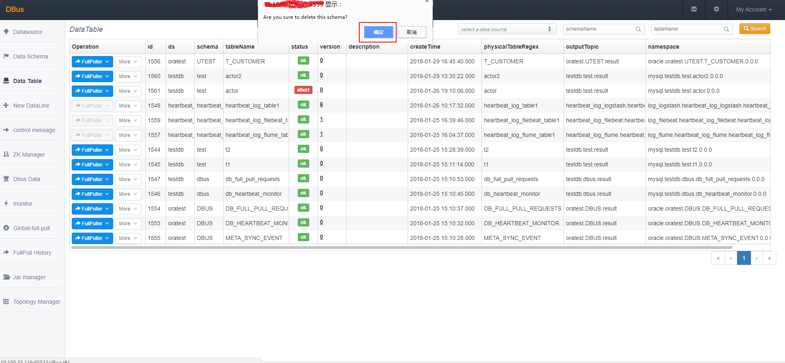

* This will become a table of contents (this text will be scraped).
 {:toc}
​	Data Schema管理界面主要展示schema有关的一些基本信息。在此界面可以进行schema基本信息的修改、schema删除及添加table等操作。

## 1  Data Schema管理页面入口

​	登录Dbus Web管理系统，Data Schema管理页面入口如下图所示：

### 1.1 Schema基本信息修改

​	点击目标Schema对应的more/modify按钮，如下图所示：

​	打开Schema基本信息修改页面，如下图所示，仅允许修改description和Status信息，其他关键信息不允许修改，以免造成抽取中的数据混乱。

​	输入相关信息，保存即可。

### 1.2 删除Schema

​	点击目标Schema对应的more/delete按钮，如下图所示：

​	在弹出的提示框里点击“确定”按钮，即可。如下图所示：

### 1.3  添加表

​		参考：[添加Schema和表](config-add-schema-and-table.html)
