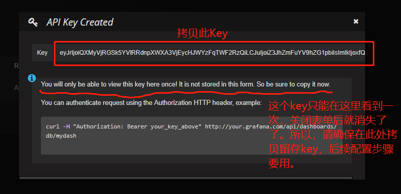
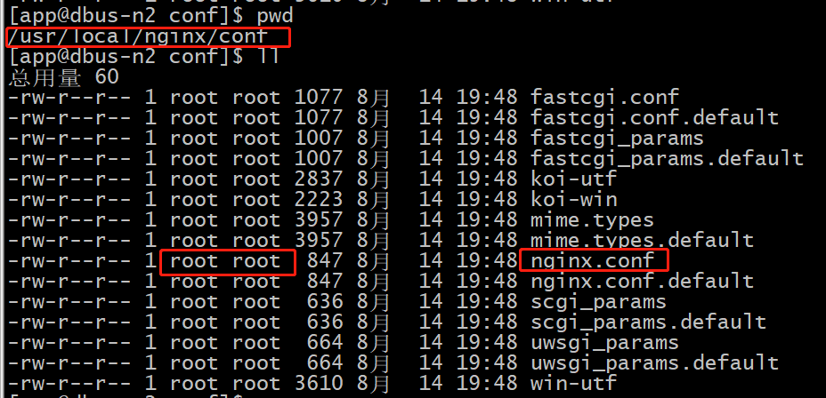
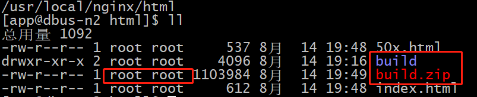
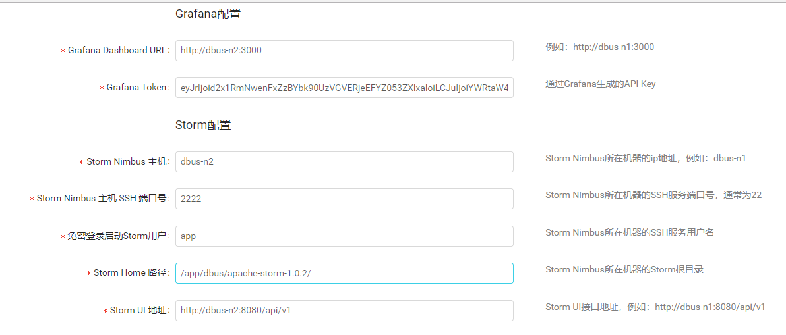
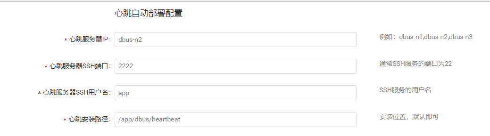
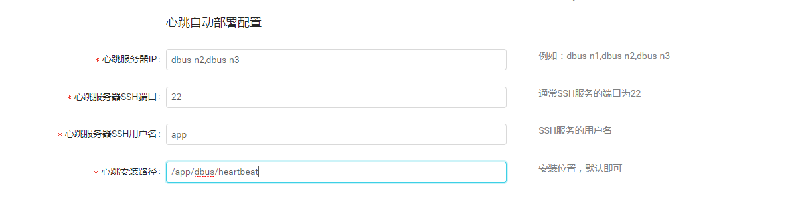

* This will become a table of contents (this text will be scraped).
{:toc}

# 1 安装部署说明

安装部署分为以下两种方式（注意：两种方式不可以混用）：

- **All In One体验版**
  - 该版本安装在单机上，自动部署安装dbus所依赖的相关组件，**仅用于体验dbus基本功能**，不可以用于生产。
  - 该版本支持mysql数据源接入体验。
- **集群部署**
  - 用于生产环境或测试环境部署。
  - 可部署在单机上或集群上。
  - 该版本包含对Oracle、mysql，logstash、filebeat、flume等数据源的支持。

# 2 快速体验 - All In One包部署

请参考[All In One包快速安装](quick-start.html)。


# 3 集群部署

## 3.1 环境准备

### 3.1.1 硬件基础

Dbus集群环境最少需要三台Linux服务器，以下以三台服务器为例进行说明：

| No   | IP          | 域名      | 运行环境   |
| ---- | ----------- | ------- | ------ |
| 1    | 192.168.0.1 | dbus-n1 | JDK1.8 |
| 2    | 192.168.0.2 | dbus-n2 | JDK1.8 |
| 3    | 192.168.0.3 | dbus-n3 | JDK1.8 |

****

**HOST配置**：修改所有服务器/etc/hosts文件设置相应的域名信息如下：

```
192.168.0.1 dbus-n1
192.168.0.2 dbus-n2
192.168.0.3 dbus-n3
```

**SSH免密登录配置**：配通dbus-n3到dbus-n1、dbus-n2、dbus-n3之间的SSH免密登录。

### 3.1.2 软件依赖

| 名称            | 版本号      | 说明                                       |
| ------------- | -------- | ---------------------------------------- |
| Canal         | v1.0.22  | DBus用于实时抽取binlog日志。DBus修改一个文件, 具体配置可参考canal相关支持说明，支持mysql5.6，5.7 |
| Zookeeper     | v3.4.6+  | 用于构建整个系统和提供配置通知等。推荐版本：v3.4.8             |
| Kafka         | v0.10    | 用于存储相关数据和消息，提供订阅和发布的能力                   |
| Storm         | v1.0.2   | 用于提供DBus流式计算                             |
| Influxdb      | v1.1.0   | 用于记录实时监控数据。**创建好账号。后续配置需提供。**            |
| Grafana       | v4.2.0   | 用于展示监控信息。                                |
| MySql         | v5.6.x   | 创建数据库dbusmgr。**创建好账号。后续配置需提供。**          |
| Nginx         | v1.9.3   | 用于存放静态html、js文件及反向代理。                    |
| kafka-manager | v1.3.3.4 | **选装**。用于便捷地查看、管理Kafka集群。建议安装。           |

### 3.1.3 推荐部署说明

```
zookeeper：     推荐部署dbus-n1、dbus-n2、dbus-n3。
Storm：         推荐部署dbus-n1、dbus-n2、dbus-n3。
Storm Nimbus：  推荐部署dbus-n1。
Storm UI：      推荐部署dbus-n1。
Kafka：         推荐部署dbus-n1、dbus-n2、dbus-n3。
DBUS Keeper：   推荐部署dbus-n3（若部署集群，可部署到dbus-n2、dbus-n3）。
DBUS HeartBeat：推荐部署dbus-n2、dbus-n3。
```

有关上述基础组件的配置，可参考：[基础组件安装配置](install-base-components.html)

### 3.1.4 前期准备 

#### 3.1.4.1 生成GrafanaToken

 Dbus使用Grafana展示数据线监控信息。需要提供Grafana Token进行监控模板的初始化。

**1** 点击打开API Keys管理页面。  


**2** 添加Key。


**3** 在跳出来的页面拷贝Key，并保存好。



## 3.2 Dbus安装配置

### 3.2.1 下载Dbus-Keeper

访问[Release Downloads](https://github.com/BriData/DBus/releases)，到该Release页面提供的云盘地址下载 dbuskeeper_web.zip 压缩包，上传到你指定的服务器，解压 unzip dbuskeeper_web.zip。

### 3.2.2  Nginx配置

复制dbuskeeper_web下的nginx.conf到nginx安装目录的conf下替换默认配置文件。



复制dbuskeeper_web下的build.zip到nginx安装目录的html下解压(unzip build.zip)，启动nginx。




### 3.2.3 修改Dbus-Keeper启动配置

修改解压后根目录config.properties，提供dbus-keeper初始化启动参数

```
# register端口，可以不改
register.server.port=9090
# gateway端口，可以不改
gateway.server.port=5090
# mgr端口，可以不改
mgr.server.port=8901
# service端口，可以不改
service.server.port=10001
# ssh公钥路径
pubKeyPath=~/.ssh/id_rsa
# eureka地址：可以不改。如果用dbus自带的，不用改。否则，改成您自己的eurecka地址。
# 注意：端口号需和上面的register一致。
eureka.client.serviceUrl.defaultZone=http://localhost:9090/eureka/
# eureka预警邮箱
eureka.instance.metadataMap.alarmEmail=example@example.com
# ZK地址
zk.str=zk_server_ip1:2181,zk_server_ip2:2181,zk_server_ip3:2181
# mysql管理库相关配置，其中mysql驱动可以不改
spring.datasource.driver-class-name=com.mysql.jdbc.Driver
spring.datasource.url=jdbc:mysql://mysql_server_ip:3306/dbusmgr?characterEncoding=utf-8
spring.datasource.username=dbusmgr
spring.datasource.password=Dbusmgr!@#123
#kafka地址
bootstrap.servers=kafka_server_ip1:9092,kafka_server_ip2:9092,kafka_server_ip3:9092
bootstrap.servers.version=0.10.0.0
#influxdb地址:influxdb_url_web(外网地址),influxdb_url_dbus(内网地址),不区分内外网相同即可
influxdb_url_web=http://influxdb_server_ip:8086
influxdb_url_dbus=http://influxdb_domain_name
#nginx地址
nginx.ip=nginx_server_ip
nginx.port=nginx_server_port
```

### 3.2.4 启动/停止Dbus-Keeper

```
>>初始化jar包，此操作为替换jar包里面的配置文件
	./init.sh		
>>启动web
	./start.sh
>>停止web运行 
	./stop.sh
```

### 3.2.5 初始化配置

登录web:  http://nginx_server_ip:nginx_server_port，首次登陆会自动跳转到初始化页面，如果没有自动进入请地址栏手动输入http://nginx_server_ip:nginx_server_port/init地址进入，根据页面提示填写相关信息：







```
点击确定，后台会自动完成以下初始化动作：
    1、配置数据正确性检测
    2、初始化心跳
    3、初始化mgr数据库
    4、模板sink添加
    5、超级管理员添加（默认用户名：admin，默认密码：12345678）
    6、初始化storm程序包
    7、初始化Grafana
    8、初始化Influxdb
    9、初始化脱敏包
    10、初始化zookeeper节点
    11、初始化报警配置
    
1、如果发现初始化心跳后没有进程，请检查服务器是否安装了unzip命令，初始化需要unzip命令支持。
2、初始化过程中，如果某个环节连通性检测失败，请根据错误提示修配置信息，一般都是ssh免密配置不到位或者初始化参数填写错误。
3、如果确认配置没有问题，仍然初始化失败，请查看后台日志进行诊断（logs/mgr.log和logs/service.log）。
4、如果提示:请注意，Keeper已经初始化，2秒后自动跳转到登陆页面，可以手动删除zk上的/DBus节点后再操作。
5、如果发现zk配置信息、DBus管理库配置信息等不可修改的配置没有数据，多等一会，可能是后台没启动完成。如果几分钟之后都一样，那应该是后台程序有报错，没有启动成功。需要查看后台日志定位原因。正常情况启动起来，zk配置信息、DBus管理配置等不可修改的信息是会自动填充的。
6、如果是storm启动出错，检查下storm_env.ini、storm_env.sh的JAVA_HOME是否配置到位。
```

**初始化完成后，会自动跳转到登录界面，输入用户名密码即可开启DBus之旅。**
**管理员初始账号/密码：admin/12345678。**