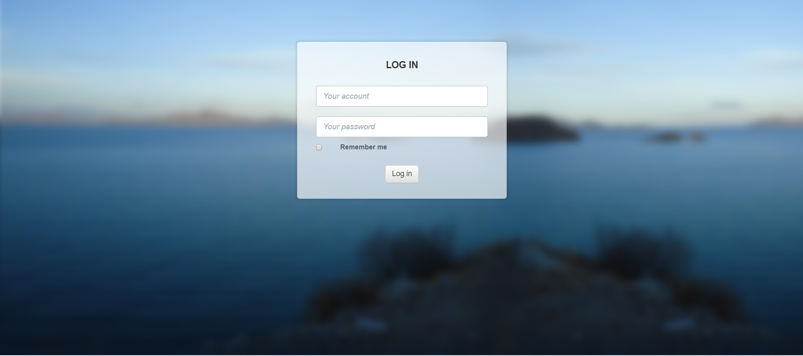
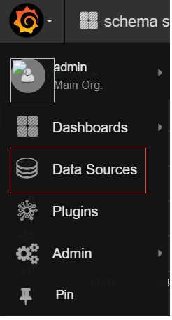
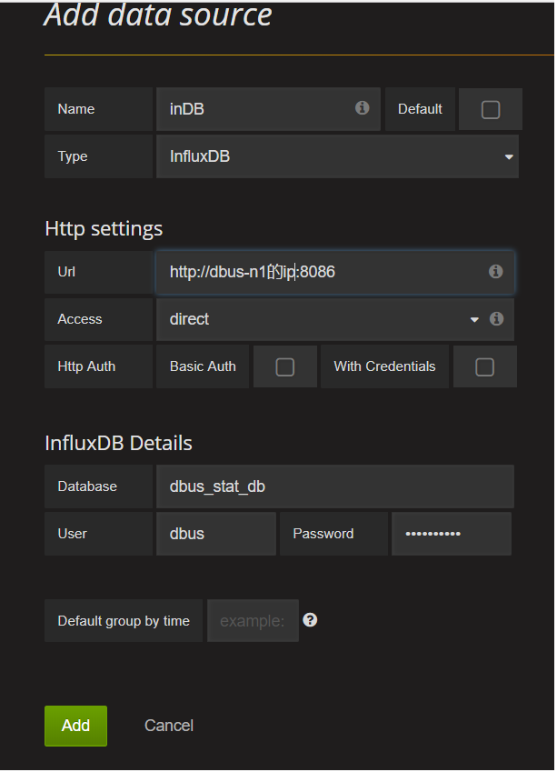
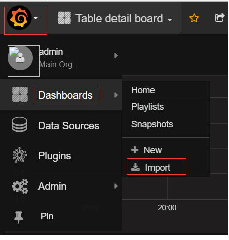

# 1. 环境说明
## 1.1 安装基础组件前提

Dbus集群环境最少需要三台Linux服务器，例如服务器信息如下：


| No   | IP          | 域名         |
| ---- | ----------- | ---------- |
| 1    | 192.168.0.1 | dbus-n1    |
| 2    | 192.168.0.2 | dbus-n2    |
| 3    | 192.168.0.3 | dbus-n3    |
| 4    | 192.168.0.4 | db-dbusmgr |

修改所有服务器/etc/hosts文件设置相应的域名信息如下：

```
192.168.0.1 dbus-n1
192.168.0.2 dbus-n2
192.168.0.3 dbus-n3
192.168.0.4 db-dbusmgr
```


**所有服务器安装JDK1.8**


## 1.2 相关依赖部件说明

| 名称        | 版本号     | 说明                                       |
| --------- | ------- | ---------------------------------------- |
| Canal     | v1.0.22 | DBus用于实时抽取binlog日志。DBus修改一个1文件, 具体配置可参考canal相关支持说明，支持mysql5.6，5.7 |
| Zookeeper | v3.4.6+ | 用于构建整个系统和提供配置通知等                         |
| Kafka     | v0.10   | 用于存储相关数据和消息，提供订阅和发布的能力                   |
| Storm     | v1.0.1  | 用于提供DBus流式计算                             |
| Influxdb  | v0.13.0 | 用于记录实时监控数据                               |
| Grafana   | v4.2.0  | 用于展示监控信息                                 |


# 2. 安装ZooKeeper

## 2.1 下载

推荐下载zookeeper版本；zookeeper-3.4.8
地址：[http://zookeeper.apache.org/releases.html](http://zookeeper.apache.org/releases.html)

## 2.2 安装

zookeeper安装在目录：/app/dbus/zookeeper-3.4.8

## 2.3 配置

### 2.3.1 通用配置如下：

分别配置dbus-n1、dbus-n2、dbus-n3的/app/dbus/zookeeper-3.4.8/conf/zoo.cfg文件

```
# The number of milliseconds of each tick
tickTime=2000

# The number of ticks that the initial 
# synchronization phase can take
initLimit=10

# The number of ticks that can pass between 
# sending a request and getting an acknowledgement
syncLimit=5

# the directory where the snapshot is stored.
# do not use /tmp for storage, /tmp here is just 
# example sakes.
# zk日志数据存储路径
dataDir=/data/zookeeper-data/

# the port at which the clients will connect
clientPort=2181

# Members in the zk cluster
server.1=dbus-n1:2888:3888
server.2=dbus-n2:2888:3888
server.3=dbus-n3:2888:3888

# 单个客户端最大连接数，0为不限制
maxClientCnxns=0

# 日志和快照文件保留3
autopurge.snapRetainCount=3

# 日志和快照文件清理周期为1小时
autopurge.purgeInterval=1
```

### 2.3.2 特殊配置：

分别在dbus-n1、dbus-n2、dbus-n3的/data/zookeeper-data/目录下执行如下命令：

```
# dbus-n1
echo "1" >> myid

# dbus-n2
echo "2" >> myid

# dbus-n3
echo "3" >> myid
```

## 2.4 启动
分别在dbus-n1、dbus-n2、dbus-n3的/app/dbus/zookeeper-3.4.8/bin目录下执行如下命令：
```
./zkServer.sh start &
```

## 2.5 关闭

分别在dbus-n1、dbus-n2、dbus-n3的/app/dbus/zookeeper-3.4.8/bin目录下执行如下命令：
```
./zkServer.sh stop
```


# 3. 安装Kafka

## 3.1 下载

推荐下载kafka版本：kafka_2.11-0.10.0.0
地址：[http://kafka.apache.org/downloads](http://kafka.apache.org/downloads)

## 3.2 安装

kafka安装在目录：/app/dbus/kafka_2.11-0.10.0.0

## 3.3 配置

dbus-n1的/app/dbus/kafka_2.11-0.10.0.0/config/server.properties配置如下：

```
# The id of the broker. This must be set to a unique integer for each broker.
broker.id=1

############################# Socket Server Settings #############################

# The address the socket server listens on. It will get the value returned from 
# java.net.InetAddress.getCanonicalHostName() if not configured.
#   FORMAT:
#     listeners = security_protocol://host_name:port
#   EXAMPLE:
#     listeners = PLAINTEXT://your.host.name:9092
listeners=PLAINTEXT://dbus-n1:9092

# The port the socket server listens on
port=9092

# Hostname and port the broker will advertise to producers and consumers. If not set, 
# it uses the value for "listeners" if configured.  Otherwise, it will use the value
# returned from java.net.InetAddress.getCanonicalHostName().
#advertised.listeners=PLAINTEXT://your.host.name:9092

# The number of threads handling network requests
num.network.threads=3

# The number of threads doing disk I/O
num.io.threads=8

# The send buffer (SO_SNDBUF) used by the socket server
socket.send.buffer.bytes=102400

# The receive buffer (SO_RCVBUF) used by the socket server
socket.receive.buffer.bytes=102400

# The maximum size of a request that the socket server will accept (protection against OOM)
socket.request.max.bytes=104857600


############################# Log Basics #############################

# A comma seperated list of directories under which to store log files
log.dirs=/data/kafka-data

# The default number of log partitions per topic. More partitions allow greater
# parallelism for consumption, but this will also result in more files across
# the brokers.
num.partitions=1

# default 2 replications
default.replication.factor=2

# The number of threads per data directory to be used for log recovery at startup and flushing at shutdown.
# This value is recommended to be increased for installations with data dirs located in RAID array.
num.recovery.threads.per.data.dir=1

############################# Log Flush Policy #############################

# Messages are immediately written to the filesystem but by default we only fsync() to sync
# the OS cache lazily. The following configurations control the flush of data to disk.
# There are a few important trade-offs here:
#    1. Durability: Unflushed data may be lost if you are not using replication.
#    2. Latency: Very large flush intervals may lead to latency spikes when the flush does occur as there will be a lot of data to flush.
#    3. Throughput: The flush is generally the most expensive operation, and a small flush interval may lead to exceessive seeks.
# The settings below allow one to configure the flush policy to flush data after a period of time or
# every N messages (or both). This can be done globally and overridden on a per-topic basis.

# The number of messages to accept before forcing a flush of data to disk
#log.flush.interval.messages=10000

# The maximum amount of time a message can sit in a log before we force a flush
log.flush.interval.ms=1000

############################# Log Retention Policy #############################

# The following configurations control the disposal of log segments. The policy can
# be set to delete segments after a period of time, or after a given size has accumulated.
# A segment will be deleted whenever *either* of these criteria are met. Deletion always happens
# from the end of the log.

# The minimum age of a log file to be eligible for deletion
log.retention.hours=168

# A size-based retention policy for logs. Segments are pruned from the log as long as the remaining
# segments don't drop below log.retention.bytes.
log.retention.bytes=107374182400

# The maximum size of a log segment file. When this size is reached a new log segment will be created.
log.segment.bytes=1073741824

# The interval at which log segments are checked to see if they can be deleted according
# to the retention policies
log.retention.check.interval.ms=300000

# The number of bytes of messages to attempt to fetch
replica.fetch.max.bytes=10485760

# The maximum size of message that the server can receive
message.max.bytes=10485760

############################# Zookeeper #############################

# Zookeeper connection string (see zookeeper docs for details).
# This is a comma separated host:port pairs, each corresponding to a zk
# server. e.g. "127.0.0.1:3000,127.0.0.1:3001,127.0.0.1:3002".
# You can also append an optional chroot string to the urls to specify the
# root directory for all kafka znodes.

zookeeper.connect=dbus-n1:2181,dbus-n2:2181,dbus-n3:2181/kafka

# Timeout in ms for connecting to zookeeper
zookeeper.connection.timeout.ms=6000

delete.topic.enable=true
```

dbus-n2的/app/dbus/kafka_2.11-0.10.0.0/config/server.properties的配置做如下修改，其它配置项和dbus-n1的配置相同：

```
broker.id=2
listeners=PLAINTEXT://dbus-n2:9092
```

dbus-n3的/app/dbus/kafka_2.11-0.10.0.0/config/server.properties的配置做如下修改，其它配置项和dbus-n1的配置相同：

```
broker.id=3
listeners=PLAINTEXT://dbus-n3:9092
```

## 3.4 启动

分别在dbus-n1、dbus-n2、dbus-n3的/app/dbus/kafka_2.11-0.10.0.0/bin目录下执行如下命令：

```
 export JMX_PORT=9999;
./kafka-server-start.sh -daemon ../config/server.properties &
```


# 4. 安装Kafka-manager

## 4.1 下载

推荐下载kafka-manager版本：kafka-manager-1.3.0.8

地址：[https://github.com/yahoo/kafka-manager/releases](https://github.com/yahoo/kafka-manager/releases)  这个地址下载后需要编译打包比较麻烦，

可以从地址: [https://pan.baidu.com/s/10S-65-7vIl2OVQNl52Ms_Q](https://pan.baidu.com/s/10S-65-7vIl2OVQNl52Ms_Q) 直接下载已经编译好的安装包

## 4.2 安装

选择一台机器安装kafka-manager，如dbus-n2

kafka安装在目录：/app/dbus/kafka-manager-1.3.0.8

## 4.3 配置

dbus-n2的/app/dbus/kafka-manager-1.3.0.8/conf/application.conf的配置如下：

```
# Copyright 2015 Yahoo Inc. Licensed under the Apache License, Version 2.0
# See accompanying LICENSE file.

# This is the main configuration file for the application.
# ~~~~~

# Secret key
# ~~~~~
# The secret key is used to secure cryptographics functions.
# If you deploy your application to several instances be sure to use the same key!
play.crypto.secret="^<csmm5Fx4d=r2HEX8pelM3iBkFVv?k[mc;IZE<_Qoq8EkX_/7@Zt6dP05Pzea3U"
play.crypto.secret=${?APPLICATION_SECRET}

# The application languages
# ~~~~~
play.i18n.langs=["en"]

play.http.requestHandler = "play.http.DefaultHttpRequestHandler"

play.application.loader=loader.KafkaManagerLoader

kafka-manager.zkhosts="dbus-n1:2181,dbus-n2:2181,dbus-n3:2181"
kafka-manager.zkhosts=${?ZK_HOSTS}
pinned-dispatcher.type="PinnedDispatcher"
pinned-dispatcher.executor="thread-pool-executor"
application.features=["KMClusterManagerFeature","KMTopicManagerFeature","KMPreferredReplicaElectionFeature","KMReassignPartitionsFeature"]

akka {
  loggers = ["akka.event.slf4j.Slf4jLogger"]
  loglevel = "INFO"
}


basicAuthentication.enabled=true
basicAuthentication.username="admin"
basicAuthentication.password="admin"
basicAuthentication.realm="Kafka-Manager"

```

## 4.4 启动

在dbus-n2的/app/dbus/kafka-manager-1.3.0.8/bin目录下执行如下命令：

```
nohup ./kafka-manager -Dconfig.file=../conf/application.conf >/dev/null 2>&1 &
```

## 4.5 验证

打开浏览器输入：http://dbus-n2:9000/login，出现如下页面：

用户名：admin 

密码：admin


登陆后，如上图进行配置，配置Cluster Zookeeper Hosts为dbus-n1对应ip:2181,dbus-n2对应ip:2181,dbus-n3对应ip:2181/kafka，点击下面的save页面保存，即可使用Kafka manager。

# 5. 安装Storm

## 5.1 下载

推荐下载storm版本：apache-storm-1.0.1
地址：[http://storm.apache.org/downloads.html](http://storm.apache.org/downloads.html)

## 5.2 安装

storm安装在目录：/app/dbus/app/dbus/apache-storm-1.0.1

## 5.3 配置

dbus-n1的/app/dbus/apache-storm-1.0.1/conf/storm.yaml配置如下：

```
########### These MUST be filled in for a storm configuration
storm.zookeeper.servers:
    - "dbus-n1"
    - "dbus-n2"
    - "dbus-n3"

# zookeeper port
storm.zookeeper.port: 2181
storm.zookeeper.root: '/storm'

# Nimbus HA
nimbus.seeds: ["dbus-n1", "dbus-n2"]
storm.local.dir: "/data/storm-data"
storm.local.hostname: "dbus-n1"

ui.port: 8080

supervisor.slots.ports:
    - 6708
    - 6709
    - 6710
    - 6711
    - 6712

#worker.childopts: "-Xms512m -Xmx2048m"
worker.childopts: "-Dworker=worker -Xms1024m -Xmx2048m -Xmn768m -XX:SurvivorRatio=4 -XX:+UseConcMarkSweepGC  -XX:CMSInitiatingOccupancyFraction=60  -XX:CMSFullGCsBeforeCompaction=2 -XX:+UseCMSCompactAtFullCollection -XX:+PrintGCDetails -XX:+PrintHeapAtGC -XX:+PrintGCApplicationStoppedTime -Xloggc:/home/app/gc.log"
```

dbus-n2的/app/dbus/apache-storm-1.0.1/conf/storm.yaml配置如下：

```
########### These MUST be filled in for a storm configuration
storm.zookeeper.servers:
    - "dbus-n1"
    - "dbus-n2"
    - "dbus-n3"

# zookeeper port
storm.zookeeper.port: 2181
storm.zookeeper.root: '/storm'

# Nimbus HA
nimbus.seeds: ["dbus-n1", "dbus-n2"]
storm.local.dir: "/data/storm-data"
storm.local.hostname: "dbus-n2"

ui.port: 8080

supervisor.slots.ports:
    - 6708
    - 6709
    - 6710
    - 6711
    - 6712

#worker.childopts: "-Xms512m -Xmx2048m"
worker.childopts: "-Dworker=worker -Xms1024m -Xmx2048m -Xmn768m -XX:SurvivorRatio=4 -XX:+UseConcMarkSweepGC  -XX:CMSInitiatingOccupancyFraction=60  -XX:CMSFullGCsBeforeCompaction=2 -XX:+UseCMSCompactAtFullCollection -XX:+PrintGCDetails -XX:+PrintHeapAtGC -XX:+PrintGCApplicationStoppedTime -Xloggc:/home/app/gc.log"
```

dbus-n3的/app/dbus/apache-storm-1.0.1/conf/storm.yaml配置如下：

```
########### These MUST be filled in for a storm configuration
storm.zookeeper.servers:
    - "dbus-n1"
    - "dbus-n2"
    - "dbus-n3"

# zookeeper port
storm.zookeeper.port: 2181
storm.zookeeper.root: '/storm'

# Nimbus HA
nimbus.seeds: ["dbus-n1", "dbus-n2"]
storm.local.dir: "/data/storm-data"
storm.local.hostname: "dbus-n3"

ui.port: 8080

supervisor.slots.ports:
    - 6708
    - 6709
    - 6710
    - 6711
    - 6712

#worker.childopts: "-Xms512m -Xmx2048m"
worker.childopts: "-Dworker=worker -Xms1024m -Xmx2048m -Xmn768m -XX:SurvivorRatio=4 -XX:+UseConcMarkSweepGC  -XX:CMSInitiatingOccupancyFraction=60  -XX:CMSFullGCsBeforeCompaction=2 -XX:+UseCMSCompactAtFullCollection -XX:+PrintGCDetails -XX:+PrintHeapAtGC -XX:+PrintGCApplicationStoppedTime -Xloggc:/home/app/gc.log"
```

## 5.4 启动

在dbus-n1的/app/dbus/apache-storm-1.0.1/bin目录下执行如下命令：

```
./storm nimbus &
./storm supervisor &
./storm ui &
```

在dbus-n2的/app/dbus/apache-storm-1.0.1/bin目录下执行如下命令：

```
./storm nimbus &
./storm supervisor &
```

在dbus-n3的/app/dbus/apache-storm-1.0.1/bin目录下执行如下命令：

```
./storm supervisor &
```

## 5.5 验证

在dbus-n1执行jps -l命令后看到如下信息：


在dbus-n2执行jps -l命令后看到如下信息：


在dbus-n3执行jps -l命令后看到如下信息：


# 6. 安装Dbus jars

## 6.1 下载

dbus jars 地址： [release 页面下载最新包](https://github.com/BriData/DBus/releases)

## 6.2 安装

dbus jars需要安装在storm nimbus所在服务器节点上，dbus-n1、dbus-n2都安装有storm nimbus，因此我们需要把dbus jars安装dbus-n1、dbus-n2的storm根目录：/app/dbus/apache-storm-1.0.1

```
cd /app/dbus/apache-storm-1.0.1
tar -zxvf dbus_jars.tar.gz
```


# 7. 安装InfluxDB

## 7.1 下载

推荐下载InfluxDB版本：influxdb-1.1.0.x86_64
地址：[https://portal.influxdata.com/downloads](https://portal.influxdata.com/downloads)

## 7.2 安装

在dbus-n1上切换到root用户，在influxdb-1.1.0.x86_64.rpm的存放目录下执行如下命令：

```
rpm -ivh influxdb-1.1.0.x86_64.rpm
```

## 7.3 启动

在dbus-n1上执行如下命令：

```
service influxdb start
```

## 7.4 初始化配置

在dbus-n1上执行如下命令：

```
#登录influx
influx

#执行初始化脚本
create database dbus_stat_db
use dbus_stat_db
CREATE USER "dbus" WITH PASSWORD 'dbus!@#123'
ALTER RETENTION POLICY autogen ON dbus_stat_db DURATION 15d
```


# 8.安装Dbus mgr库

## 8.1 前提

已经安装好mysql数据库服务，我们假定为db-dbusmgr节点

## 8.2 下载

下载dbus库的脚本，保存到/app/dbus/,  下载地址：

- 初始化数据库和用户SQL ：init-scripts/init-dbusmgr/1_init_database_user.sql

- 初始化表SQL:  init-scripts/init-dbusmgr/2_dbusmgr_tables/dbusmgr_tables.sql

## 8.3 导入初始化SQL脚本

```
#以root身份登录mysql客户端，执行初始化脚本
source /app/dbus/1_init_database_user.sql
source /app/dbus/dbusmgr_tables.sql
```


# 9. 安装Dbus-tools

## 9.1 下载

下载dbus-tools版本：0.4.0
地址： [release 页面下载最新包](https://github.com/BriData/DBus/releases)

## 9.2 安装

在dbus-n1上通过如下命令解压安装在目录：/app/dbus/dbus-tools-0.4.0

```
cd /app/dbus
unzip dbus-tools-0.4.0.zip
```

## 9.3 配置

修改/app/dbus/dbus-tools-0.4.0/conf/zk.properties内容如下：

```
dbus.zookeeper.servers=dbus-n1:2181,dbus-n2:2181,dbus-n3:2181
dbus.kafka.BootstrapServers=dbus-n1:9092,dbus-n2:9092,dbus-n3:9092
#dbus.zookeeper.session.timeout=5000
```

修改/app/dbus/dbus-tools-0.4.0/conf/InitZooKeeper/mysql.properties内容如下：

```
# db-dbusmgr是已安装mysql服务所在机器的IP
url=jdbc:mysql://db-dbusmgr:3306/dbusmgr?characterEncoding=utf-8
# 将(#password_place_holder#}替换成/app/dbus/DBus-0.4.0.sql中dbusmgr用户的密码
password=dmVvY9bibMGBGD3X
```

## 9.4 执行sh脚本完成配置

在dbus-n1上进入/app/dbus/dbus-tools-0.4.0执行如下命令：

```
#先赋予脚本可执行权限
chmod 744 -R bin
bin/initZK.sh
```


# 10. 安装Dbus-heartbeat

## 10.1 下载

下载dbus-heartbeat版本：0.4.0
地址： [release 页面下载最新包](https://github.com/BriData/DBus/releases)

## 10.2 安装

在dbus-n2上通过如下命令解压安装在目录：/app/dbus/dbus-heartbeat-0.4.0

```
unzip dbus-heartbeat-0.4.0.zip
```

在dbus-n3上的安装和dbus-n2上的步骤相同

## 10.3 配置

修改/app/dbus/dbus-heartbeat-0.4.0/conf/zk.properties内容如下：

```
zk.str=dbus-n1:2181,dbus-n2:2181,dbus-n3:2181
zk.session.timeout=20000
zk.connection.timeout=25000
zk.retry.interval=30

dbus.heartbeat.config.path=/DBus/HeartBeat/Config/heartbeat_config.json
dbus.heartbeat.leader.path=/DBus/HeartBeat/Leader
```

修改/app/dbus/dbus-heartbeat-0.4.0/conf/consumer.properties内容如下：

```
############################# Consumer Basics #############################
bootstrap.servers=dbus-n1:9092,dbus-n2:9092,dbus-n3:9092
group.id=heartbeat_consumer_group
#client.id=heartbeat_consumer
enable.auto.commit=true
auto.commit.interval.ms=1000
session.timeout.ms=30000
key.deserializer=org.apache.kafka.common.serialization.StringDeserializer
value.deserializer=org.apache.kafka.common.serialization.StringDeserializer
max.partition.fetch.bytes=10485760
max.poll.records=30
session.timeout.ms=30000
```

修改/app/dbus/dbus-heartbeat-0.4.0/conf/producer.properties内容如下：

```
############################# Producer Basics #############################
bootstrap.servers=dbus-n1:9092,dbus-n2:9092,dbus-n3:9092
acks=1
retries=3
batch.size=16384
linger.ms=1
buffer.memory=33554432
key.serializer=org.apache.kafka.common.serialization.StringSerializer
value.serializer=org.apache.kafka.common.serialization.StringSerializer

```

修改/app/dbus/dbus-heartbeat-0.4.0/conf/jdbc.properties内容如下：

```
DB_TYPE=mysql
DB_KEY=dbus.conf
DB_DRIVER_CLASS=com.mysql.jdbc.Driver
# db-dbusmgr是已安装mysql服务所在机器的IP
DB_URL=jdbc:mysql://db-dbusmgr:3306/dbusmgr?characterEncoding=utf-8
DB_USER=dbusmgr
# 将(#password_place_holder#}替换成/app/dbus/DBus-0.4.0.sql中dbusmgr用户的密码
DB_PWD=(#password_place_holder#}
DS_INITIAL_SIZE=1
DS_MAX_ACTIVE=1
DS_MAX_IDLE=1
DS_MIN_IDLE=1
```

修改/app/dbus/dbus-heartbeat-0.4.0/conf/stat_config.properties内容如下：

```
dbus.statistic.topic=dbus_statistic
kafka.offset=none
influxdb.url=http://dbus-n1:8086
influxdb.dbname=dbus_stat_db
influxdb.tablename=dbus_statistic
```

在dbus-n3上的安装和dbus-n2上的步骤相同

## 10.4 启动

在dbus-n2上进入/app/dbus/dbus-heartbeat-0.4.0目录执行如下命令：

```
# 赋予heartbeat.sh可执行权限
chmod 744 heartbeat.sh
# 启动心跳
./heartbeat.sh &
```

在dbus-n3上的安装和dbus-n2上的步骤相同


# 11. 安装Dbus-web

## 11.1 下载

下载dbus-web版本：0.4.0
地址： [release 页面下载最新包](https://github.com/BriData/DBus/releases)

## 11.2 安装

在dbus-n1上通过如下命令解压安装在目录：/app/dbus/distribution-0.4.0-bin

```
cd /app/dbus
mkdir distribution-0.4.0-bin
```

把distribution-0.4.0-bin.zip上传到distribution-0.4.0-bin目录下

```
cd distribution-0.4.0-bin
unzip distribution-0.4.0-bin.zip
```

## 11.3 配置

修改/app/dbus/distribution-0.4.0-bin/conf/application.properties配置文件信息如下：

```
# zk server
zk.servers=dbus-n1:2181,dbus-n2:2181,dbus-n2:2181

# simple http server port of static resources
http.server.port = 65532

# simple reverse proxy
proxy.server.port = 65533

# manager server port
manager.server.port = 65534

# webservice port
rest.server.port = 65535

# user name and password
administrator = admin
password = admin
```

修改/app/dbus/distribution-0.4.0-bin/conf/mybatis.properties配置文件信息如下：

```
driver=com.mysql.jdbc.Driver

# db-dbusmgr是已安装mysql服务所在机器的IP
url=jdbc:mysql://db-dbusmgr:3306/dbusmgr?characterEncoding=utf-8
username=dbusmgr
# 将dbus替换成/app/dbus/DBus-0.4.0.sql中dbusmgr用户的密码
password=dbus
poolMaximumActiveConnections=2
poolMaximumIdleConnections=1
poolPingEnabled=true
poolPingQuery=select 1
poolPingConnectionsNotUsedFor=600000
```


修改/app/dbus/distribution-0.4.0-bin/conf/consumer.properties配置文件信息如下：

```
bootstrap.servers=dbus-n1:9092,dbus-n2:9092,dbus-n3:9092

client.id=dbus-web.reader
group.id=dbus-web.reader

enable.auto.commit=true
auto.commit.interval.ms=2000
session.timeout.ms=30000

key.deserializer=org.apache.kafka.common.serialization.StringDeserializer
value.deserializer=org.apache.kafka.common.serialization.StringDeserializer

max.partition.fetch.bytes=10485760
max.poll.records=30
```

## 11.4 启动

前提：

*保证部署web的机器能够免密登录到部署storm nimbus的机器；*

在dbus-n1上进入/app/dbus/distribution-0.4.0-bin目录执行如下命令：

```
cd /app/dbus/distribution-0.4.0-bin
# 赋予manager.sh、httpserver.sh、proxy.sh、service.sh、start-all.sh、stop-all.sh可执行权限
chmod 744 *.sh

cd /app/dbus/distribution-0.4.0-bin/node-v6.9.2-linux-x64/bin
chmod 744 *

cd /app/dbus/distribution-0.4.0-bin/node-v6.9.2-linux-x64/lib/node_modules/pm2/bin
chmod 744 *


# 启动心跳
./start-all.sh &
```

## 11.5 验证

在浏览器中输入url：http://dbus-n1:65533/dbus/



用户名：admin

密码：admin


# 12. 安装Grafana

## 12.1 下载

推荐下载grafana版本：grafana-3.1.1
地址：[https://grafana.com/grafana/download](https://grafana.com/grafana/download)

## 12.2 安装

在dbus-n1上首先切换到root用户，执行如下命令

```
rpm -ivh grafana-3.1.1-1470047149.x86_64.rpm
```

## 12.3 配置

在dbus-n1上修改配置文件/etc/grafana/grafana.ini的[decurity]部分如下，其它部分不用修改：

```
[security]
# default admin user, created on startup
admin_user = admin

# default admin password, can be changed before first start of grafana,  or in profile settings
admin_password = admin
```

## 12.4 启动

在dbus-n1上执行如下命令：

```
service grafana-server start
```

## 12.5 验证

### 12.5.1 登录grafana

打开浏览器输入：http://dbus-n1:3000/login，出现如下页面：

用户名：admin 

密码：admin


### 12.5.2 配置grafana

#### 12.5.2.1 配置Grafana influxdb数据源如下图：





密码：dbus!@#123 (安装influxdb初始化配置脚本设置的密码)

#### 12.5.2.2 配置Grafana Dashboard

下载Schema Dashboard配置：initScript/init-table-grafana-config/grafana-schema.cfg

下载Table Dashboard配置：initScript/init-table-grafana-config/grafana-table.cfg

下载log Dashboard 配置：init-scripts/init-log-grafana-config/*.cfg

操作步骤如下：




分别上传schema.json和table.json的配置文件


导入后出现如上图所示的两个dashboards


# 13. 启动web后的基础设置

启动dbus-web后，需要先设置web基础设置，包括设置kafka地址，storm启动地址等

具体参考：[web-基础配置](config-dbus-web.html)


