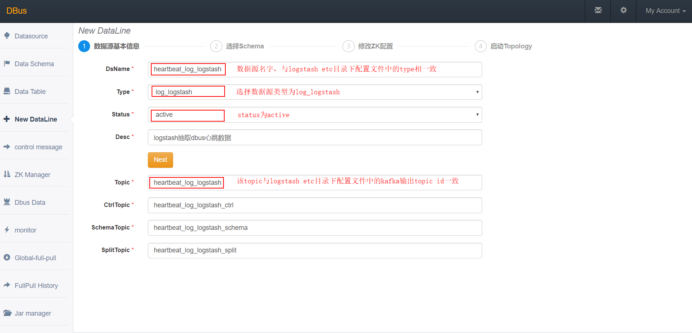
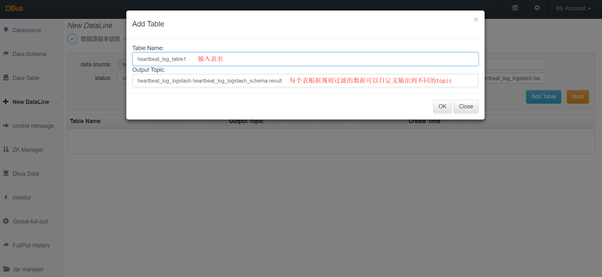
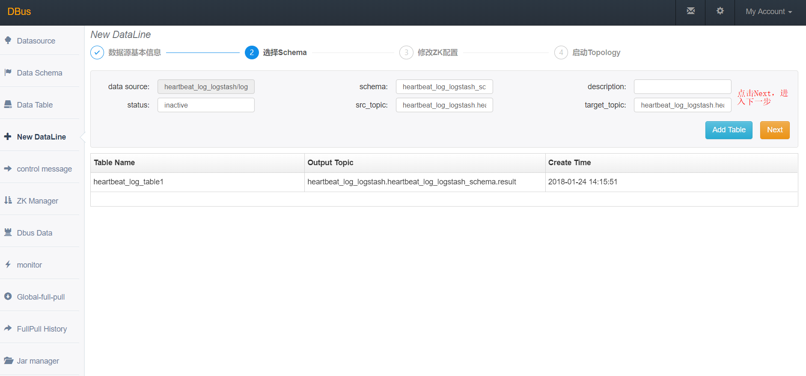
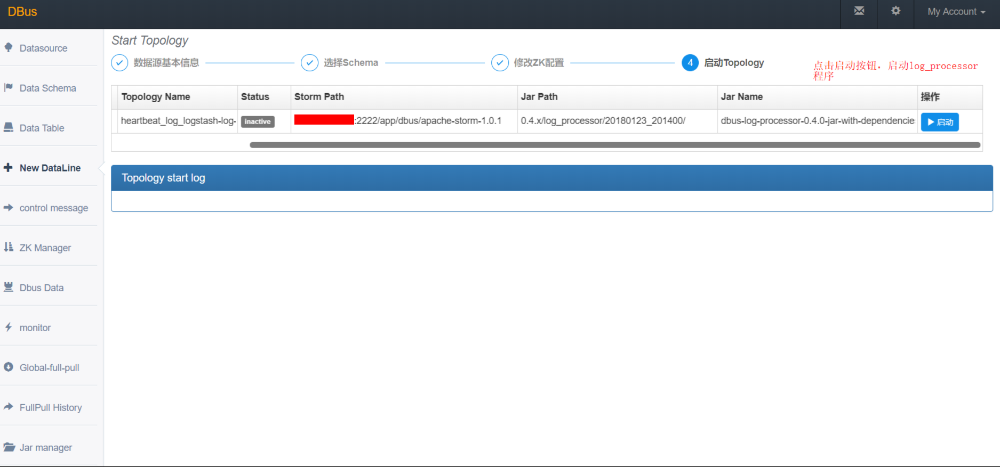
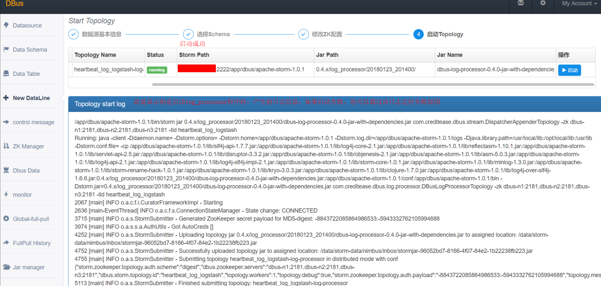
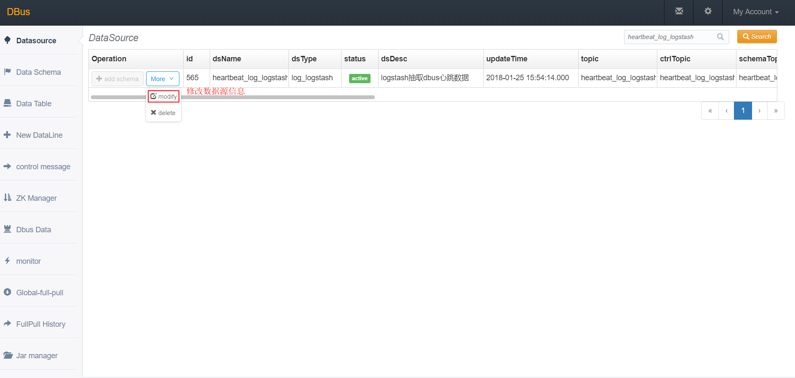
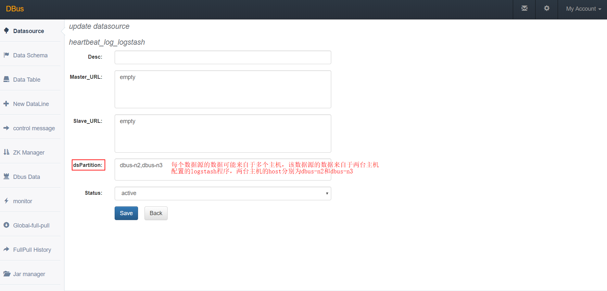
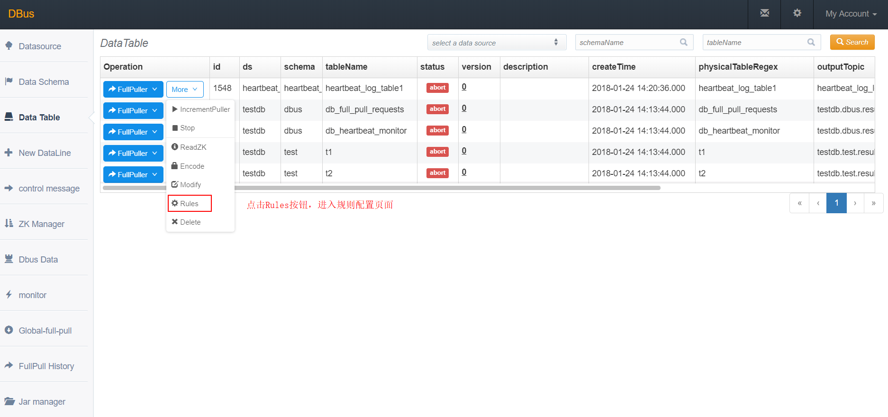
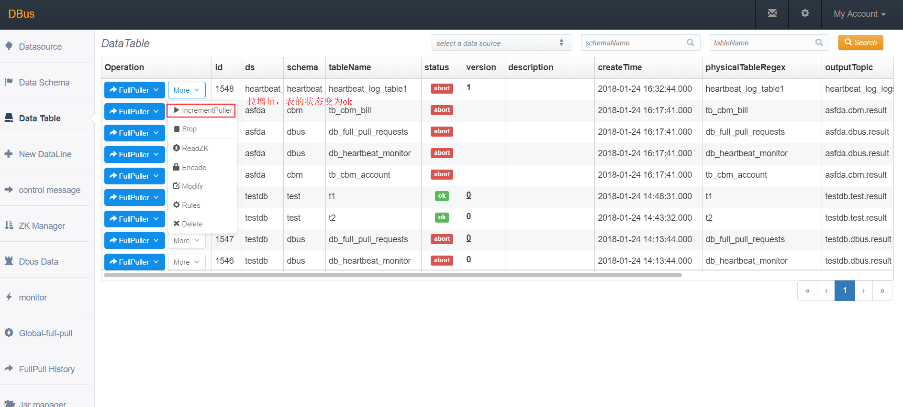

**系统架构：**


**总体说明：**

​	DBus可以接入三种数据源：logstash、flume、filebeat，下面以使用logstash为数据抽取端，抽取DBus自身产生的监控和报警日志数据。DBus监控和报警模块部署在 dbus-n2和dbus-n3 上，路径为：/app/dbus/dbus-heartbeat-0.4.0/logs/heartbeat/heartbeat.log。因此，logstash的日志数据抽取端也要部署在dbus-n2和dbus-n3 上。

​	我们在dbus-n2，dbus-n3两台机器上分别部署了logstash程序，用于对普通日志进行抽取，两台机器上的logstash程序配置完全一致。心跳数据由logstash自带的心跳插件产生（心跳数据的作用是便于DBus对数据进行统计和输出），logstash程序抽取到kafka topic中的数据中既有普通格式的数据，同时也有心跳数据，而且这两种格式的数据分别来自不同的主机。

|  No  |   域名    | 是否有监控和报警日志？ | 是否部署logstash？ | 是否部署心跳shell脚本？ |        抽取日志        |        输出topic         |
| :--: | :-----: | :---------: | :-----------: | :------------: | :----------------: | :--------------------: |
|  1   | dbus-n1 |      否      |       否       |       否        |         无          |           无            |
|  2   | dbus-n2 |      是      |       是       |       否        | 1.DBus自身产生的监控和报警日志 | heartbeat_log_logstash |
|  3   | dbus-n3 |      是      |       是       |       否        | 1.DBus自身产生的监控和报警日志 | heartbeat_log_logstash |


**主要配置步骤：**

1 配置 和 安装logstash源相关

2 一键加线和配置

3 检验结果

## 1  配置 和 安装logstash源相关

监控和报警日志在dbus-n2和dbus-n3上，因此 logstash的日志数据抽取端也要部署在dbus-n2和dbus-n3 上。

### 1.1 logstash安装

* **logstash版本**
  DBus使用的logstash的版本是v5.6.1。

* **下载**

  [https://www.elastic.co/downloads/past-releases/logstash-5-6-1](https://www.elastic.co/downloads/past-releases/logstash-5-6-1)

* **logstah目录说明**
  - **logstash目录**

    

    ​

    **etc目录：**该目录是DBus新建的，用于放置logstash的配置文件，例如被抽取文件路径、心跳及kafka配置等。

    **logs目录：**放置logstash产生的日志，建议将日志放置在一个磁盘较大的目录，这里为其建立一个软连接，指向/data/dbus/logstash-logs目录。

    **patterns目录：** 放置logstah产生心跳的时间戳格式，DBus在该目录下新建了一个名为heartbeat的文件，该文件中定义了logstash产生的心跳格式。heartbeat文件中定义的心跳格式如下：
    `HEARTBEATTIMESTAMP %{YEAR}[./-]%{MONTHNUM}[./-]%{MONTHDAY}[T ]%{HOUR}:?%{MINUTE}(?::?%{SECOND})?`


### 1.2. logstash配置文件说明


以logstash抽取DBus的监控和报警日志为例，说明该如何去写logstash的配置文件。我们在logstash的目录下面新建了一个etc文件夹，用于存放logstash的抽取配置文件，然后在etc目录下新建了一个heartbeat.conf的文件[参考链接](https://github.com/BriData/DBus/tree/master/init-scripts/init-logstash-config)，下面解析下该文件的各项配置。

    input {
        file {
            path => ["/app/dbus/dbus-heartbeat-0.4.0/logs/heartbeat/*.*"]	# 所要读取的日志文件路径
            sincedb_path => "/app/dbus/logstash-5.6.1-heartbeat/etc/sincedb_heartbeat" # 保存了抽取文件的inode、文件偏移量等信息，自动生成
            codec => multiline {
                 pattern => "^\["  # 根据所要合并的多行进行设置（此处为正则表达式，表示以[为开头的行才作为一条记录，其余的向前合并）
                 negate => "true"
                 what => "previous" # 表示不符合上述pattern的行，向前合并
            }
            type => "heartbeat_log_logstash"         # 改成相应的数据源名，这里我们是要通过logstash对dbus心跳日志进行抽取，所以数据源名定义为heartbeat_log_logstash
            start_position => "end"         # 表示从什么位置开始读取文件数据，默认是结束位置；
            #close_older => 3600            # fd 无数据关闭文件时间间隔默认 1小时 3600
            #max_open_files => 4095         # 运行打开最大文件上线，默认 4095
            #add_field => {"test"=>"test"}  # 添加自定义的字段   未使用
            #tags => "tag1"                 # 增加标签           未使用
            #discover_interval => 15        # 设置多长时间扫描目录，发现新文件  使用默认即可
            #stat_interval => 1             # 设置多长时间检测文件是否修改      使用默认即可
            #sincedb_write_interval => 15   # sincedb 写文件时间频率 默认 15秒
        }
        #logstash本身的心跳信息
        heartbeat {
            message => "epoch"
            interval => 60				   # 每60s产生一次心跳
            type => "dbus-heartbeat"	    # 心跳类型定义为dbus-heartbeat
        }
    }
    
    filter {
         if [type] == "heartbeat_log_logstash" { # 与上面input file中的type名对应，意为对上述input file中取得的数据进行进一步过滤抽取
                     grok {
                            patterns_dir => "../patterns" # 此处为自定义的pattern，如果要添加或修改自定义的pattern,可以放在此目录下。下面HEARTBEATTIMESTAMP即是定义在此目录下的
                             match => {
                            # logstash本身配置了约120种pattern，其中DATA、LOGLEVEL和GREEDYDATA都在其中，详细参考https://github.com/logstash-plugins/logstash-patterns-core/tree/master/patterns
                             "message" => "\[%{DATA:thread}\] %{LOGLEVEL:level} ?\: %{HEARTBEATTIMESTAMP:timestamp}%{GREEDYDATA:log}"
                             }
                     }
           }
    }
    
    output {
    	# stdout{codec=>rubydebug}  # 将抽取日志输出到控制台
    	# 代表输出到kafka，以下要配置kafka的服务器IP，端口，topic id
        kafka {
                bootstrap_servers => "dbus-n1:9092,dbus-n2:9092,dbus-n3:9092"  # kafka 服务器IP:端口
                topic_id => "heartbeat_log_logstash"  # 要输出到kafka的topic
                acks => "all"
                compression_type => "lz4"
                retries => 3
                codec => json {
                    charset => "UTF-8"
                }
                batch_size => 1048576         # batch max than 1MB size, larger than it, send batch
                linger_ms => 1000             # batch wait 1 seconds
                max_request_size => 10485760  # set as 10MB, max_request_size => Default value is 1048576
                buffer_memory => 67108864     # default size 33554432=32M. 67108864=64M
    
                #message_key => "heartbeat-logstash"
                # max_request_size => Default value is 1048576
                # send_buffer_bytes => Default value is 131072
                # key_serializer => Default value is "org.apache.kafka.common.serialization.StringSerializer"
                # value_serializer => Default value is "org.apache.kafka.common.serialization.StringSerializer"
             }
      }

### 1.3. logstash启动

 **在logstash解压目录下执行以下命令：**

*  **前台启动命令：** bin/logstash -f ./etc/heartbeat.conf

*  **后台启动命令：** bin/logstash -f ./etc/heartbeat.conf &

    当用**前台启动命令时**出现以下信息，则说明启动成功（**注意控制台是否出现报错信息**）：

    ```
    [2018-01-23T16:08:51,288][INFO ][logstash.pipeline        ] Starting pipeline {"id"=>"main", "pipeline.workers"=>1, "pipeline.batch.size"=>125, "pipeline.batch.delay"=>5, "pipeline.max_inflight"=>125}
    [2018-01-23T16:08:53,032][INFO ][logstash.pipeline        ] Pipeline main started
    [2018-01-23T16:08:53,700][INFO ][logstash.agent           ] Successfully started Logstash API endpoint {:port=>9600}
    ```

### 1.4. logstash验证

**读取kafka的topic: heartbeat_log_logstash，确认是否有数据：**

*  **进入kafka安装目录。**

* **执行以下命令，查看数据，如果有数据，则说明logstash可以成功抽取文件：**

   `bin/kafka-console-consumer.sh --zookeeper dbus-n1:2181,dbus-n2:2181,dbus-n3:2181/kafka  --topic heartbeat_log_logstash`  

* **logstash的心跳数据样例：**

  ```json
  {
      "host": "dbus-n3",
      "@version": "1",
      "clock": 1516762833,
      "@timestamp": "2018-01-24T03:00:33.831Z",
      "type": "dbus-heartbeat"
  }
  ```

* **logstash抽取之后产生的数据样例：**

  ```json
  {
      "path": "/app/dbus/dbus-heartbeat-0.4.0/logs/heartbeat/heartbeat.log",
      "@timestamp": "2018-01-24T02:59:39.494Z",
      "level": "WARN",
      "log": "CheckHeartBeatEvent 196 - 节点:/DBus/HeartBeat/Monitor/test/dbus/db_heartbeat_monitor/0,状态:异常,报警次数:1,超时次数:1",
      "@version": "1",
      "host": "dbus-n3",
      "thread": "check-heartbeat-event",
      "message": "[check-heartbeat-event] WARN : 2018/01/24 10:59:37.906 CheckHeartBeatEvent 196 - 节点:/DBus/HeartBeat/Monitor/test/dbus/db_heartbeat_monitor/0,状态:异常,报警次数:1,超时次数:1",
      "type": "heartbeat_log_logstash",
      "timestamp": "2018/01/24 10:59:37.906 "
  }
  ```


## 2 DBus 一键加线和配置

### 2.1 DBus一键加线

logstash将数据抽取到Kafka topic后，dbus log_processor程序就可以对该topic数据进行处理了，在DBus web进行数据源和table的配置工作。

* **新建数据源：**首先新建数据源，进入New DataLine页面，由于我们是用logstash对心跳日志进行抽取，因此数据源的名字可以起的有意义一些，Type选择log_logstash，topic必须和logstash配置文件中的topic一致。

  

* **新增表：**点击Add Table按钮，新增一张表，稍后会对该表进行规则配置，新增完后，点击Next。

  

  

  


* **clone模板，生成配置信息：**每个数据源都会起一个storm程序，每个程序都会在zookeeper上存放一些配置信息，通过模板clone，为每个数据源生成一份自己的配置信息。

  

* **启动log_processor程序：**启动storm程序，对数据进行处理，后面会对新增表进行规则配置。

  
  **启动结果：**点击启动按钮后，当Status变为running后，表示启动成功，如果启动不成功，可以通过查看Topology start log定位失败原因。
  


### 2.2 数据源配置修改

因为我们在dbus-n1和dbus-n2两台机器中分别配置了logstash程序，用于对数据进行抽取，而DBus监控和报警模块会对来自这两台机器的数据流进行监控，因此，我们需要在数据源配置信息中，将多台主机的host信息填入dsPartition选项中，供DBus监控和报警模块使用，注意：如果主机ip，请将"."转换为"_"，例如：127.0.0.1应该要转换为127_0_0_1。

* **修改数据源信息：**点击modify按钮进行修改。
   

   该数据源的数据可能来自于多个主机上的logstash程序，要在dsPartition中，配置上所有主机的host信息，为DBus心跳监控及报警程序使用。

   


### 2.3. 配置规则（详细配置方式请参考todo）
* **进入Data Table页面，查看新增加的表，点击Rules按钮，为该表配置规则，详细配置方式请参考详：([config-table.md](https://github.com/BriData/DBus/tree/master/docs/config-table.md)**

   

* **点击Rules按钮，进行规则配置**

   

* **新增规则组：**点击Add group按钮，新增一个规则组，点击规则组名字，进入规则配置页面。

   

* **配置规则:** topic是在logstash配置文件中配置的topic，即源topic，可以指定offset，获取固定区间的数据，然后点击show data按钮，此时会在页面下方显示原始数据，点击Add，新增一些过滤规则，对数据进行处理。

   

* **数据过滤完成：**配置完规则后，查看过滤出的数据，点击Save all rules按钮，保存规则，并返回到规则组页面。

   

* **升级版本：**首先使规则组的Status状态变为active，然后点击升级版本（每次增加、删除或修改规则组后，都应该对该表升一次版本）。

   

* **拉取增量 : ** 使该表的状态变为ok。

   

* **点击生效按钮，使该表生效 : **点击Take Effect生效按钮，使该表生效（当后续再对该表进行规则组配置操作后，也应该对该表再执行Take Effect生效按钮，使该表能够获取到最新的规则配置）。

   

##  3  验证数据

我们可以在grafana配置以下，看看实际流量情况。

* **上传grafana配置文件[参考链接](https://github.com/BriData/DBus/tree/master/init-scripts/init-log-grafana-config/)： **点击Import，上传grafana json配置文件。
   
* **选择InDB数据库：**ds的名字必须与新建数据线中的数据源名字一致。
   


* **之前新增表的流量监控信息，type表示来自于哪台主机的数据**
   
* **\_unknown_table_表示不满足任何表的数据**
   
