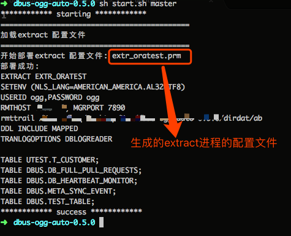
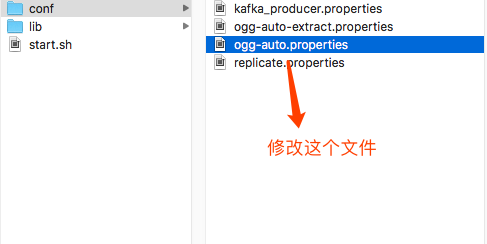
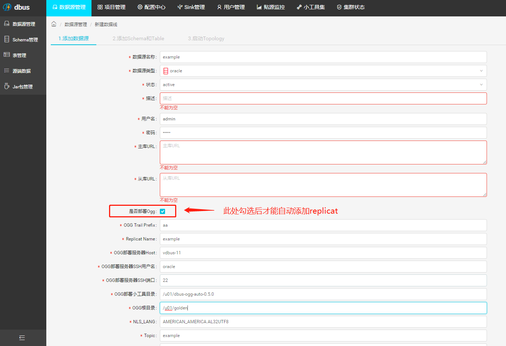
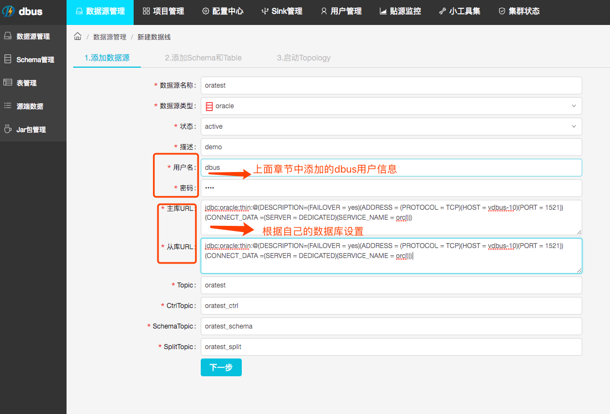
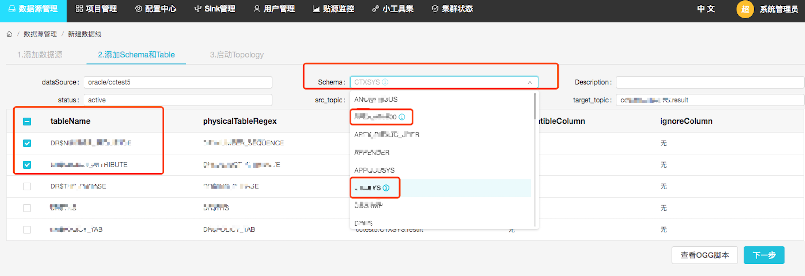
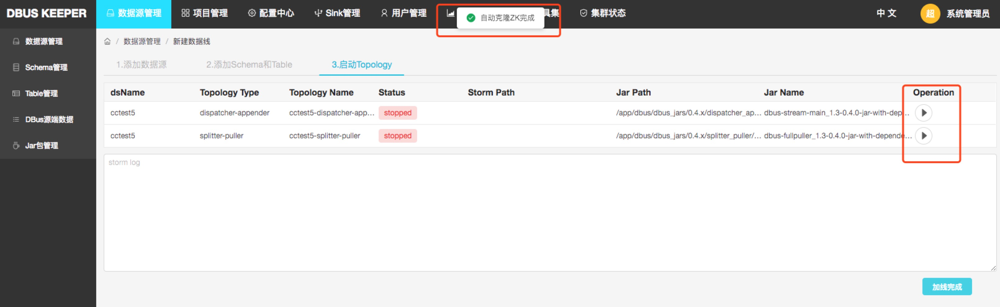
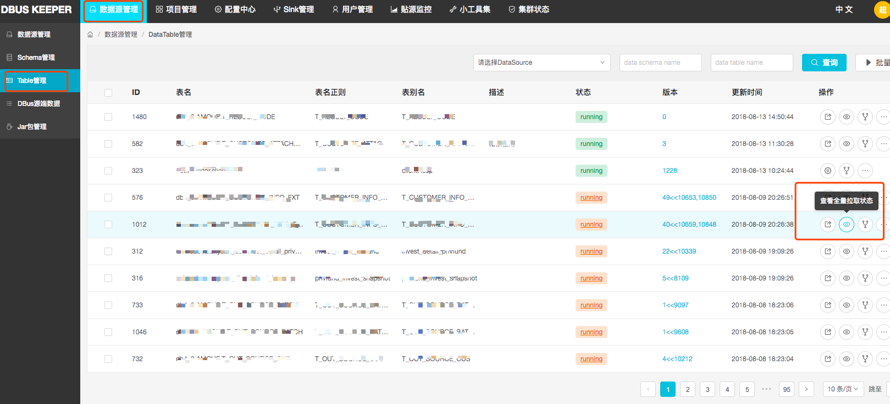
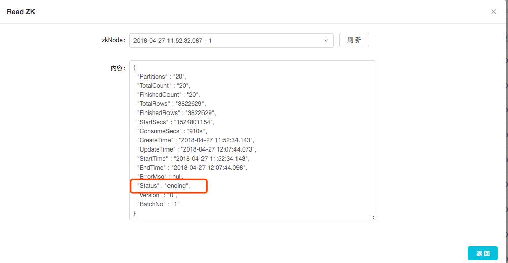

* This will become a table of contents (this text will be scraped).
 {:toc}
以下内容为DBus接入Oracle数据库的日志实时获取实现方案以及相关组件的配置说明。

> Oracle数据库日志解析通过Oracle的商业软件：Oracle GoldenGate实现。
>
> 特别说明：
>
> 1、DBus不包含任何Oracle以及Oraclegoldengate组件和代码，DBus也没有修改任何Oracle以及Oracle goldengate组件和代码。
>
> 2、使用DBus对接和处理的任何数据包括但不限于Oracle 以及Oraclegoldengate的数据，使用人应确保数据来源的合法性及使用遵循Oracle公司相关协议。
>
> 3、DBus只是对接了Oracle goldengate for bigdata输出到Kafka中avro格式的数据，仅作为个人学习和研究使用。
>
> 有关Oracle goldengate协议情况，请参考http://www.oracle.com/technetwork/middleware/goldengate/downloads/index.html***
>
> **相关依赖说明：**
>
> 请按照Oracle数据库的版本选择合适的Oracle GoldenGate和Oracle GoldenGate for Bigdata版本


**限制说明：**

- 考虑到kafka的message大小不宜太大，目前设置的是最大10MB，因此系统支持以下10种数据类型的实时数据抽取：

  BINARY_DOUBLE, BINARY_FLOAT, NUMBER, FLOAT, 

  CHAR, NCHAR, VARCHAR2, NVARCHAR2, DATE, TIMESTAMP

**模块整体实现方案：**

```
在以下文档中以OGG作为Oracle GoldenGate的简写；以OGG for bigdata作为Oracle GoldenGate for Bigdata的简写
```

DBus处理OGG for bigdata实时输出的AVRO格式的二进制数据，并处理表结构变更、DBus heartbeat、数据转换以及全量数据初始化等相关逻辑，下图展示了整体数据流程，DBus通过订阅OGG for bigdata写入到Kafka中的日志数据处理oracle数据库表记录的变化情况，通过JDBC分片获取Oracle数据库表中的初始化数据。


**部署说明**

本章安装配置按照以下环境进行配置说明：

* 服务器：ora-master，安装Oracle主库，oracle实例名称为：$oratest$, 实例名称将会在*DBus web 一键加表配置* 中使用

* 服务器：ora-slave，    安装Oracle备库、以及OGG

* 服务器：ogg-for-bigdata-server，存放OGG产生的远程tail file，安装OGG for bigdata

  ​

  ​

## 1 dbus数据库初始化

说明：

* 执行本章说明的内容需要已完成 **“部署说明”** ，若未安装OGG、OGG for bigdata或进行初始化设置，请先参考[基础检查和安装](#before)
* 如果已经初始化dbus数据库，只需要加表的教程，请直接移步下一节


1. 创建dbus用户和数据库

   使用oracle用户在 **ora-master 服务器** 执行

   ```sql
   Shell> sqlplus / as sysdba;
   SQL> create tablespace tbs_dbus datafile '/u01/dbus.dbf' size 4G autoextend off;
   SQL> create user dbus identified by dbus default tablespace tbs_dbus quota unlimited on tbs_dbus;
   SQL> grant connect,resource to dbus;
   SQL> grant execute on SYS.DBMS_FLASHBACK to dbus;
   -- 用于以只读模式下读取表的列表
   SQL> grant select on SYS.dba_tables to dbus;
   -- 用于以只读模式下读取任意表的列信息的列表
   SQL> grant select on SYS.dba_tab_columns to dbus;
   SQL> grant select on SYS.dba_tab_cols to dbus;
   SQL> grant select on SYS.dba_cons_columns to dbus;
   SQL> grant select on SYS.dba_constraints to dbus;
   SQL> grant select on SYS.dba_log_groups to dbus;
   -- 用于查分区表
   SQL> grant select on SYS.DBA_TAB_PARTITIONS to dbus;
   --用于查找schema是否存在
   SQL> grant select on SYS.dba_users to dbus;
   ```

2. 建表结构和sequence

   sql语句详见：[dbus-oracle.sql](https://github.com/BriData/DBus/blob/master/init-scripts/init-oracle-dbus/dbus-oracle.sql)


3. 创建系统ddl trigger

   以DBA身份登录数据库，创建系统trigger，sql语句详见：[tr_dbus_ddl.trg](https://github.com/BriData/DBus/blob/master/init-scripts/init-oracle-dbus/tr_dbus_ddl.trg)

   ```sql
   -- 确认trigger状态
   SQL> select object_name,status from all_objects where object_name = 'TR_DBUS_DDL';

   OBJECT_NAME                    STATUS
   ------------------------------ -------
   TR_DBUS_DDL                    VALID
   ```

   ​

## 2 接表配置说明

以获取utest用户下的t_customer表为例进行配置说明

### 2.1 测试用户初始化

* 实际接的表已存在，则不需要创建，直接下一步

	创建测试用户和测试表

	```sql
	Shell> sqlplus / as sysdba;
	-- 创建utest用户，并赋权限
	SQL> create user utest identified by utest;
	SQL> grant connect, resource to utest;
	-- 创建 t_customer 表
	SQL> create table utest.t_customer(
	  2  id number primary key,
	  3  customer_name varchar2(64),
	  4  age number(3),
	  5  address varchar2(256)
	  6  );
	
	Table created.
	
	--赋select权限给dbus用户，用来执行拉全量
	SQL> grant select on utest.t_customer to dbus;
	--赋闪回权限给dbus用户(拉全量使用)
	SQL> grant flashback on utest.t_customer to dbus;
	--添加全量补充日志
	SQL> alter table utest.t_customer add supplemental log data (all) columns;
	```

### 2.2 源端OGG添加extract进程

#### 2.2.1确保mgr进程启动

在OGG所在的 ora-slave 服务器 上执行

```
#首先确保mgr进程启动
GGSCI> info mgr
Manager is running (IP port yourip.7890, Process ID 24092).
```

  如果没有启动参考[mgr启动](#mgr)
     
#### 2.2.2配置extract进程

**我们提供了两种添加方式,推荐使用二种**

**1.手动配置**

  如果手动配置，请参考[extract手动配置](#extract_nauto)


**2.脚本自动配置**

- 解压dbus-ogg-auto-0.5.0.tar.gz脚本文件，然后修改ogg-auto-extract.properties文件中的内容,如图；

   

  * 具体修改的配置项如下：

    ```
    #OGG安装目录，公共基础，必填
    ogg.home=/u01/golden-ora
    #extract进程名称，同时也是生成的配置文件的名称，需要不与其他extract重复
    #此字符不宜过长（不能大于8个字符）
    extract.name=extr01
    
    #--- 加表配置项 ---
    
    #如果只是加表，只配置这一项即可，后面的不用管；如果是新增extract配置,请保持空
    tables.append=
    
    #--- 首次配置项 ---
    
    #ogg用户名，ogg信息根据配置的填写
    ogg.user=ogg
    #ogg用户密码
    ogg.pwd=ogg
    #数据库配置的字符集可以通过select userenv('language') from dual查询
    nls.lang=AMERICAN_AMERICA.AL32UTF8
    #安装OGG for bigdata机器的ip，一般是备库ip
    rm.host=dbus-n2
    #安装OGG for bigdata机器中配置的OGG for bigdata的mgr进程配置的port
    mgr.port=7890
    #远程ogg for bigdata目录下的dirdat目录。最后的占位字符只能有两个字符。
     extract.file=/u01/golden/dirdat/ad
    #添加同步的表，逗号分隔。
    tables=UTEST.T_CUSTOMER
    ```


  * “加表配置项”和“首次配置项” 

    脚本提供了两个功能：

    第一个是添加新的抽取进程，然后生成新的配置文件，此功能需要在配置文件中保持“tables.append”参数值为空。

    第二个是在抽取进程已存在，只是新增一些表，那么就只需要将新增的表添加到“加表配置项”下的“tables.append”的参数中，“首次配置项”中的参数可忽略。此时，脚本只会将这些表，追加到配置文件，设置完毕，将已有的抽取进程重启即可。

    

  * 修改完毕后运行脚本 **sh start.sh master**, 加上master参数，运行效果图如下：

   


  * 配置添加成功，然后添加和启动extract进程

  ```
  #制定抽取tranlog，这里的：now是参数值，也可以写一个固定的时间值
  GGSCI> add extract extr01, tranlog, begin now
  
  #添加远程, 与上一步添加的配置一样
  GGSCI> add rmttrail /u01/golden/dirdat/ad, extract extr01
  #启动抽取进程
  GGSCI> start extr01
  #确认启动成功
  GGSCI> info extr01
  # Status RUNNING 表示启动成功
  EXTRACT    EXTR01    Last Started 2018-09-05 13:52   Status RUNNING
    Checkpoint Lag       00:00:00 (updated 00:00:32 ago)
    Process ID           11396
    Log Read Checkpoint  Oracle Redo Logs
                   2018-09-05 13:51:55  Seqno 47, RBA 11880464
                   SCN 0.0 (0)
                       
  # 如果出现
  #ERROR   OGG-02091  Oracle GoldenGate Capture for Oracle, orcl.prm:  Operation not supported because enable_goldengate_replication is not set to true.
  # 请在主库执行以下语句
  SQL> alter system set enable_goldengate_replication=true;
  
  ```


### 2.3 目标端OGG for Bigdata添加replicat进程
以下操作在服务器**ogg-for-bigdata-server**上执行

#### 2.3.1确保mgr进程启动

在OGG所在的 ora-slave 服务器 上执行

```
#首先确保mgr进程启动
GGSCI> info mgr
Manager is running (IP port yourip.7890, Process ID 24092).
```

  如果没有启动参考[mgr启动](#mgr)

#### 2.3.2添加相关依赖包

* 如果依赖的kafka相关jar包，参考[添加kafka依赖](#kafka)

#### 2.3.3添加配置信息

**我们提供了三种添加方式,推荐使用第三种**

**1.手动添加**

​	如需手动添加，请参考[手动添加配置](#non-auto)

**2.基于脚本自动添加配置文件**

- 将ogg脚本dbus-ogg-auto-0.5.0.tar.gz拷贝至服务器，并解压，然后修改ogg-auto.properties文件，如下图所示：




- 具体的配置信息如下：


```shell
#解压安装OGG for bigdata的目录，必填
ogg.big.home=/u01/golden
#数据源名称，同时也是配置文件名称的来源
dsname=oratest

#--- 加表配置项 ---

#如果只是加表，只配置这一项即可，后面的不用管；如果是新增extract配置,请保持空
tables.append=

#--- 首次配置项 ---

#oracle连接串，根据自己的数据库配置填写
ogg.url=jdbc:oracle:thin:@(DESCRIPTION=(FAILOVER = yes)(ADDRESS = (PROTOCOL = TCP)(HOST = dbus-n2)(PORT = 1521))(CONNECT_DATA =(SERVER = DEDICATED)(SERVICE_NAME = orcl)))
#ogg用户名，ogg信息根据配置的填写
ogg.user=ogg
#ogg用户密码
ogg.pwd=ogg
#默认不用修改，如果需要配置与之前的producer不同的配置，填写新的文件名称。否则，会覆盖之前的配置文件。
kafka.producer.name=kafka_producer4.properties
#kafka地址
kafka.url=dbus-n1:9092,dbus-n2:9092,dbus-n3:9092
#数据库配置的字符集
nls.lang=SIMPLIFIED CHINESE_CHINA.AL32UTF8
#添加同步的表，逗号分隔。
tables=UTEST.T_CUSTOMER
```

- 
  “加表配置项”和“首次配置项” 

  与OGG提供的功能类似，脚本为OGG for bigdata也提供了两个功能：

  第一个是添加新的replicate进程，然后生成新的配置文件，此功能需要在配置文件中保持“tables.append”参数值为空。

  第二个是进程已存在，只是新增一些表，那么就只需要将新增的表添加到“加表配置项”下的“tables.append”的参数中，“首次配置项”中的参数可忽略。此时，脚本只会将这些表，追加到配置文件，设置完毕，将已有的抽取进程重启即可。	


- 然后运行脚本，sh start.sh，会打印执行结果，并在当前文件下的report文件夹下生成相应的报告文件,若执行成功，会打印大致如下信息，表示部署成功:

  


​	详细信息请参考：

​	https://docs.oracle.com/goldengate/bd123110/gg-bd/GADBD/using-kafka-handler.htm#GADBD453

- 添加和启动replicat进程

  进入安装目录

```shell
#!!此处需要注意： 
#1.exttrail的内容要与2.2节中配置项一致;
#2.replicat进程名称要与2.3.1生成的oratest.prm文件名一致
GGSCI> add replicat oratest, exttrail /u01/golden/dirdat/ad
GGSCI> start oratest
#验证启动是否成功
GGSCI> info oratest
REPLICAT   ORATEST   Last Started 2018-09-05 14:01   Status RUNNING
 Checkpoint Lag       00:00:00 (updated 00:00:07 ago)
 Process ID           14189
 Log Read Checkpoint  File /u01/golden/dirdat/ad000000000
                   First Record  RBA 0
```
**3.web自动添加replicat和添加删除表**

**强烈推荐这一种**!!!

- 将dbus-ogg-auto-0.5.0.tar.gz拷贝至服务器，(建议和ogg放在同一级目录,方便查找修改)并解压即可

- 如果是老用户请在zookeeper创建一个空节点,新用户不需要添加,初始化的时候会自动添加

  ```
  /DBus/Commons/auto-deploy-ogg.conf
  ```

其实到了这里就可以了,剩下的是2.4DBus keeper 一键加线配置时才需要做的事情



至此utest.t_customer表中的数据变化就可以写到kafka中了，接下来使用dbus-keeper系统进行配置，将数据接入到dbus系统并输出UMS到kafka。

### 2.4 DBus keeper 一键加线配置

1. **数据源设置**

   登录dbus-keeper，进入数据源管理-添加数据源 页面如下图

   

   **操作步骤说明**

   * ”数据源名称“：这里设置的值要和 **2.3.1 添加配置** 步骤中oratest.props文件里的配置项`gg.handler.kafkahandler.topicMappingTemplate`的值相同，即：oratest
   * “数据源类型”选择“oracle”
   * “状态”选择“active”
   * “描述”为描述信息
   * “用户名”：是章节**1 dbus数据库初始化** 步骤中创建的dbus用户名称，即：dbus
   * “密码”：为dbus用户的密码，此处是：dbus
   * ”主库URL“：为主备环境中使用dbus用户连接主库的jdbc连接串
   * “从库URL”：为主备环境中使用dbus用户连接备库的jdbc连接串，单机环境和”主库URL“相同即可


   * Topic CtrlTopic SchemaTopic SplitTopic 这四项会根据DsName自动生成，生成规则如下
     * Topic = DsName
     * CtrlTopic = DsName + “_ctrl”
     * SchemaTopic = DsName + "_schema"
     * SplitTopic = DsName + "_split"
* 这里最新添加了**是否部署Ogg** 选项

  * OGG Trail Prefix : 目标端ogg日志文件前缀,两位数英文字母,例如(aa,ab,ac...)
  * Replicat Name : replicat进程名称不超过8个字符
  * OGG部署服务器Host : 目标端ogg所在的机器ip
  * OGG部署服务器SSH用户名 :  目标端ogg所在的机器免密用户名
  * OGG部署服务器SSH端口 :  目标端ogg所在的机器免密端口号
  * OGG部署小工具目录 : dbus-ogg-auto-0.5.0.tar.gz解压后的根目录
  * OGG根目录 : 目标端 ogg安装的根目录
  * NLS_LANG : 数据库

   表单填写完成后点击 `Next` 按钮进入到选着Schema和table页面

2. **选择Schema和Table页面**

   

   **操作步骤说明**

   * data source下拉列表会按照“Type/DsName”模式自动填充，本例中显示为：oracle/oratest
   * schema下拉列表中选择要接入dbus的Schema，本例选择：UTEST，选择schema后页面下方的列表会显示UTEST用户下对dbus用户授select权限的所有表，本例中显示T_CUSTOMER
   * description为描述信息
   * status设置为active，即有效状态
   * src_topic按照DsName + "." + Schema的规则自动生成
   * target_topi按照DsName + "." + Schema + ".result"的规则自动生成
   * 勾选列表中的T_CUSTOMER，点击 `Next` 按钮进入到修改zk配置页面

3. **启动Topology页面**

   此处较之前，省去了clone zk的步骤，列表中显示需要启动的Topology信息，点击右侧的 `启动` 按钮可以启动相应的模块

   

   ​

## 3 验证结果

增量初始化验证

插入测试数据：

```sql
Shell> sqlplus utest/utest;
SQL> insert into utest.t_customer values (1, 'ALi', 28, 'BeiJing');
SQL> commit;
```

登录grafana观察监控数据：


全量数据验证：

登录dbus keeper，进入到 `Table管理（表管理）` 菜单，找到T_CUSTOMER表，点击`独立拉全量` 按钮后在弹出的确认对话框中选择 `确定` ，拉全量发起成功后，该表的 `status` 会变成 `waiting`， 待全量模块处理完成后再次变成 `ending` 状态。
验证全量拉取是否成功，右侧操作栏，点击"查看拉全量状态"。
全量拉取的信息存储在ZK上，Dbus keeper会读取的zk下相应节点的信息，来查看全量拉取状态。看结点信息中Status字段ß，其中splitting表示正在分片，pulling表示正在拉取，ending表示拉取成功。



## 4 附录
<span id = "before"> </span>
本章将主要说明以下内容：

* 在ora-slave 上安装 `OGG`
* 在 `ogg-for-bigdata-server` 上安装 OGG for bigdata


### 4.1 OGG安装配置

* 推荐下载版本：`Oracle GoldenGate 12.3.0.1.2 for Oracle on Linux x86-64`

* 下载地址：[http://www.oracle.com/technetwork/middleware/goldengate/downloads/index.html](http://www.oracle.com/technetwork/middleware/goldengate/downloads/index.html)

    安装配置步骤请参考oracle 官方说明，以下为简要配置说明，如有不清楚请参考官方手册。https://docs.oracle.com/goldengate/c1230/gg-winux/OGGIN/installing-oracle-goldengate-db.htm


#### 4.1.1 主库配置


 使用oracle用户在 **ora-master 服务器**执行

 如果ora-master上为Oracle设置了用户和用户组，需要提前切换用户，此处用户名为：oracle

```shell
  Shell> su - oracle
```

1. 检查环境变量

 ```shell
 echo $ORACLE_SID
 echo $ORACLE_BASE
 echo $ORACLE_HOME
 ```
没有则需要设置变量为以下值

 ```shell 
--变量值需要修改为自己的
ORACLE_SID=oratest
ORACLE_BASE=/app/u01/oracle
ORACLE_HOME=$ORACLE_BASE/11.2.0/db_1
 ```


​	
2. 主库归档模式启动


	```shell 
	#sysdba登入，检查下面命令的输出结果
	SQL> archive log list;
	
	#如果没有启动。需要先创建目录
	--切换到root用户，查看目录是否存在
	Shell> sudo -i
	Shell> ll /u01/arch
	--不存在则创建arch目录
	Shell> mkdir /u01/arch
	Shell> chown oracle:oinstall /u01/arch/
	   
	--然后登录sqlplus,开启归档日志
	Shell> su - oracle
	Shell> sqlplus / as sysdba;
	SQL> alter system set log_archive_dest_1='location=/u01/arch/';
	SQL> shutdown immediate;
	SQL> startup mount;
	SQL> alter database archivelog;
	SQL> archive log list;
	```

3. 启用supplement log mode
	
	 ```sql
	--查看是否启用：
	SQL> select SUPPLEMENTAL_LOG_DATA_MIN from v$database;
	SUPPLEMENTAL_LOG_DATA_MI
	---------------------------------------------------
	NO
	--如果未启用，使用如下命令启用：
	SQL> alter database add supplemental log data;
	SQL> alter database open;
	--切换日志
	SQL> alter system archive log current;
	```

4. 强制产生日志

 实际生产应用中，最好同时打开ORACLE的强制日志模式，以防止源数据库因直接路径加载忽略redo生成而导致这部分数据无法同步

	```sql
	-- 确认是否开启
	SQL> select force_logging from v$database;
	FOR
	---
	NO
	--如果没有，启用强制产生日志：
	SQL> alter database force logging;
	```

5. 创建ogg用户


	```sql
	--创建表空间
	--请注意根据环境修改datafile路径
	SQL> create tablespace tbs_gguser datafile '/u01/data/ogg.dbf' size 50m autoextend on; 
	--创建OGG用户
	SQL> create user ogg identified by ogg default tablespace tbs_gguser temporary tablespace temp quota unlimited on tbs_gguser;
	
	--给ogg用户授权
	SQL> grant connect,resource, DBA to ogg;
	```


#### 4.1.2 安装OGG到配库服务器ora-slave


   1. 注意事项

     * OGG源端需要和Oracle数据库安装在同一台机器(一般选择备库)

	  使用oracle用户在 **ora-slave 服务器**执行以下操作

	```shell
	#切换到oracle用户
	Shell> su - oracle
	```

   2. 设置环境变量
	
	```shell
	export ORACLE_SID=oratest
	export ORACLE_BASE=/app/u01/oracle
	export ORACLE_HOME=$ORACLE_BASE/11.2.0/db_1
	```
  
   3. 安装环境准备
	
	```shell
	#上传123012_fbo_ggs_Linux_x64_shiphome.zip包至/home/oracle/
	#解压
	Shell> unzip 123012_fbo_ggs_Linux_x64_shiphome.zip
	
	#解压后的文件和目录信息
	-rw-r--r-- 1 oracle oinstall 338735172 1月  19 15:50 123012_fbo_ggs_Linux_x64_shiphome.zip
	drwxr-xr-x 3 oracle oinstall      4096 12月  9 22:02 fbo_ggs_Linux_x64_shiphome
	-rw-r--r-- 1 oracle oinstall      1440 12月 20 01:21 OGG-12.3.0.1-README.txt
	-rw-r--r-- 1 oracle oinstall    236538 12月 20 03:32 OGG_WinUnix_Rel_Notes_12.3.0.1.pdf
	```

   4. 执行安装

	```shell
	#进入到安装目录
	Shell> cd fbo_ggs_Linux_x64_shiphome/Disk1/
	
	#修改oggcore.rsp文件中的配置项：INSTALL_OPTION 和 SOFTWARE_LOCATION
	Shell> vim response/oggcore.rsp
	
	#找到待修改的配置项：INSTALL_OPTION 和 SOFTWARE_LOCATION
	#-------------------------------------------------------------------------------
	# Specify the installation option.
	# Specify ORA12c for installing Oracle GoldenGate for Oracle Database 12c and
	#         ORA11g for installing Oracle GoldenGate for Oracle Database 11g 
	#-------------------------------------------------------------------------------
	INSTALL_OPTION=ORA11g #这里是你的数据库版本
	
	#-------------------------------------------------------------------------------
	# Specify a location to install Oracle GoldenGate
	#-------------------------------------------------------------------------------
	SOFTWARE_LOCATION=/u01/golden123012/
	
	# 执行安装命令（以下两行为同一条命令）
	Shell> ./runInstaller -silent -nowait -responseFile /home/oracle/fbo_ggs_Linux_x64_shiphome/Disk1/response/oggcore.rsp
	#安装结果确认
	[oracle@10 Disk1]$ Oracle GoldenGate Core 的 安装 已成功。
	```

#### 4.1.3 初始化和配置OGG，在备库服务器ora-slave执行

* 配置步骤


    1. 建立相应的子目录
    
       使用oracle用户在 **ora-slave 服务器**执行
    
       ```shell
       #进入ggsci命令行工具
       Shell> /u01/golden123012/ggsci
    
       Oracle GoldenGate Command Interpreter for Oracle
       Version 12.3.0.1.2 OGGCORE_12.3.0.1.0_PLATFORMS_171208.0005_FBO
       Linux, x64, 64bit (optimized), Oracle 11g on Dec  8 2017 21:13:00
       Operating system character set identified as UTF-8.
    
       Copyright (C) 1995, 2017, Oracle and/or its affiliates. All rights reserved.
    
       #执行创建subdirs命令
       GGSCI> create subdirs
    
       Creating subdirectories under current directory /u01/golden123012
    
       Parameter file                 /u01/golden123012/dirprm: created.
       Report file                    /u01/golden123012/dirrpt: created.
       Checkpoint file                /u01/golden123012/dirchk: created.
       Process status files           /u01/golden123012/dirpcs: created.
       SQL script files               /u01/golden123012/dirsql: created.
       Database definitions files     /u01/golden123012/dirdef: created.
       Extract data files             /u01/golden123012/dirdat: created.
       Temporary files                /u01/golden123012/dirtmp: created.
       Credential store files         /u01/golden123012/dircrd: created.
       Masterkey wallet files         /u01/golden123012/dirwlt: created.
       Dump files                     /u01/golden123012/dirdmp: created.
       ```
    
    2. 配置支持DDL
    
       首先需要将 ora-slave 服务器上 `/u01/golden123012` 目录下相关sql文件拷贝到主库的`/u01/golden123012/` 目录下，相关sql文件如下：
    
       * params.sql
       * marker_setup.sql
       * ddl_setup.sql 
       * role_setup.sql
       * ddl_enable.sql
    
       使用oracle用户在**ora-master 服务器**执行
       
       配置说明：
    
       ```shell
       #修改params.sql
       Shell> vim params.sql
       #修改以下变量值为 'TRUE'
       define allow_invisible_index_keys = 'TRUE'
    
       #使用oracle用户在ora-slave服务器执行
       GGSCI> edit param ./globals
       #输入以下内容并保存，标明支持DDL的GG对象存放在哪个schema下
       GGSCHEMA ogg
    
       #使用oracle用户在ora-master服务器执行
       #进入到/u01/golden123012/目录，以DBA身份登录sqlplus
       Shell> sqlplus / as sysdba;
       #给ogg用户授权
       SQL> GRANT EXECUTE ON utl_file TO ogg;
       #执行脚本
       SQL> @marker_setup.sql --执行过程中需要按照提示输入schema name：ogg
       #执行该脚本之前需要关闭所有连接到oracle的session
       SQL> @ddl_setup.sql    --执行过程中需要按照提示输入schema name：ogg
       SQL> @role_setup.sql   --执行过程中需要按照提示输入schema name：ogg
       #根据提示给用户ogg赋GGS_GGSUSER_ROLE角色权限
       SQL> GRANT GGS_GGSUSER_ROLE TO ogg;
       SQL> @ddl_enable.sql
       ```
    
       > 细节请参考官方文档：https://docs.oracle.com/goldengate/c1230/gg-winux/GGODB/installing-trigger-based-ddl-capture-1.htm
    
    3. <span id="mgr">配置OGG的mgr进程</span>
    
       使用oracle用户在 **ora-slave 服务器**执行
    
       ```shell
       #进入ggsci命令行
       Shell> /u01/golden-ora/ggsci
       #编辑mgr配置文件(执行后会进入vi环境)
       GGSCI> edit param mgr
       #输入以下内容并保存
       PORT 7890
       PURGEOLDEXTRACTS /u01/golden-ora/dirdat, USECHECKPOINTS
       #自动重启的配置
       AUTORESTART EXTRACT *,RETRIES 5,WAITMINUTES 1
       #启动mgr进程
       GGSCI> start mgr
       #确认mgr进程启动是否成功
       GGSCI> info mgr
       Manager is running (IP port yourip.7890, Process ID 18221).
       ```


### 4.2 OGG for bigdata安装配置
* 下载地址：[http://www.oracle.com/technetwork/middleware/goldengate/downloads/index.html](http://www.oracle.com/technetwork/middleware/goldengate/downloads/index.html)

* 推荐下载版本：`Oracle GoldenGate for Big Data 12.3.1.1.1 on Linux x86-64`

* 安装步骤：

     本节使用在所有命令在：**ogg-for-bigdata** 服务器上执行

  1. 设置环境变量

     ```shell
     export JAVA_HOME=/usr/java/latest
     export LD_LIBRARY_PATH=$JAVA_HOME/jre/lib/amd64/server:$LD_LIBRARY_PATH
     export PATH=$PATH:$HOME/bin
     ```

     `$JAVA_HOME/jre/lib/i386/server` 目录包含 `libjvm.so` 和 `libjsig.so` 文件

     **不同的版本的jdk这个目录名称可能不同。**

  2. 解压安装

     ```shell
     Shell> mkdir /u01/golden/
     #上传 123111_ggs_Adapters_Linux_x64.zip包至/u01/golden/
     Shell> unzip 123111_ggs_Adapters_Linux_x64.zip
     Shell> tar -xvf ggs_Adapters_Linux_x64.tar
     ```

  3. 配置并启动mgr进程

     ```shell
     #执行ggsci命令
     Shell> /u01/golden/ggsci
     GGSCI> create subdirs
     GGSCI> edit param mgr
     # 输入以下内容并保存
     PORT 7890
     # 只保留 7 天的 trail file 文件
     PURGEOLDEXTRACTS /u01/golden/dirdat/*, usecheckpoints, minkeepdays 7
     AUTORESTART REPLICAT *,RETRIES 5,WAITMINUTES 1

     GGSCI> start mgr
     GGSCI> info mgr
     Manager is running (IP port yourip.7890, Process ID 24092).
     ```

     更详细的配置参数请参考：https://docs.oracle.com/goldengate/bd123110/gg-bd/GADBD/using-kafka-handler.htm#GADBD449
     
   4. 添加kafka依赖<span id = "kafka"> </span>
        依赖的kafka相关jar包，以kafka_2.11-0.10.0.0为例说明，可以到kafka安装目录下找到以下jar包：

          ```shell
          kafka-clients-0.10.0.0.jar
          lz4-1.3.0.jar
          slf4j-api-1.7.21.jar
          snappy-java-1.1.2.4.jar
          ```
        然后到安装目录下，创建kafka-jars目录

        	  ```shell
        	Shell> cd /u01/golden/
        	Shell> mkdir kafka-jars
        	#上传jar到/u01/golden/kafka-jars目录
        	Shell> ll
        	-rw-r--r-- 1 oracle oracle  743727 5月  18 2016 kafka-clients-0.10.0.0.jar
        	-rw-r--r-- 1 oracle oracle  236880 1月  13 2016 lz4-1.3.0.jar
        	-rw-r--r-- 1 oracle oracle   41071 4月  29 2016 slf4j-api-1.7.21.jar
        	-rw-r--r-- 1 oracle oracle 1056032 4月  29 2016 snappy-java-1.1.2.4.jar
          ```
        	
        	
          ```
    依赖的jar包以及版本请参考官方文档：

  https://docs.oracle.com/goldengate/bd123110/gg-bd/GADBD/kafka-handler-client-dependencies.htm#GADBD372


  ​

 * 安装参考：https://docs.oracle.com/goldengate/bd123110/gg-bd/GBDIG/installing-oracle-goldengate-big-data.htm#GBDIG-GUID-2379B9F2-BDBF-47C8-8B7B-AB273773FBD3

 * 参考文档：https://docs.oracle.com/goldengate/bd123110/gg-bd/GADBD/using-kafka-handler.htm#GADBD449


### 4.3 手动配置extract进程 <span id="extract_nauto"></span>

*  在OGG所在的 **ora-slave 服务器** 上执行

	```
	#编辑extract进程配置文件
	GGSCI> edit param extr01
	#输入以下内容并保存
	EXTRACT EXTR01
	--数据库配置的字符集可以通过select userenv('language') from dual查询
	SETENV (NLS_LANG=AMERICAN_AMERICA.AL32UTF8)
	USERID ogg,PASSWORD ogg
	RMTHOST ip, MGRPORT 7890 --这里的ip指的是安装Oracle GoldenGate for Big Data机器的ip
	rmttrail /u01/golden/dirdat/ad
	DDL INCLUDE MAPPED
	TRANLOGOPTIONS DBLOGREADER
	
	TABLE UTEST.T_CUSTOMER;
	TABLE DBUS.DB_FULL_PULL_REQUESTS;
	TABLE DBUS.DB_HEARTBEAT_MONITOR;
	TABLE DBUS.META_SYNC_EVENT;
	TABLE DBUS.TEST_TABLE;
	
	#制定抽取tranlog，这里的：now是参数值，也可以写一个固定的时间值
	GGSCI> add extract extr01, tranlog, begin now
	
	#添加远程
	GGSCI> add rmttrail /u01/golden/dirdat/ad, extract extr01
	#启动抽取进程
	GGSCI> start extr01
	#确认启动成功
	GGSCI> info extr01
	# Status RUNNING 表示启动成功
	EXTRACT    EXTR01    Last Started 2018-01-24 12:03   Status RUNNING
	Checkpoint Lag       00:00:00 (updated 00:00:05 ago)
	Process ID           15216
	Log Read Checkpoint  Oracle Redo Logs
	                     2018-01-24 12:04:06  Seqno 4270, RBA 15248896
	                     SCN 0.52999102 (52999102)
	                     
	# 如果出现
	#ERROR   OGG-02091  Oracle GoldenGate Capture for Oracle, orcl.prm:  Operation not supported because enable_goldengate_replication is not set to true.
	# 请在主库执行以下语句
	SQL> alter system set enable_goldengate_replication=true;
	
	```


###4.4 手动添加ogg for bigdata的replicate进程配置文件 <span id="non-auto"></span>


* kafka_producer.properties配置文件

  ```properties
  #创建kafka_producer.properties文件
  Shell> cd /u01/golden/dirprm/
  Shell> vim kafka_producer.properties

  #输入以下内容并保存
  bootstrap.servers=dbus-n1:9092,dbus-n2:9092,dbus-n1:9092
  acks=all
  #compression.type=snappy
  #compression.type=gzip
  compression.type=lz4
  reconnect.backoff.ms=1000
  key.serializer=org.apache.kafka.common.serialization.StringSerializer
  value.serializer=org.apache.kafka.common.serialization.ByteArraySerializer
  batch.size=5242880
  #batch.size=1048576
  linger.ms=1000
  max.request.size = 10485760
  ```


* oratest.props文件

  ```properties
  #创建oratest.props文件
  Shell> cd /u01/golden/dirprm/
  Shell> vim oratest.props

  #输入以下内容并保存
  gg.handlerlist = kafkahandler
  gg.handler.kafkahandler.type = kafka
  gg.handler.kafkahandler.KafkaProducerConfigFile = kafka_producer.properties
  #需要和2.4.3 DBus相关配置中数据源设置的Topic相同
  gg.handler.kafkahandler.topicMappingTemplate = oratest
  gg.handler.kafkahandler.keyMappingTemplate = ${NULL}
  #需要和2.4.3 DBus相关配置中数据源设置的SchemaTopic相同
  gg.handler.kafkahandler.schemaTopicName = oratest_schema
  gg.handler.kafkahandler.format = avro_op
  gg.handler.kafkahandler.blockingSend = false
  gg.handler.kafkahandler.includeTokens = true
  gg.handler.kafkahandler.format.wrapMessageInGenericAvroMessage = true
  gg.handler.kafkahandler.format.genericWrapperUseFingerprint = false
  gg.handler.kafkahandler.format.treatAllColumnsAsStrings = true
  gg.handler.name.format.versionSchemas = true
  gg.handler.kafkahandler.mode = tx
  gg.handler.kafkahandler.format.iso8601Format = true
  goldengate.userexit.writers = javawriter
  javawriter.stats.display = TRUE
  javawriter.stats.full = TRUE
  gg.log = log4j
  gg.log.level = INFO
  gg.report.time = 30sec
  gg.classpath = dirprm/:kafka-jars/*:
  javawriter.bootoptions = -Xmx512m -Xms32m -Djava.class.path=ggjava/ggjava.jar
  ```
  
* 添加和启动replicate进程

  ```shell
	GGSCI> edit param oratest
	#输入以下内容并保存
	REPLICAT oratest
	SETENV (NLS_LANG= SIMPLIFIED CHINESE_CHINA.AL32UTF8)
	#props文件需要与上一节生成的props文件名称一致
	TARGETDB LIBFILE libggjava.so SET property=dirprm/oratest.props
	DDL INCLUDE ALL
	
	GROUPTRANSOPS 500
	MAXTRANSOPS 1000
	
	MAP UTEST.T_CUSTOMER, TARGET UTEST.T_CUSTOMER;
	MAP DBUS.DB_FULL_PULL_REQUESTS, TARGET DBUS.DB_FULL_PULL_REQUESTS;
	MAP DBUS.DB_HEARTBEAT_MONITOR, TARGET DBUS.DB_HEARTBEAT_MONITOR;
	MAP DBUS.META_SYNC_EVENT, TARGET DBUS.META_SYNC_EVENT;
	
	GGSCI> add replicat oratest, exttrail /u01/golden/dirdat/ad
	GGSCI> start oratest
	#验证启动是否成功
	GGSCI> info oratest
	REPLICAT   ORATEST   Last Started 2018-01-24 14:58   Status RUNNING
	Checkpoint Lag       00:00:00 (updated 00:00:08 ago)
	Process ID           21887
	Log Read Checkpoint  File /u01/golden/dirdat/ab000000002
	                     2018-01-24 12:02:37.818342  RBA 1472
	```
	

详细信息请参考：

https://docs.oracle.com/goldengate/bd123110/gg-bd/GADBD/using-kafka-handler.htm#GADBD453
