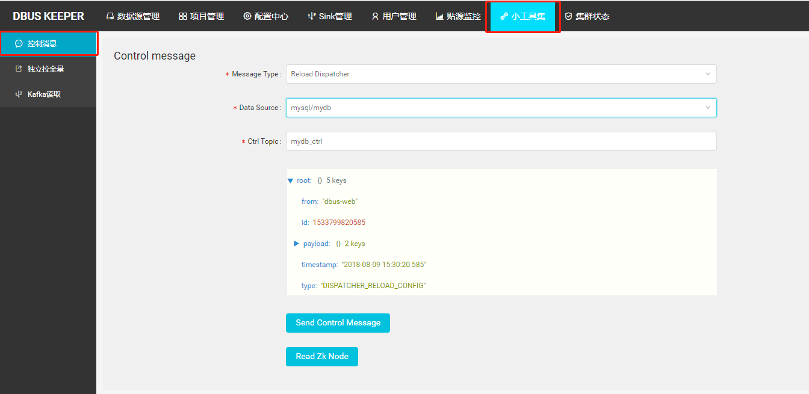
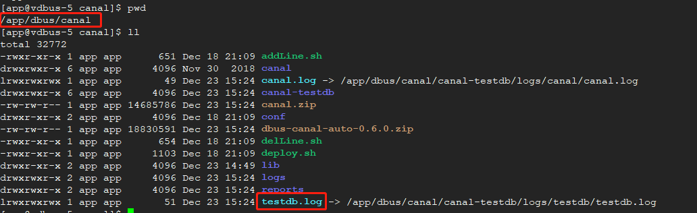

* This will become a table of contents (this text will be scraped).
 {:toc}
***

## Q1:为什么grafana不显示统计数据？
dbus是一个包含多个模块流式计算系统，实时数据需要经过的链路为：`canal`→`extractor`→`dispatcher`→`appender`，任何一个环节出现问题都可能导致grafana中无法显示统计数据，针对以下三种场景给出问题的可能的原因以及解决办法；
* 添加schema或table

    可能原因：缓存没有成功刷新或者配置没有被重新加载，添加schema或者table时系统已经处于运行状态中，各个模块都有自己的本地缓存，新添加的table保存在数据库或者zookeeper中，正常情况下dbus web管理功能中添加schema或table后会自动发送控制消息通知相关模块重新加载配置、刷新缓存，如果由于某种原因导致发送控制消息失败或者相关模块处理控制消息失败则可能出现grafana中看不到统计数据折线图的情况

    解决办法：手动调用相关模块的重新加载功能，需要重新加载的模块有`extractor`、`dispatcher`和`appender`，重新加载模块功能请参考：[如何重新加载模块](#faq_control_message)

* 新建数据线
    可能原因一：新建数据线后并没有自动reload `heartbeat`模块

    解决办法：手动reload `hreatbeat`模块，请参考：[如何重新加载模块](#faq_control_message)


    可能原因二：请确认是否配置了canal抽取端
    解决办法：参考canal抽取端配置
* 拉全量导致的问题

    可能原因：拉全量时会暂时停止`appender`模块的数据流，在无论全量拉取成功或失败都会发送控制消息给`appender`模块，`appender`模块接收到控制消息后会唤醒数据接收线程(spout)继续处理数据，但如果全量模块因为某种原因没有发送控制消息给`appender`模块，则数据流会一直处于暂停状态，grafana监控中便无法显示`增量计数`，这样’增量计数’和`分发器计数`两条折线将会不同步。

    解决办法：登录dbus web进入到`Data table`菜单，在查询条件中选择datasource，在schemaName输入框中输入相应的schema name点击Search并在列表中找到停止处理数据的表（状态为非`ok`状态），点击`IncrementPuller`按钮即可恢复数据流.


## Q2:为什么monitor页面无法显示？
此页面的地址需在web配置页面进行配置，Global-Config的Monitor内容为此页面的地址。将统计数据的grafana页面的url填入Monitor保存即可。

## Q3:如何重新加载模块？

模块重新加载功能通过发送 `control message` 实现，请登录dbus web管理系统进入 `control message` 页面，如下图所示，其中 `message type` 定义了要加载的模块，`data source` 定义了要加载的数据源，`ctrl_topic` 表示消息写入的kafka topic，此项不需要修改，下方为消息预览和 `Send Control Message` 按钮，点击这个按钮即可完成控制消息的发送从而完成模块重新加载.




## Q4:一键上线为何失败？

一键上线的作用是配置抽取新数据库数据的完整流程，因此影响一键上线的因素非常多，下面针对一键上线中步骤中需要注意的问题：

* 数据源基本信息需要填写user和password， 这里user指的是**和待抽取的数据库在同一个Mysql实例的dbus用户的用户名和密码**，dbus用户一键上线之前操作之前需要被赋予待抽取数据库表的 `select` 权限，可以参考FAQ：[Q6:如何授权dbus用户读取源端表](#faq_auth_tab2dbus)

* 选择schema这一步可以参考[add schema and table流程]( https://github.com/BriData/DBus/wiki/Usage(5)-add-schema-and-table)

* 修改zk配置步骤中 ` Clone ZkConf From Templates` 的作用是将zookeeper 中的节点 `/DBus/ConfTemplates` 下的所有节点复制一份并做一些适当的修改以作为新创建的数据源的配置信息。这里能够成功的前提是在前期的准备过程中已经对`/DBus/ConfTemplates` 节点进行过初始化，初始化过程请参考：[Usage(2) Start and Check](https://github.com/BriData/DBus/wiki/Usage(2)-Start-and-Check#4-storm)

* 启动Topology步骤的作用是运行三个storm topology，启动storm topology之前需要首先将topology jar和启动脚本包上传的storm nimbus所在服务器的指定目录，同时在 `global config` 中配置启动脚本所在的目录，参考：[Usage(3) web basic configuration]( https://github.com/BriData/DBus/wiki/Usage(3)-web-basic-configuration)的全局配置部分，由于dbus web服务器和storm nimbus服务器通常不是同一台服务器，因此需要配置两台机器之间的ssh免密登录。

## Q5:如何看监控和报警？

**邮件**

内容形式为：

    Address: abc@126.com
    Subject: DBus心跳监控报警
    Contents: 尊敬的先生/女士您好，Dbus心跳监控发现数据线路:/DBus/HeartBeat/Monitor/db/schema/table发生异常，报警次数:1,超时次数:1,请及时处理.

**DBus-Web**

* 检查表状态是否ok

* 查看版本变更历史

* 查看Grafana

**心跳日志**

在心跳log中，搜索关键字：`Address`或`Subject`或`Contents`，即可找到报警记录

## Q6:如何授权dbus用户读取源端表?

dbus web会通过`data source` 中的 `slave_url` 和 `dbus` 用户与源库建立jdbc连接，以便于通过dbus web配置以及使用dbus系统进行初始化数据拉取，因此为了能够读取到源库表的信息，需要给`dbus`用户赋带抽取表的查询权限，具体授权语句如下：
```sql
-- db.table 是需要同步的表名
grant select on db1.table to dbus;
```

## Q7:初始化心跳后没有找到心跳进程?

如果发现初始化心跳后没有进程，请检查心跳所在服务器是否安装了unzip命令。初始化需要unzip命令支持。

## Q8:启动Topology时报和storm.py相关异常?

启动topology时报如下异常：

```sql
Traceback (most recent call last):
  File "/app/dbus-allinone/apache-storm-1.0.1/bin/storm.py", line 766, in <module>
    main()
  File "/app/dbus-allinone/apache-storm-1.0.1/bin/storm.py", line 763, in main
    (COMMANDS.get(COMMAND, unknown_command))(*ARGS)
  File "/app/dbus-allinone/apache-storm-1.0.1/bin/storm.py", line 234, in jar
    transform_class = confvalue("client.jartransformer.class", [CLUSTER_CONF_DIR])
  File "/app/dbus-allinone/apache-storm-1.0.1/bin/storm.py", line 144, in confvalue
    p = sub.Popen(command, stdout=sub.PIPE)
  File "/usr/lib64/python2.6/subprocess.py", line 642, in __init__
    errread, errwrite)
  File "/usr/lib64/python2.6/subprocess.py", line 1238, in _execute_child
    raise child_exception

OSError: [Errno 2] No such file or directory
```

原因：ssh -p 22 root@localhost没有把JAVA_HOME环境变量带过来。

解决办法： 

```sql
1.在~/.bashrc文件配置 JAVA_HOME环境变量 
2.在/apache-storm-1.0.1/bin/storm 脚本最上面增加java环境变量
export JAVA_HOME=/opt/programs/jdk1.8.0_152
export JRE_HOME=/opt/programs/jdk1.8.0_152/jre
export CLASSPATH=.:$JAVA_HOME/lib/dt.jar:$JAVA_HOME/lib/tools.jar:$JRE_HOME/lib
export PATH=$PATH:$JAVA_HOME/bin:$JRE_HOME/bin
```
## Q9:关系型数据库，拉全量卡死，Topo重启

关系型数据库数据类型多种多样。当类型为char/varchar的列被作为分片列，里面存储的是普通字符串，或md5/uuid编码后的字符串，拉全量会遇到困难，因为分片的上下界不是列式数字那样的简单的比较了。对于这样的列，如不做特殊配置，dbus按片拉取的时候可能会出现长时间卡死，导致全量拉取topology重启。具体原因可参考：https://mp.weixin.qq.com/s?__biz=MzU4MTUwMTI4Mw==&mid=2247483749&idx=1&sn=e03d8c9a1e7db56c2615a8cebc289a73&chksm=fd47e969ca30607f5d42d0e5f5b227481526a56e0814ef6242d0046786bbac58241b01aa2d07&scene=0#rd

所以，当分片列为md5、uuid或普通字符串时，建议进行拆片风格的特殊配置，以保证dbus顺利拉取全量数据。

具体配置步骤如下：


## Q10:关于dbus的日志

### 1、dbusweb日志：

位于dbusweb部署根目录的logs目录下。

```
config.log         --本地配置中心日志，一般无需关心
register.log       --本地注册中心日志，一般无需关心
gateway.log        --本地网关日志，记录了全部来自页面的调用记录
mgr.log            --控制台日志，记录了所有的dbus关键处理过程相关日志，关注度较高
service.log        --数据库层面服务日志，记录了所有的dbus和数据库交互的相关日志,关注度较高
```

### 2、dbus流式数据处理相关日志

#### 2.1、mysql

**以数据线testdb为例:**

canal部署在dbusn1的 /app/dbus/canal目录下，testdb.log就是canal的日志，或者进到canal-testdb/logs下查看



mysql-exteractor抽取(0.6.1版本废弃该模块)、dispatcher-appender增量、splitter-puller全量日志均在storm的worker日志目录下。


以mysql-exteractor为例：先通过dbusweb找到worker所在的机器和日志位置，登录机器查看，dbusweb提供最后500行的预览


#### 2.2、oracle

**以数据线orcl为例：**

ogg的replicat状态查看：去你的ogg部署的根目录执行

```
[oracle@dbus-n2 golden]$ ./ggsci 
Oracle GoldenGate for Big Data
Version 12.3.1.1.1

Oracle GoldenGate Command Interpreter
Version 12.3.0.1.0 OGGCORE_OGGADP.12.3.0.1.0GA_PLATFORMS_170828.1608
Linux, x64, 64bit (optimized), Generic on Aug 28 2017 17:13:45
Operating system character set identified as UTF-8.

Copyright (C) 1995, 2017, Oracle and/or its affiliates. All rights reserved.


GGSCI (vdbus-11) 1> info orcl

REPLICAT   ORCL      Last Started 2019-12-17 14:32   Status RUNNING
Checkpoint Lag       00:00:00 (updated 03:18:19 ago)
Log Read Checkpoint  File /u01/golden/dirdat/aa000000000
                     2019-12-19 14:53:04.988283  RBA 20109

```

状态不是running请查看该目录下的ggserr.log查看错误信息

dispatcher-appender增量、splitter-puller全量日志均在storm的worker日志目录下，同mysql相同方法查看。


## Q11:mysql表无数据

举例数据线testdb的schema1库的t1表

**首先查看表的状态是否是running状态，非正常状态请先启动表。 表管理->目标表->操作->启动。**

### 1、mysql数据流转图：

```
dbus 0.6.0
增量数据流转：
canal  -> extractor -> 一级topic(数据线同名,例如:testdb) 
-> dispatcher -> 二级topic(数据线.schema 例如:testdb.schema1)
-> appender -> 三级topic(数据线.schema.result  例如:testdb.schema1.result)

dbus 0.6.1
增量数据流转：
canal -> 一级topic(数据线同名,例如:testdb) 
-> dispatcher -> 二级topic(数据线.schema 例如:testdb.schema1)
-> appender -> 三级topic(数据线.schema.result  例如:testdb.schema1.result)
```

### 2、快速定位错误：

#### 方式一 表管理检查数据线：

该方式最简单最快捷,但是最不准确,结果仅供参考,推荐程度☆☆☆

正常检查数据线结果


1.插入心跳包失败： 检查主库数据库权限，或者查看service.log日志，查看错误原因。

2.抽取进程失败：查看canal日志是否异常，canal无异常，0.6.0版本还要查看mysql-exteractor日志获取具体异常信息。

3.分发进程和增量进程失败：查看dispatcher-appender日志获取具体异常信息。

#### 方式二 kafka小工具

该方式最准确,结果仅供参考,推荐程度☆☆☆☆☆☆☆☆☆☆☆☆☆☆.......

通过kafka小工具，查看第一级、第二级、第三级的offset有没有增长，没有增长说明有问题

查看第一级topic  testdb，没有数据说明canal或者mysql-exteractor异常

查看第二级topic  testdb.schema1和第三级topic testdb.schema1.result没有数据说明dispatcher-appender有问题，目前dispatcher appender是一个worker进程，一起部署的。

#### 方式三 grafana

此方式依赖心跳正常工作,推荐程度☆☆☆


## Q12:oracle表无数据

举例数据线orcl的utest库的customer表

**首先查看表的状态是否是running状态，非正常状态请先启动表。 表管理->目标表->操作->启动。**

### 1、oracle数据流转图：

```
增量数据流转：
源端ogg extractor进程发送数据到目标端ogg,在dirdata下生成指定前缀的日志文件,例如：aa000000000
->目标端ogg replicat进程读取aa000000000日志文件 -> 一级topic(数据线同名,例如:testdb) 
-> dispatcher -> 二级topic(数据线.schema 例如:testdb.schema1)
-> appender -> 三级topic(数据线.schema.result  例如:testdb.schema1.result)
```

### 2、快速定位错误：

#### 方式一 表管理检查数据线：

该方式最简单最快捷,但是最不准确,结果仅供参考,推荐程度☆☆☆

正常检查数据线结果


1.插入心跳包失败： 检查主库数据库权限，或者查看service.log日志，查看错误原因。

2.抽取进程失败：查看源端或者目标端ogg日志获取具体异常信息。

3.分发进程和增量进程失败：查看dispatcher-appender日志获取具体异常信息。

#### 方式二 kafka小工具

该方式最准确,结果仅供参考,推荐程度☆☆☆☆☆☆☆☆☆☆☆☆☆☆.......

通过kafka小工具，查看第一级、第二级、第三级的offset有没有增长，没有增长说明有问题

查看第一级topic  testdb，没有数据说明源端或者目标端ogg异常。

查看第二级topic  testdb.schema1和第三级topic testdb.schema1.result没有数据说明dispatcher-appender有问题，目前dispatcher appender是一个worker进程，一起部署的。

#### 方式三 grafana

此方式依赖心跳正常工作,推荐程度☆☆☆


#### 均无异常

查看源端ogg是否配置抽取该表

```
[oracle@vdbus-10 golden]$ ./ggsci 

Oracle GoldenGate Command Interpreter for Oracle
Version 12.2.0.1.1 OGGCORE_12.2.0.1.0_PLATFORMS_151211.1401_FBO
Linux, x64, 64bit (optimized), Oracle 12c on Dec 12 2015 02:56:48
Operating system character set identified as UTF-8.

Copyright (C) 1995, 2015, Oracle and/or its affiliates. All rights reserved.


GGSCI (vdbus-10) 1> info all

Program     Status      Group       Lag at Chkpt  Time Since Chkpt

MANAGER     RUNNING                                           
EXTRACT     RUNNING     ORCL        00:00:00      00:00:04    
EXTRACT     RUNNING     ORCL19      00:00:00      00:00:08    


GGSCI (vdbus-10) 2> view param orcl

EXTRACT ORCL
SETENV (NLS_LANG=AMERICAN_AMERICA.AL32UTF8)
USERID ogg,PASSWORD ogg
RMTHOST vdbus-11, MGRPORT 7809
rmttrail /u01/golden/dirdat/aa
DDL INCLUDE MAPPED
TRANLOGOPTIONS DBLOGREADER

TABLE UTEST.CUSTOMER;

```

查看目标端ogg是否配置抽取该表

## Q13: HeartBeat schema hash不一致


原因dbus提供的.avsc文件和你的ogg生成的.avsc文件不一致

解决方法:

到目标端ogg根目录下的dirdef目录(举例:/u01/golden123111/dirdef)，找到

DBUS.DB_HEARTBEAT_MONITOR.avsc
DBUS.META_SYNC_EVENT.avsc

替换 dbus-stream-main-0.6.0-jar-with-dependencies.jar 根目录的对应文件

替换方法: 建议采用vim命令直接修改文件内容,以上文件有几个替换几个

## Q14:启动拓扑zookeeper节点报错

启动数据源的拓扑经常报各种错误例如：NumberFormatException，NullPointerException ...多数情况就是数据源的配置被改坏了,这就需要重置数据源配置

**处理方法:**数据源管理->找到对应数据源->点击[拓扑管理]按钮,第二个按钮->点击任意[修改配置]按钮,第三个按钮->点击左下角[恢复初始化配置]


