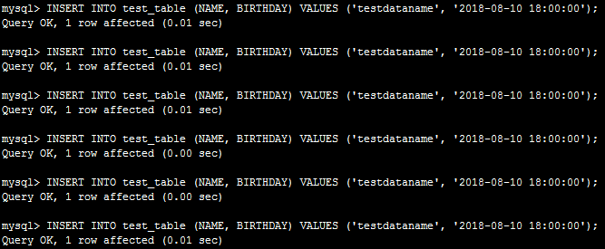
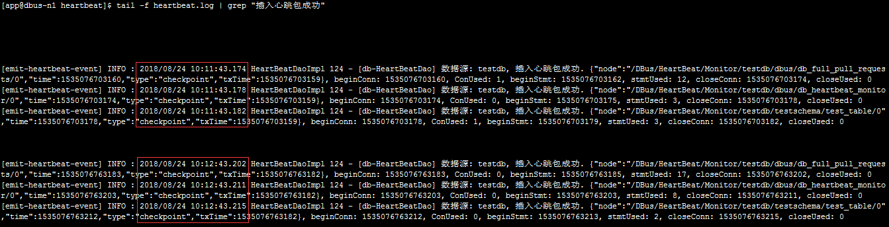
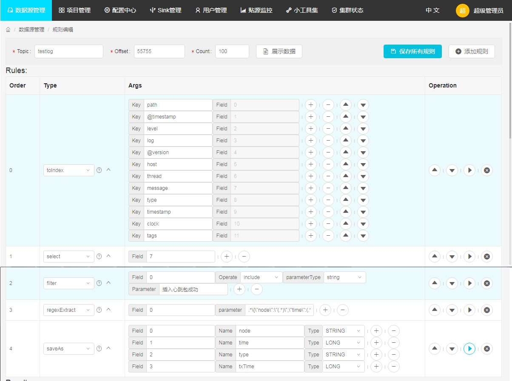
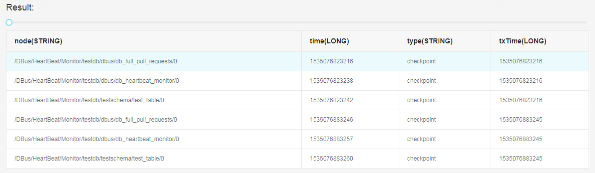
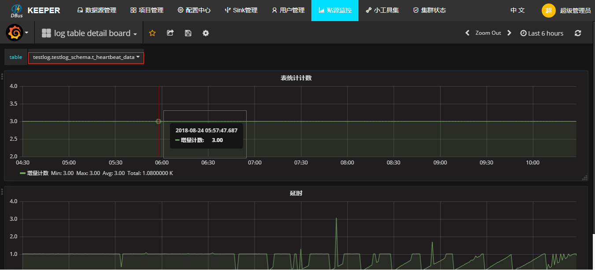
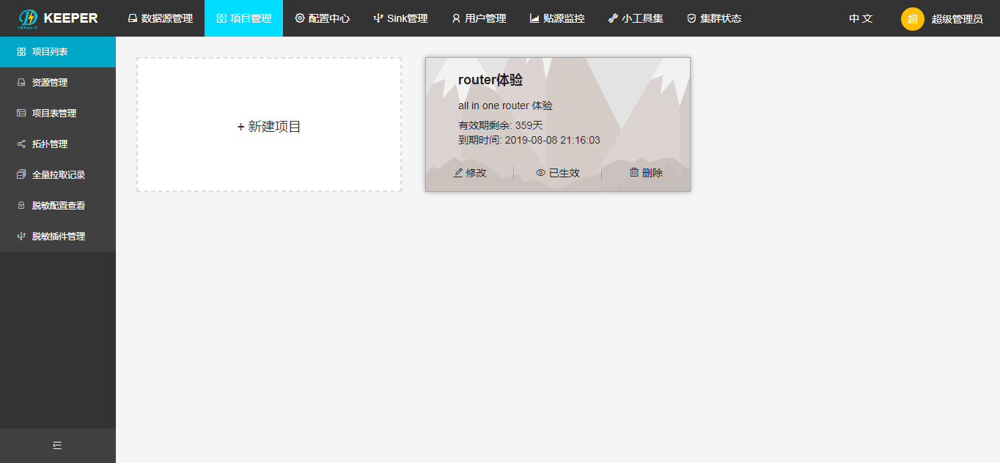
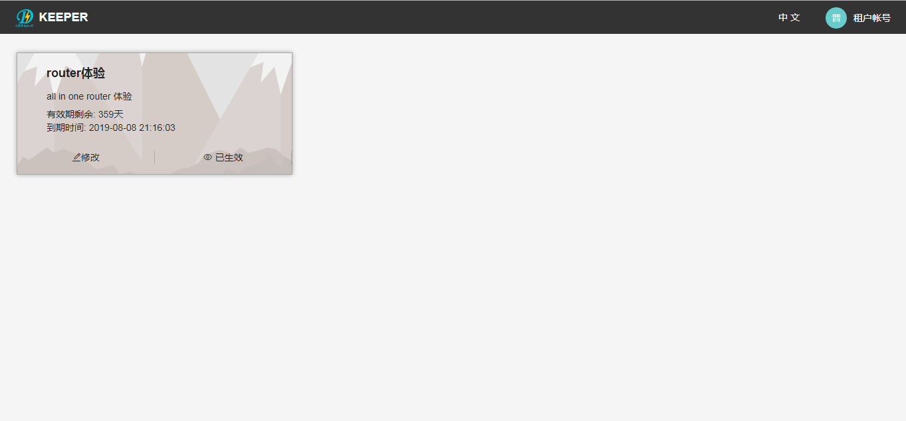

* This will become a table of contents (this text will be scraped).
{:toc}

# 1. 环境说明

**当前版本v0.5.0，如需尝试最新版dbus，请移步集群配置版。**

all in one是一个单机版本dbus环境，是给用户快速体验dbus的功能，只是一个简单体验版，不能用于其它环境或者用途，具体包括如下：

- 基础组建：
  - zookeeper  3.4.6
  - kafka 0.10.0.0
  - storm 1.0.1
  - granfana  4.2.0
  - logstash 5.6.1
  - influxdb （需要单独安装， 参考如下步骤3）
  - mysql （需要单独安装，参考如下步骤2）
- dbus相关包：
  - dbus-keeper 0.5.0
  - dbus-stream-main 0.5.0
  - dbus-router 0.5.0
  - dbus-heartbeat 0.5.0
  - dbus-log-processor 0.5.0
- mysql数据源所需：
  - canal 

### 1.1 环境依赖

安装dbus-allinone环境的建议配置如下

- JDK 1.8.181 或 以上

- CPU 2核 或以上

- 内存 16GB或以上

- 磁盘 20GB或以上

注：一台Linux centos服务器， 该服务器最好是空机器，上面不要安装dbus所依赖的zk，kafka，storm等

### 1.2 修改域名

注：ip是您的具体ip，这里用192.168.0.1为例子

修改服务器/etc/hosts文件设置相应的域名信息如下：

```
192.168.0.1 dbus-n1
```

修改服务器hostname命令如下：

```
hostname dbus-n1
```

配置好后，服务器IP和域名信息如下：

| No   | IP                                       | 域名      |
| ---- | ---------------------------------------- | ------- |
| 1    | 192.168.0.1（该ip是您的具体ip，这里用192.168.0.1为例子） | dbus-n1 |

### 1.3 创建app用户及配置SSH免密登录

由于dbus启动拓扑采用的ssh调用storm命令，all in one包中默认的调用ssh使用app用户和22端口，因此要正常体验all in one需要创建app账户和配置ssh免密登录，免密登录配置的从dbus-n1到dbus-n1的免密登录

配置完成后执行如下命令看时候配置成功

```
[app@dbus-n1 ~]$ ssh -p 22 app@dbus-n1
Last login: Fri Aug 10 15:54:45 2018 from 10.10.169.53
[app@dbus-n1 ~]$
```


# 2. 前期准备

## 2.1 安装Mysql

### 2.1.1 下载

推荐下载Mysql版本：5.7.19 地址：[https://dev.mysql.com/downloads/mysql/](https://dev.mysql.com/downloads/mysql/)

### 2.1.2 安装

解压mysql-5.7.19-1.el6.x86_64.rpm-bundle.tar包后，执行以下命令安装：

```
rpm -ivh mysql-community-server-5.7.19-1.el6.x86_64.rpm --nodeps
rpm -ivh mysql-community-client-5.7.19-1.el6.x86_64.rpm --nodeps
rpm -ivh mysql-community-libs-5.7.19-1.el6.x86_64.rpm --nodeps
rpm -ivh mysql-community-common-5.7.19-1.el6.x86_64.rpm --nodeps
rpm -ivh mysql-community-libs-compat-5.7.19-1.el6.x86_64.rpm --nodeps
```

### 2.1.3 配置

在/etc/my.cnf配置文件中，只是增加bin-log相关配置，其他不用修改，关注以下汉字注释部分

```
[mysqld]
# dbus相关配置开始
log-bin=mysql-bin
binlog-format=ROW
server_id=1
# dbus相关配置结束
```

### 2.1.4 启动

执行以下命令启动mysql:

```
service mysqld start
```

## 2.2. 安装InfluxDB

### 2.2.1 下载

推荐下载InfluxDB版本：influxdb-1.1.0.x86_64
地址：[https://portal.influxdata.com/downloads](https://portal.influxdata.com/downloads)

### 2.2.2 安装

在dbus-n1上切换到root用户，在influxdb-1.1.0.x86_64.rpm的存放目录下执行如下命令：

```
rpm -ivh influxdb-1.1.0.x86_64.rpm
```

### 2.2.3 启动

在dbus-n1上执行如下命令：

```
service influxdb start
```

### 2.2.4 初始化配置

在dbus-n1上执行如下命令：

```
#登录influx
influx

#执行初始化脚本
create database dbus_stat_db
use dbus_stat_db
CREATE USER "dbus" WITH PASSWORD 'dbus!@#123'
ALTER RETENTION POLICY autogen ON dbus_stat_db DURATION 15d
```


# 3. 安装Dbus-allinone包

### 3.1 下载

在百度网盘提供dbus-allinone.tar.gz  包，访问 [release 页面下载最新包](https://github.com/BriData/DBus/releases)

### 3.2 安装

将下载的dbus-allinone包上传到服务器 /app目录下，且必须在此目录下

```
# 如果没有app目录，要先创建app目录
mkdir /app
cd /app
tar -zxvf dbus-allinone.tar.gz
```

### 3.3 初始化数据库

以root身份登录mysql客户端，执行以下命令进行数据库初始化，会创建dbmgr库以及用户、canal用户、dbus库以及用户、testschema库以及用户：

```
source /app/dbus-allinone/sql/init.sql
```

### 3.4 启动

执行start.sh一键启动dbus所有服务，启动项比较多。

```
cd /app/dbus-allinone
./start.sh
```

请耐心等待(大概需要5分钟左右时间)，正确的启动日志如下：
```
Start grafana...
Grafana started. pid: 23760
=============================================================================================
Start zookeeper...
zookeeper pid 23818
Zookeeper started.
=============================================================================================
Start kafka...
No kafka server to stop
kafka pid 24055
kafka started.
=============================================================================================
Start Canal ... 
canal started.
=============================================================================================
Start logstash...
No logstash to stop
nohup: appending output to `nohup.out'
logstash pid 24151
logstash started.
=============================================================================================
Start storm nimbus...
No storm nimbus to stop
Storm nimbus pid 24215
Storm nimbus started.
=============================================================================================
Start storm supervisor...
No storm supervisor to stop
Storm supervisor pid 24674
Storm supervisor started.
=============================================================================================
Start storm ui...
No storm ui to stop
Storm ui pid 24939
Storm ui started. ui port: 6672
=============================================================================================
Stop storm topology.
Storm topology stoped.
=============================================================================================
Start storm topology...
Storm topology started.
=============================================================================================
Start Dbus Heartbeat...
No Dbus Heartbeat to stop
Dbus Heartbeat pid 26854
Dbus Heartbeat started.
=============================================================================================
Start Dbus keeper...
=========================stop===========================
keeper-proxy process not exist
gateway process not exist
keeper-mgr process not exist
keeper-service process not exist
register-server process not exist

=========================start===========================
register-server started. pid: 27077
keeper-proxy  started. pid: 27172
gateway started. pid: 27267
keeper-mgr started. pid: 27504
keeper-service started. pid: 27645
Dbus keeper prot: 6090
Dbus keeper started.
=============================================================================================
```


### 3.5 生成检查报告看是否启动正常

进入目录/app/dbus-allinone/allinone-auto-check-0.5.0，执行自动检测脚本auto-check.sh，稍等待一会儿

```
cd /app/dbus-allinone/allinone-auto-check-0.5.0
./auto-check.sh
```

会在目录/app/dbus-allinone/allinone-auto-check-0.5.0/reports下生产对应时间的检查报告，如下所示

```
[app@dbus-n1 reports]$ tree
.
└── 20180824111905
    └── check_report.txt
```

打开check_report.txt文件查看相应的检查报告，如下所示

（注意以#开头为解释说明信息，报告中不会生成 ）

```
# 出现以下信息说明dbusmgr库正常
check db&user dbusmgr start:
============================================
table t_avro_schema data count: 0
table t_data_schema data count: 4
table t_data_tables data count: 4
table t_dbus_datasource data count: 2
table t_ddl_event data count: 0
table t_encode_columns data count: 0
table t_encode_plugins data count: 1
table t_fullpull_history data count: 0
table t_meta_version data count: 5
table t_plain_log_rule_group data count: 1
table t_plain_log_rule_group_version data count: 1
table t_plain_log_rule_type data count: 0
table t_plain_log_rules data count: 5
table t_plain_log_rules_version data count: 5
table t_project data count: 1
table t_project_encode_hint data count: 1
table t_project_resource data count: 1
table t_project_sink data count: 1
table t_project_topo data count: 1
table t_project_topo_table data count: 1
table t_project_topo_table_encode_output_columns data count: 1
table t_project_topo_table_meta_version data count: 0
table t_project_user data count: 1
table t_query_rule_group data count: 0
table t_sink data count: 1
table t_storm_topology data count: 0
table t_table_action data count: 0
table t_table_meta data count: 7
table t_user data count: 2

# 出现以下信息说明dbus库正常
check db&user dbus start:
============================================
table db_heartbeat_monitor data count: 15
table test_table data count: 0
table db_full_pull_requests data count: 0

# 出现以下信息说明canal用户正常
check db&user canal start: 
============================================
master status File:mysql-bin.000002, Position:12047338
table db_heartbeat_monitor data count: 15
table test_table data count: 0
table db_full_pull_requests data count: 0

# 出现以下信息说明testschema库正常
check db&user testschema start: 
============================================
table test_table data count: 0

# 出现以下信息说明zk启动正常
check base component zookeeper start: 
============================================
23818 org.apache.zookeeper.server.quorum.QuorumPeerMain

# 出现以下信息说明kafka启动正常
check base component kafka start: 
============================================
24055 kafka.Kafka

# 出现以下信息说明storm nimbus、supervisor、ui 启动正常
check base component storm start: 
============================================
26500 org.apache.storm.daemon.worker
25929 org.apache.storm.daemon.worker
27596 org.apache.storm.LogWriter
26258 org.apache.storm.LogWriter
24215 org.apache.storm.daemon.nimbus
27035 org.apache.storm.LogWriter
27611 org.apache.storm.daemon.worker
26272 org.apache.storm.daemon.worker
24674 org.apache.storm.daemon.supervisor
24939 org.apache.storm.ui.core
26486 org.apache.storm.LogWriter
27064 org.apache.storm.daemon.worker
25915 org.apache.storm.LogWriter

# 出现以下信息说明influxdb 启动正常
check base component influxdb start: 
============================================
influxdb 10265     1  0 Aug08 ?        02:28:06 /usr/bin/influxd -pidfile /var/run/influxdb/influxd.pid -config /etc/influxdb/influxdb.conf
app      28823 28746  0 11:19 pts/3    00:00:00 /bin/sh -c ps -ef | grep influxdb
app      28827 28823  0 11:19 pts/3    00:00:00 grep influxdb

# 出现以下信息说明grafana 启动正常
check base component grafana start: 
============================================
app      23760     1  0 11:09 pts/3    00:00:00 ./grafana-server
app      28828 28746  0 11:19 pts/3    00:00:00 /bin/sh -c ps -ef | grep grafana
app      28832 28828  0 11:19 pts/3    00:00:00 grep grafana

# 出现以下信息说明心跳heartbeat 启动正常
check base component heartbeat start: 
============================================
26854 com.creditease.dbus.heartbeat.start.Start

# 出现以下信息说明logstash 启动正常
check base component logstash start: 
============================================
24151 org.jruby.Main

# 出现以下信息说明canal 启动正常
check canal start: 
============================================
zk path [/DBus/Canal/otter-testdb] exists.
24105 com.alibaba.otter.canal.deployer.CanalLauncher

# 出现以下信息说明dispatcher-appender、mysql-extractor、splitter-puller、router 启动正常
check topology start: 
============================================
api: http://dbus-n1:6672/api/v1/topology/summary
topology testlog-log-processor status is ACTIVE
topology testdb-mysql-extractor status is ACTIVE
topology testdb-splitter-puller status is ACTIVE
topology testdb-dispatcher-appender status is ACTIVE
topology tr-router status is ACTIVE

# 出现以下信息说明从数据库->extractor-dispatcher->appender线路正常
check flow line start: 
============================================
first step insert heart beat success.
data arrive at topic: testdb
data arrive at topic: testdb.testschema
data arrive at topic: testdb.testschema.result
```


# 4. 验证all in one包是否安装成功

### 登录grafana前提

需要在通过浏览器登录grafana的机器配置host文件，如果已经配置过请跳过此前提

如果验证机器是windows系统，修改C:\Windows\System32\drivers\etc\hosts文件设置相应的域名信息如下：

```
# 192.168.0.1 替换成部署allinone包的服务器ip地址
192.168.0.1 dbus-n1
```

如果验证机器是linux系统，修改/etc/hosts文件设置相应的域名信息如下：

```
# 192.168.0.1 替换成部署allinone包的服务器ip地址
192.168.0.1 dbus-n1
```

### 4.1 登录grafana

登录grafana url地址: http://dbus-n1:3000/login


### 4.2 mysql插入数据验证

```
#登录测试用户
mysql -utestschema -p     #testschema账户密码：j0<C6cqcqr:TestSchema
#执行测试脚本
use testschema;
INSERT INTO test_table (NAME, BIRTHDAY) VALUES ('testdataname', '2018-08-10 18:00:00');
INSERT INTO test_table (NAME, BIRTHDAY) VALUES ('testdataname', '2018-08-10 18:00:00');
INSERT INTO test_table (NAME, BIRTHDAY) VALUES ('testdataname', '2018-08-10 18:00:00');
INSERT INTO test_table (NAME, BIRTHDAY) VALUES ('testdataname', '2018-08-10 18:00:00');
INSERT INTO test_table (NAME, BIRTHDAY) VALUES ('testdataname', '2018-08-10 18:00:00');

```



### 4.3 查看DBus是否实时获取到数据


# 5. 验证logstash抽取心跳日志是否安装成功

dbus-heartbeat心跳模块儿产生日志位置在：/app/dbus-allinone/dbus-heartbeat-0.5.0/logs/heartbeat/heartbeat.log，利用logstash抽取该日志文件，把非结构化的数据，提取成结构化的数据

### 5.1 日志中原始非结构化数据如下：

通过如下命令，查看要提取的非结构化数据，如下图所示，每一分钟产生3条包含"插入心跳包成功"的日志

```
cd /app/dbus-allinone/dbus-heartbeat-0.5.0/logs/heartbeat/
tail -f heartbeat.log | grep "插入心跳包成功"
```



### 5.2 在Dbus Keeper上配置相应的结构化规则和查看规则执行后的结果

提取规则如下图：



规则执行后结果



### 5.3 在grafana查看实时提取流量监控

选择log table deatil board


选择table：testlog.testlog_schema.t_heartbeat_data 




# 6. 登录DBus Keeper体检UI操作

### 登录dbus keeper前提

需要在通过浏览器登录dbus keeper的机器配置host文件，如果已经配置过请跳过此前提

如果验证机器是windows系统，修改C:\Windows\System32\drivers\etc\hosts文件设置相应的域名信息如下：

```
# 192.168.0.1 替换成部署allinone包的服务器ip地址
192.168.0.1 dbus-n1
```

如果验证机器是linux系统，修改/etc/hosts文件设置相应的域名信息如下：

```
# 192.168.0.1 替换成部署allinone包的服务器ip地址
192.168.0.1 dbus-n1
```

### 6.1登录dbus keeper

登录dbus keeper url地址：http://dbus-n1:6090/login


体验管理员功能，请使用用户：admin   密码：12345678

管理员界面如下:




体验租户功能，请使用用户：user@dbus.com   密码：12345678

租户界面如下:

