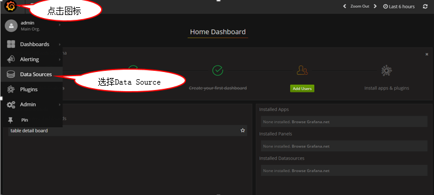
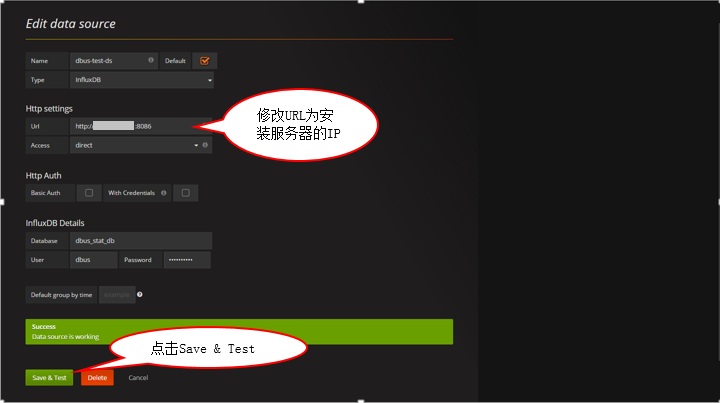
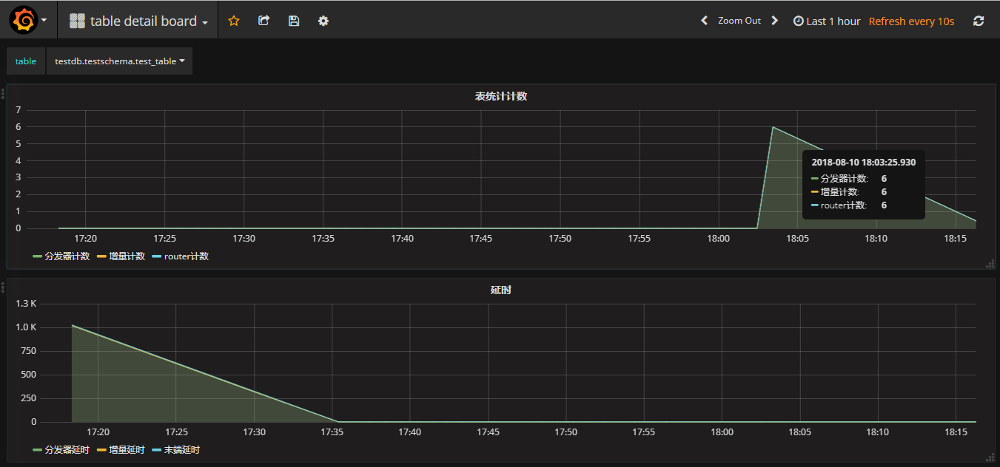
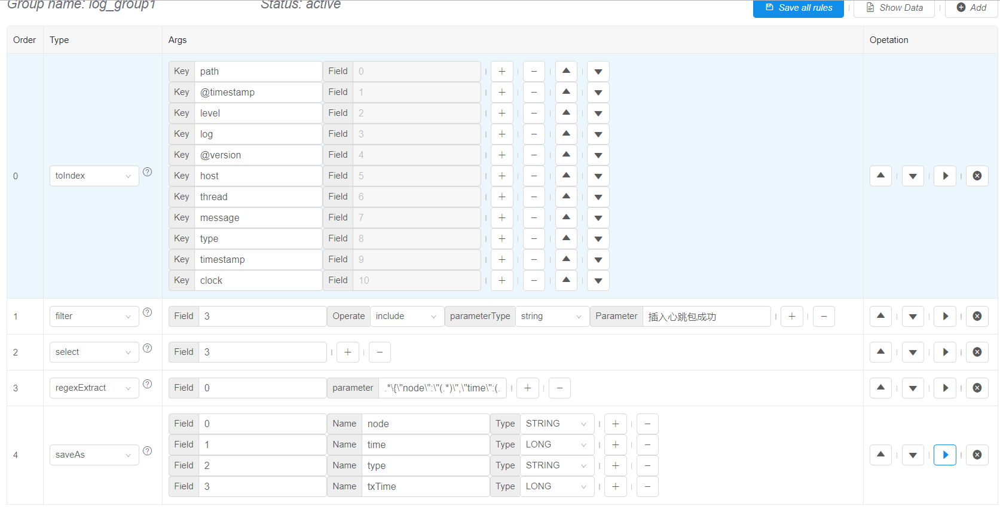

# 1. 环境说明

### 1.1 安装dbus-allinone包前提 

安装dbus-allinone环境最少需要一台Linux服务器，例如服务器信息如下：

| No   | IP          | 域名      |
| ---- | ----------- | ------- |
| 1    | 192.168.0.1 | dbus-n1 |

修改服务器/etc/hosts文件设置相应的域名信息如下：

```
192.168.0.1 dbus-n1
```

修改服务器hostname命令如下：

```
hostname dbus-n1
```

# 2. 安装Mysql

### 2.1 下载

推荐下载Mysql版本：5.7.19
地址：[https://dev.mysql.com/downloads/mysql/](https://dev.mysql.com/downloads/mysql/)

### 2.2 安装

解压mysql-5.7.19-1.el6.x86_64.rpm-bundle.tar包后，执行以下命令安装：

```
rpm -ivh mysql-community-server-5.7.19-1.el6.x86_64.rpm --nodeps
rpm -ivh mysql-community-client-5.7.19-1.el6.x86_64.rpm --nodeps
rpm -ivh mysql-community-libs-5.7.19-1.el6.x86_64.rpm --nodeps
rpm -ivh mysql-community-common-5.7.19-1.el6.x86_64.rpm --nodeps
rpm -ivh mysql-community-libs-compat-5.7.19-1.el6.x86_64.rpm --nodeps
```

### 2.3 配置

在/etc/my.cnf配置文件中，增加bin-log相关配置，关注以下汉字注释部分

```
# For advice on how to change settings please see
# http://dev.mysql.com/doc/refman/5.7/en/server-configuration-defaults.html

[mysqld]
#
# Remove leading # and set to the amount of RAM for the most important data
# cache in MySQL. Start at 70% of total RAM for dedicated server, else 10%.
# innodb_buffer_pool_size = 128M
#
# Remove leading # to turn on a very important data integrity option: logging
# changes to the binary log between backups.
# log_bin
#
# Remove leading # to set options mainly useful for reporting servers.
# The server defaults are faster for transactions and fast SELECTs.
# Adjust sizes as needed, experiment to find the optimal values.
# join_buffer_size = 128M
# sort_buffer_size = 2M
# read_rnd_buffer_size = 2M
datadir=/var/lib/mysql
socket=/var/lib/mysql/mysql.sock

# dbus相关配置开始
log-bin=mysql-bin
binlog-format=ROW
server_id=1
# dbus相关配置结束

# Disabling symbolic-links is recommended to prevent assorted security risks
symbolic-links=0

log-error=/var/log/mysqld.log
pid-file=/var/run/mysqld/mysqld.pid
```

### 2.4 启动

执行以下命令启动mysql:

```
service mysqld start
```


# 3. 安装InfluxDB

参考基础组件文档中   [6. 安装InfluxDB](install-base-components.html)


# 4. 安装Dbus-allinone

### 4.1 下载

在百度网盘提供dbus-allinone包，访问 [release 页面下载最新包](https://github.com/BriData/DBus/releases)

### 4.2 安装

将下载的dbus-allinone包上传到服务器 /app目录下，且必须在此目录下

```
# 如果没有app目录，要先创建app目录
mkdir /app
cd /app
tar -zxvf dbus-allinone.tar.gz
```

### 4.3 初始化数据库

以root身份登录mysql客户端，执行以下命令进行数据库初始化：

```
source /app/dbus-allinone/sql/1_init_database_user.sql
source /app/dbus-allinone/sql/2_dbusmgr_tables.sql
source /app/dbus-allinone/sql/3_dbus.sql
source /app/dbus-allinone/sql/4_test.sql
source /app/dbus-allinone/sql/5_canal.sql
```

### 4.4 启动

执行start.sh一键启动dbus所有服务，启动项比较多，请耐心等待，如果失败请查看 [FAQ](more-faq.html)

```
cd /app/dbus-allinone
./start.sh
```

# 5. Grafana配置

### 5.1 登录到http://dbus-n1:3000/login


### 5.2 修改grafana数据源







# 6. 验证Mysql是否安装成功

### 6.1 插入数据验证

```
#登录测试用户
mysql -utestschema -p     #testschema账户密码参考/app/dbus-allinone/sql/4_test.sql
#执行测试脚本
use testschema;
INSERT INTO test_table (NAME, BIRTHDAY) VALUES ('ASFASFASF', '2018-01-25 16:11:20');
INSERT INTO test_table (NAME, BIRTHDAY) VALUES ('QWEQWEQWE', '2018-01-25 16:11:20');
INSERT INTO test_table (NAME, BIRTHDAY) VALUES ('QWEQWEQWE', '2018-01-25 16:11:20');
INSERT INTO test_table (NAME, BIRTHDAY) VALUES ('QWEQWEQWE', '2018-01-25 16:11:20');
INSERT INTO test_table (NAME, BIRTHDAY) VALUES ('QWEQWEQWE', '2018-01-25 16:11:20');
```


### 6.2 查看DBus是否实时获取到数据





# 7. 验证logstash抽取心跳日志是否安装成功

dbus-heartbeat心跳模块儿产生日志位置在：/app/dbus-allinone/dbus-heartbeat-0.4.0/logs/heartbeat/heartbeat.log，利用logstash抽取该日志文件，把非结构化的数据，提取成结构化的数据

### 7.1 日志中原始非结构化数据如下：

通过如下命令，查看要提取的非结构化数据，如下图所示，每一分钟产生3条包含"插入心跳包成功"的日志

```
tail -f heartbeat.log | grep "插入心跳包成功"
```


### 7.2 在Dbus-web上配置相应的结构化规则

提取规则



通过执行规则后的结果


### 7.3 在grafana查看实时提取流量

选择log table deatil board


选择table：testlog.testlog_schema.t_dbus_heartbeat


可以很清楚的看到实时抽取的数量都是3