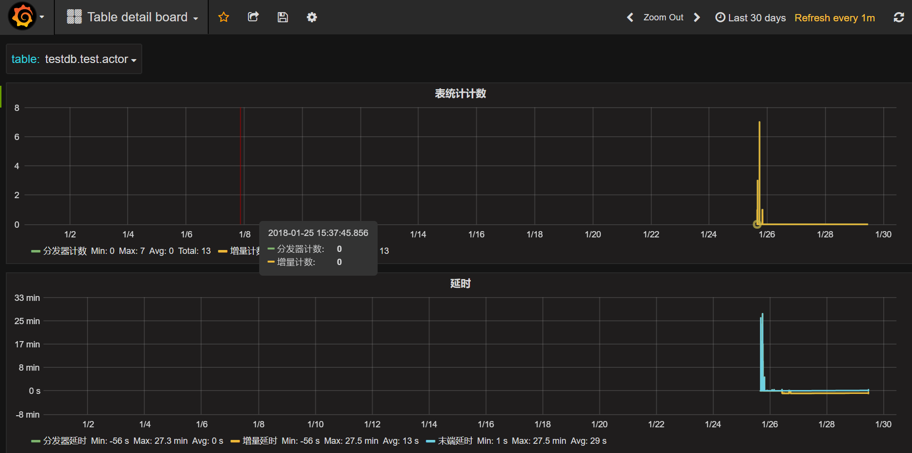

​	目前DBus支持接入多种类型的数据源，包括关系型数据库（mysql/oracle）、日志(可来自logstash、flume、filebeat等)、*平文本、Json*等。其中只有关系型数据库数据源需要添加Schema，其他类型数据源没有此概念。

## 1 关系型数据库类型数据源添加Schema和表

​	一般来说，添加schema，目的是为了接入某张/某些表的数据，所以，DBus没有单独提供专门添加schema的功能，而是将其和添加表融合在一起。因此添加schema和添加表，打开的页面是一样的。在这个页面做完相关操作，点击Next按钮（相当于提交按钮），尚不存在的schema会自动添加到系统。

> 前置条件：在添加schema或table之前，需要给源端数据库dbus用户授予相关表的 `select` 权限。
>
> 对于mysql数据库：授权操作如下：
>
> ```
> -- db.table 是需要同步的表名
> grant select on db1.table to dbus;
> ```
>
> 正确授权后，有权限接入数据的schema/table会自动出现在配置操作页面。

### 1.1 添加schema

​	注：目前DBus支持的所有数据源类型中，仅可对关系型数据库数据源进行添加schema操作。

#### 1.1.1 点击add schema

点击目标数据源对应的+add schema按钮，如下图所示：

## 

#### 1.1.2 新增schema 

进入新增schema页面，如下图：


​	选择要抽取的schema（数据库名称）后，下面的列表会自动刷新显示当前选择的数据库中的表，选中要抽取数据的表后，点击”Next”按钮，系统提示“insert x tables success!”则添加schema成功，此时页面会跳转到table列表页面。 

​	除了schema选择及表选择，其他信息一般不用动，采用默认值即可。

#### <span id="make-table-ok">1.1.3 使新增表生效</span> 

​	在表管理页面，会看到新添加的表的状态为“abort”，点击“more/IncrementPuller”按钮后刷新页面可以看到状态变成“ok”，至此，操作完成，**过两分钟后**可打开grafana确认系统各组件是否重新加载并开始处理新添加表的数据，如何确认请参考：[确认schema或者table添加成功](#confirm-schema-table-added-ok)


#### 1.1.4 使DBus心跳生效
点击Send Control Message按钮，发送reload消息，使心跳生效。


###   1.2 添加表

#### 1.2.1 点击“add table”按钮 

登录dbus web管理系统，进入Data Schema页面，找到要添加新table的schema点击“add table”按钮，如下图：


进入新增table页面。

#### 1.2.2 选取要新增的table 

在新增table页面，你会发现，对于已经抽取过的表，默认是选中状态，且无法操作。


​	在列表中选中要抽取的表，点击”Next”按钮，系统提示“insert x tables success!”则添加table成功.此时页面会跳转到table列表页面

#### 1.2.3  使新增表生效 

同 [1.1.3 使新增表生效](#make-table-ok)
#### 1.2.4 使DBus心跳生效
点击Send Control Message按钮，发送reload消息，使心跳生效。


### <span id="confirm-schema-table-added-ok">1.3 确认schema或者table添加成功</span>

​	添加schema或table完成后，可以打开grafana查看新添加表的数据是否已正常流入dbus stream抽取系统，如下图。一共两组线图，上面一组是计数，下面一组是延时。



​	计数图：正常情况下计数图中"分发计数器"和"增量计数器"两条线是重合的，表示从数据源接收并分发到DBus的数据量，与DBus增量抽取处理的数据量一致。若该组线平直，无波动，表示没有数据进来。此时，若想确认无数据是系统接入问题，还是源端本来就没有数据，可在源端操作一下数据变更，观察该曲线是否有波动。

​	延时图：延时图中的线图，则包含了三类延时信息：分发器延时、增量延时、末端延时。正常情况下，三条线应该走向一致，基本重合，表示系统运行良好，各环节处理顺畅。若发现几条线走向不一致，说明某个环节发生了堵塞延时，有时是大量数据涌来时，不同环节程序吞吐能力不一样导致，有时是源端主备库同步延时时间过长引起，有时是源端数据库大量的跑批任务导致数据库忙引起，需具体情况具体分析。 

​	为方便管理，DBus提供了源端主备同步状态检查功能，请参考：[源端主备同步状态检查](config-inspect-data.html)

​	如果出现问题请参考FAQ：[Q1:grafana中无法显示统计数据的常见解决方案](more-faq.html#faq_grafana_err)  


## 2 Log(日志)类型数据源添加表

​	DBus支持采集、转换来自logstash、logstash（json格式）、flume、filebeat等的日志。对同一个log数据源，可添加多张表。然后通过对每张表配置不同的采集、转换规则，来满足用户多样化的需求。

​	无论是logstash数据源，flume数据源，还是filebeat数据源，加表和配置规则的操作步骤都类似。

​	具体请参考：同 [log类型数据源新增表](install-flume-source.html#log-add-table)