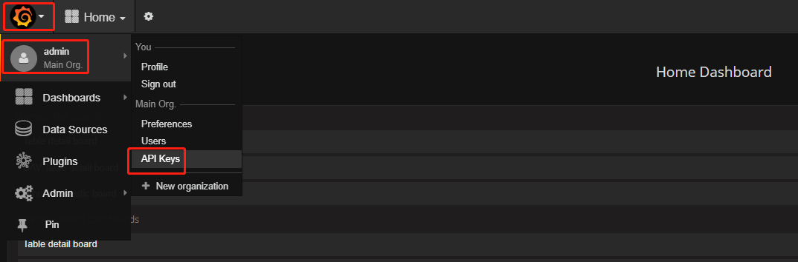

# 1. 环境准备
## 1.1 安装基础组件前提

Dbus集群环境最少需要三台Linux服务器，例如服务器信息如下：


| No   | IP          | 域名         |
| ---- | ----------- | ---------- |
| 1    | 192.168.0.1 | dbus-n1    |
| 2    | 192.168.0.2 | dbus-n2    |
| 3    | 192.168.0.3 | dbus-n3    |
| 4    | 192.168.0.4 | db-dbusmgr |

**所有服务器安装JDK1.8**

修改所有服务器/etc/hosts文件设置相应的域名信息如下：

```
192.168.0.1 dbus-n1
192.168.0.2 dbus-n2
192.168.0.3 dbus-n3
192.168.0.4 db-dbusmgr
```

## 1.2 依赖服务

| 名称            | 版本号      | 说明                                       |
| ------------- | -------- | ---------------------------------------- |
| Canal         | v1.0.22  | DBus用于实时抽取binlog日志。DBus修改一个1文件, 具体配置可参考canal相关支持说明，支持mysql5.6，5.7 |
| Zookeeper     | v3.4.6+  | 用于构建整个系统和提供配置通知等。推荐版本：v3.4.8             |
| Kafka         | v0.10    | 用于存储相关数据和消息，提供订阅和发布的能力                   |
| Storm         | v1.0.1   | 用于提供DBus流式计算                             |
| Influxdb      | v0.13.0  | 用于记录实时监控数据。创建好账号。后续配置需提供。                |
| Grafana       | v4.2.0   | 用于展示监控信息。生成Token信息备用。[点击查看Grafana生成Token步骤](#gen-grafana-token) |
| MySql         | v5.6.x   | 创建数据库dbus_mgr。创建好账号。后续配置需提供。             |
| SSH免密         | -        | 所有机器之间相互配通SSH免密登录。                       |
| kafka-manager | v1.3.0.8 | **选装 **。用于便捷地查看、管理Kafka集群。建议安装。          |

<span id="gen-grafana-token">**[Grafana生成Token信息步骤]**</span>

**步骤一**:点击打开API Keys管理页面。  



**步骤二**:添加Key。


**步骤三**:在跳出来的页面拷贝Key，并保存好。


# 2. 部署配置

## 2.1 下载Dbus-web

下载dbus-web版本：0.5.0
地址： [release 页面下载最新包](https://github.com/BriData/DBus/releases)

解压……。修改配置……。启动…………………

（提供配置示例…………………………下面框框里不见得对。请修改）

```
# zk server
zk.servers=dbus-n1:2181,dbus-n2:2181,dbus-n2:2181

# simple http server port of static resources
http.server.port = 65532

# simple reverse proxy
proxy.server.port = 65533

# manager server port
manager.server.port = 65534

# webservice port
rest.server.port = 65535

# user name and password
administrator = admin
password = admin
```


## 2.2 初始化配置

初始化页面填入相关配置，点击确定……

……


开始试用……


