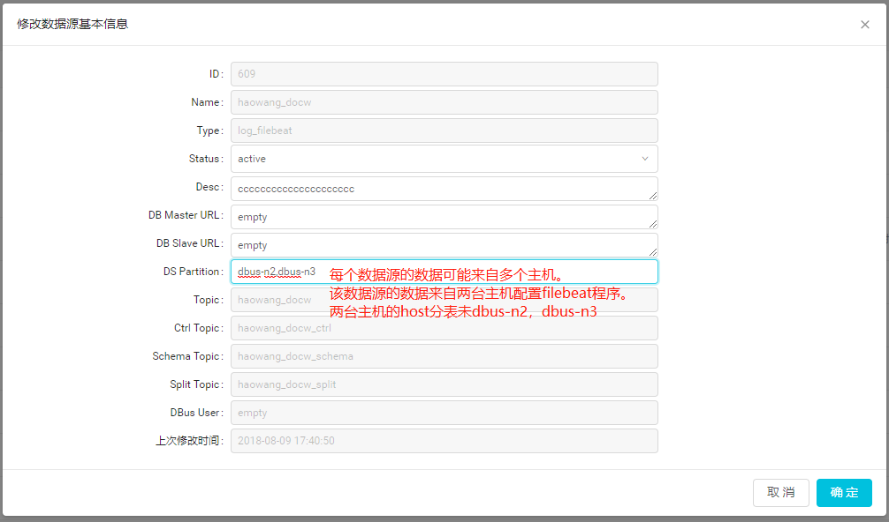
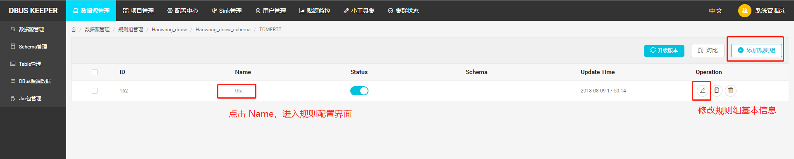

{:toc}

系统架构：**


**总体说明：**

​	DBus可以接入三种数据源：logstash、flume、filebeat，下面以使用filebeat为数据抽取端，抽取DBus自身产生的监控和报警日志数据。DBus监控和报警模块部署在 dbus-n2和dbus-n3 上，路径为：/app/dbus/dbus-heartbeat-0.4.0/logs/heartbeat/heartbeat.log。因此，filebeat的日志数据抽取端也要部署在dbus-n2和dbus-n3 上。

​	另外与logtash不同，filebeat需要一个额外的产生心跳数据的shell脚本，由crontab负责执行，输出的日志路径为：/app/dbus/dbus-agent-heartbeat/logs/agent-heartbeat.log，用于监测整条链路是否正常工作。因此，产生心跳数据的shell脚本也要部署在dbus-n2和dbus-n3 上。

​	filebeat抽取程序同时监控DBus自身的监控和报警日志（路径：/app/dbus/dbus-heartbeat-0.4.0/logs/heartbeat/heartbeat.log） 和shell脚本产生的心跳数据（路径：/app/dbus/dbus-agent-heartbeat/logs/agent-heartbeat.log），这样，filebeat既可以抽取数据日志，也可以抽取心跳日志。

|  No  |   域名    | 是否有监控和报警日志？ | 是否部署filebeat？ | 是否部署心跳shell脚本？ |                   抽取日志                   |        输出topic         |
| :--: | :-----: | :---------: | :-----------: | :------------: | :--------------------------------------: | :--------------------: |
|  1   | dbus-n1 |      否      |       否       |       否        |                    无                     |           无            |
|  2   | dbus-n2 |      是      |       是       |       是        | 1.DBus自身产生的监控和报警日志                                              2. shell脚本产生的心跳数据 | heartbeat_log_filebeat |
|  3   | dbus-n3 |      是      |       是       |       是        | 1.DBus自身产生的监控和报警日志                                              2. shell脚本产生的心跳数据 | heartbeat_log_filebeat |


**主要配置步骤：**

1 配置 和 安装filebeat源相关

2 一键加线和配置

3 检验结果

## 1  配置 和 安装filebeat源相关

监控和报警日志在dbus-n2和dbus-n3上，因此 filebeat的日志数据抽取端也要部署在dbus-n2和dbus-n3 上。

### 1.1 filebeat安装

* **filebeat版本**

  DBus使用的filebeat的版本是v6.1.0。

* **下载地址**

  [https://www.elastic.co/downloads/beats](https://www.elastic.co/downloads/beats)

* **filebeat目录说明**

    **filebeat目录结构：**
    

     **data目录 :** 不需要用户创建，filebeat会自动创建，记录了filebeat读取文件的路径、inode信息及文件offset等信息。

     **filebeat.yml :** filebeat的配置文件，例如被抽取文件的路径及输出端kafka等配置信息。

     **logs目录：**放置filebeat产生的日志，建议将日志放置在一个磁盘空间比较大的目录，这里为其建立一个软连接，指向/data/dbus/filebeat-logs目录。 

### 1.2 配置文件说明

   在filebeat的目录下，有filebeat的配置文件filebeat.yml，下面重点说下其配置要点。详细配置请参考filebeat的配置文件：filebeat.yml，[参考链接](https://github.com/BriData/DBus/tree/master/init-scripts/init-filebeat-config/)。

```yaml
  filebeat.prospectors:			  # filebeat的探测器，可以对多个路径下的文件进行抽取
- type: log
  enabled: true
  paths:
    - /app/dbus/dbus-heartbeat-0.4.0/logs/heartbeat/heartbeat.*  # DBus自身产生的监控和报警日志
  fields_under_root: true		  # fields_under_root设置为true，使下面的fields生效
  fields:
    type: heartbeat_log_filebeat   # 改为数据源的log比如：heartbeat_log_filebeat
  encoding: utf-8                  # 指定被监控的文件的编码类型使用plain和utf-8都是可以处理中文日志的

  # 适用于日志中每一条日志占据多行的情况，比如各种语言的报错信息调用栈
  multiline.pattern: '^\['   # 多行日志开始的那一行匹配的pattern
  multiline.negate: true     # 是否需要对pattern条件转置使用，不翻转设为true，反转设置为false。
  multiline.match: after     # 匹配pattern后，与前面（before）还是后面（after）的内容合并为一条日志
 
- type: log
  enabled: true
  paths:
    - /app/dbus/dbus-agent-heartbeat/logs/*.*	# shell脚本产生的心跳数据
  fields_under_root: true					# fields_under_root设置为true，使下面的fields生效
  fields:
    type: dbus-heartbeat 					# DBus将心跳类型定义为：dbus-heartbeat，建议一致
  encoding: utf-8             # 指定被监控的文件的编码类型使用plain和utf-8都是可以处理中文日志的

filebeat.config.modules:
  path: ${path.config}/modules.d/*.yml		# filebeat配置文件
  reload.enabled: true					   # 使filebeat自动reload配置文件,每10s扫描一次
  encoding: utf-8
  reload.period: 10s

#----------------------------- kafka output --------------------------------
# 输出到kafka
output.kafka:
  # initial brokers for reading cluster metadata
  hosts: ["dbus-n1:9092","dbus-n2:9092","dbus-n3:9092"]
  # message topic selection + partitioning
  topic: 'heartbeat_log_filebeat'
  partition.round_robin:
  reachable_only: false
  required_acks: 1
  compression: snappy
  max_message_bytes: 1000000
```

### 1.3. filebeat启动和验证

 **在filebeat解压目录下，执行命令：**

```
1. 前台启动方式：./filebeat
2. 后台启动方式：./filebeat &
```


当采用**前台启动**方式时，如果出现以下信息，则说明启动成功（**注意控制台是否出现报错信息**）：

```
filebeat-6.1.0-linux-x86_64]$ 2018/01/25 09:12:48.287446 beat.go:436: INFO Home path: [/app/dbus/filebeat-6.1.0-linux-x86_64] Config path: [/app/dbus/filebeat-6.1.0-linux-x86_64] Data path: [/app/dbus/filebeat-6.1.0-linux-x86_64/data] Logs path: [/app/dbus/filebeat-6.1.0-linux-x86_64/logs]
2018/01/25 09:12:48.287944 metrics.go:23: INFO Metrics logging every 30s
2018/01/25 09:12:48.308776 beat.go:443: INFO Beat UUID: 7b900775-36e1-4b26-9ac2-abd98e76518d
2018/01/25 09:12:48.308828 beat.go:203: INFO Setup Beat: filebeat; Version: 6.1.0
2018/01/25 09:12:48.310757 module.go:76: INFO Beat name: dbus-n2
2018/01/25 09:12:48.523740 beat.go:276: INFO filebeat start running.
2018/01/25 09:12:48.523895 registrar.go:88: INFO Registry file set to: /app/dbus/filebeat-6.1.0-linux-x86_64/data/registry
2018/01/25 09:12:48.523972 registrar.go:108: INFO Loading registrar data from /app/dbus/filebeat-6.1.0-linux-x86_64/data/registry
2018/01/25 09:12:48.525069 registrar.go:119: INFO States Loaded from registrar: 8
2018/01/25 09:12:48.525132 filebeat.go:261: WARN Filebeat is unable to load the Ingest Node pipelines for the configured modules because the Elasticsearch output is not configured/enabled. If you have already loaded the Ingest Node pipelines or are using Logstash pipelines, you can ignore this warning.

```

### 1.4. 心跳脚本和crontab说明

   DBus提供了心跳shell脚本[点击下载](https://github.com/BriData/DBus/tree/master/init-scripts/init-dbus-agent-heartbeat)（需要crontab定时运行），用于每60s产生一次json格式的心跳数据，filebeat可对心跳数据文件进行提取，进而实现了和logstash定时产生心跳数据一样的功能。心跳数据的作用是便于DBus对数据进行统计和输出。

* **心跳脚本目录** 

   

   **agent-heartbeat.sh:**  产生心跳的脚本，通过crontab定时运行该脚本，可以实现每60s产生一个心跳数据。

   **logs:**  该目录下存在心跳脚本产生的心跳数据，当用crontab启动agent-heartbeat.sh后，就可以在该目录下发现一个agent-heartbeat.log的文件，filebeat通过抽取该文件，就可以产生定时心跳数据的功能。

   **read.me:**  说明了crontab启动该脚本的命令，将read.me内容直接复制到crontab中即可。

 * **心跳脚本说明**

```shell
  # !/bin/sh
  # 注意！！！ 这里的HOST应该与filebeat配置文件中的host需一致，即如果filebeat中配置的是ip，则此处也应该配置ip（即下面一行不需要注释），如果filebeat中配置的是域名，则此处也需要用域名（即下面一行不需要注释），此处样例用的是域名。
  # HOST=`ifconfig | sed '6,$d' | sed -n '/inet addr/s/^[^:]*:\([0-9.]\{7,15\}\) .*/\1/p'`

  if test -z ${HOST}
then
  HOST=`hostname`
fi

CLOCK=`date "+%s"`

NS=`date "+%N"`

MS=`expr $NS / 1000000`
while test ${#MS} -lt 3
do
  MS="0$MS"
done

TIMESTAMP=`date "+%Y-%m-%d %H:%M:%S"`".$MS"

PACKET="{\"host\": \"$HOST\", \"@version\": \"1\", \"clock\": $CLOCK, \"@timestamp\": \"$TIMESTAMP\", \"type\": \"dbus-heartbeat\"}"

BASE_DIR=$(cd `dirname $0`; pwd)/logs

DAY=`date "+%d"`
PRE_YMD=`tail -n 1 "$BASE_DIR"/agent-heartbeat.log | awk -F , '{print $4}' | awk -F ": " '{print $2}' | awk '{print $1}'`
PRE_YMD=${PRE_YMD//\"/}
PRE_DAY=`echo $PRE_YMD | awk -F "-" '{print $3}'`

if test -n ${PRE_DAY}
then
  if test ${DAY} -ne ${PRE_DAY}
  then
    mv agent-heartbeat.log agent-heartbeat.log"$PRE_YMD"
  fi
fi

echo $PACKET >> "$BASE_DIR"/agent-heartbeat.log

if test $? -ne 0
then
  echo "add packet failed" >> "$BASE_DIR"/agent-error.log
fi
```

### 1.5 验证filebeat配置成功

**读取kafka的topic：heartbeat_log_filebeat，确认是否有数据：**

- **进入kafka安装目录。**
- **执行以下命令，查看数据，如果有数据，则说明filebeat可以成功抽取文件：**

`bin/kafka-console-consumer.sh --zookeeper dbus-n1:2181,dbus-n2:2181,dbus-n3:2181/kafka  --topic heartbeat_log_filebeat`  

- **filebeat的心跳数据样例：**

```json
{
    "@timestamp": "2018-01-25T09:04:11.877Z",
    "@metadata": {
        "beat": "filebeat",
        "type": "doc",
        "version": "6.1.0",
        "topic": "heartbeat_log_filebeat"
    },
    "source": "/app/dbus/dbus-agent-heartbeat/logs/agent-heartbeat.log",
    "offset": 18750,
    "message": "{\"host\": \"dbus-n2\", \"@version\": \"1\", \"clock\": 1516871041, \"@timestamp\": \"2018-01-25 17:04:02.983\", \"type\": \"dbus-heartbeat\"}",
    "type": "dbus-heartbeat",
    "prospector": {
        "type": "log"
    },
    "beat": {
        "name": "dbus-n2",
        "hostname": "dbus-n2",
        "version": "6.1.0"
    }
}
```

- **filebeat抽取之后产生的数据样例：**

```json
{
    "@timestamp": "2018-01-25T12:37:59.614Z",
    "@metadata": {
        "beat": "filebeat",
        "type": "doc",
        "version": "6.1.0",
        "topic": "heartbeat_log_filebeat"
    },
    "source": "/app/dbus/dbus-heartbeat-0.4.0/logs/heartbeat/heartbeat.log",
    "offset": 12715390,
    "message": "[send-stat-msg-event] INFO : 2018/01/25 20:37:53.822 KafkaSource 107 - KafkaSource got 1 records......",
    "prospector": {
        "type": "log"
    },
    "type": "heartbeat_log_filebeat",
    "beat": {
        "name": "dbus-n2",
        "hostname": "dbus-n2",
        "version": "6.1.0"
    }
}
```

## 2 DBus 一键加线和配置

### 2.1 DBus一键加线

filebeat将数据抽取到Kafka topic后，DBus程序就可以对该topic数据进行处理了，在DBus web进行数据源和table的配置工作。

* **新建数据源：**首先新建数据源，进入New DataLine页面，由于我们是用filebeat对心跳日志进行抽取，因此数据源的名字可以起的有意义一些，Type选择log_filebeat，topic必须和filebeat配置文件中的topic一致。

   

* **新增表：**点击Add Table按钮，新增一张表，稍后会对该表进行规则配置，新增完后，点击下一步。

   

* **启动log_processor程序：**启动storm程序，对数据进行处理，后面会对新增表进行规则配置。

   启动完毕，Status变为running：

   


### 2.2 数据源配置修改

因为我们在dbus-n1和dbus-n2两台机器中分别配置了filebeat程序，用于对数据进行抽取，而DBus监控和报警模块会对来自这两台机器的数据流进行监控，因此，我们需要在数据源配置信息中，将多台主机的host信息填入dsPartition选项中，供dbus监控和报警模块使用，注意：如果主机的hostname是ip，请将"."转换为"_"，例如：127.0.0.1应该要转换为127_0_0_1。


* **修改数据源信息：**点击modify按钮进行修改。
   
* **填写host信息：**该数据源的数据可能来自于多个主机上的filebeat程序，要在dsPartition中，配置上所有主机的host信息，为DBus监控和报警模块使用。
   

### 2.3. 配置规则
* **进入Data Table页面，查看新增加的表，点击[规则配置]按钮，为该表配置规则，详细配置方式请参考：([config-table.md](https://github.com/BriData/DBus/tree/master/docs/config-table.md)**

   

* **新增规则组：**点击Add group按钮，新增一个规则组，点击规则组名字，进入规则配置页面。

   

* **配置规则:** topic是在filebeat中配置的topic，即源topic，可以指定offset，获取固定区间的数据，然后点击show data按钮，此时会在页面下方显示原始数据，点击Add，新增一些过滤规则，对数据进行处理。配置完规则后，查看过滤出的数据，点击Save all rules按钮，保存规则，并返回到规则组页面。

   

* **升级版本：**首先使规则组的Status状态变为active，然后点击升级版本（每次增加、删除或修改规则组后，都应该对该表升一次版本）。

   

* **拉取增量: ** 使该表的状态变为ok，点击Take Effect生效按钮，使该表生效（当后续再对该表进行规则组配置操作后，也应该对该表再执行Take Effect生效按钮，使该表能够获取到最新的规则配置）。

   


## 3  验证数据

我们可以在grafana配置以下，看看实际流量情况。

* **上传grafana配置文件，[参考链接](https://github.com/BriData/DBus/tree/master/init-scripts/init-log-grafana-config) ： **点击Import，上传grafana json配置文件。
   
* **选择InDB数据库：**ds的名字必须与新建数据线中的数据源名字一致。
   

* **监控信息：**之前新增表的流量监控信息，type表示来自于哪台主机的数据。
   
* **\_unknown_table_表示不满足任何表的数据。**
   

