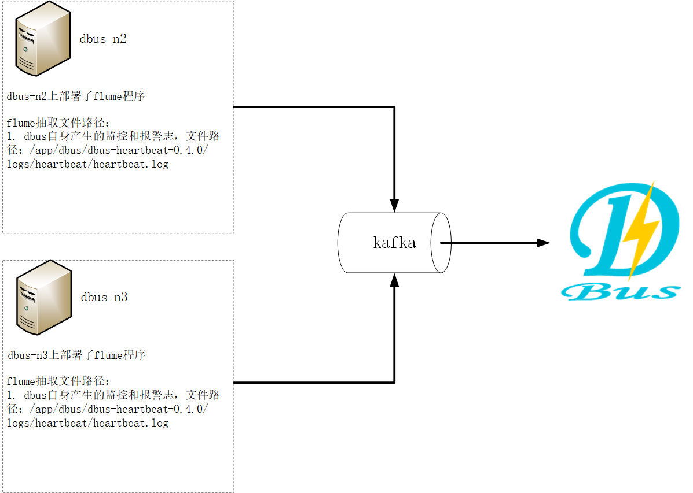
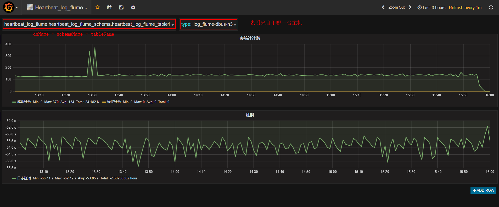

{:toc}

**系统架构：**



**总体说明：**

​	DBus可以接入三种数据源：logstash、flume、filebeat，下面以使用flume为数据抽取端，抽取DBus自身产生的监控和报警日志数据。DBus监控和报警模块部署在 dbus-n2和dbus-n3 上，路径为：/app/dbus/dbus-heartbeat-0.4.0/logs/heartbeat/heartbeat.log。因此，flume的日志数据抽取端也要部署在dbus-n2和dbus-n3 上。

​	另外与logtash不同，flume需要一个额外的产生心跳数据的shell脚本，由crontab负责执行，输出的日志路径为：/app/dbus/dbus-agent-heartbeat/logs/agent-heartbeat.log，用于监测整条链路是否正常工作。因此，产生心跳数据的shell脚本也要部署在dbus-n2和dbus-n3 上。

​	flume抽取程序同时监控DBus自身的监控和报警日志（路径：/app/dbus/dbus-heartbeat-0.4.0/logs/heartbeat/heartbeat.log） 和shell脚本产生的心跳数据（路径：/app/dbus/dbus-agent-heartbeat/logs/agent-heartbeat.log），这样，flume既可以抽取数据日志，也可以抽取心跳日志。

|  No  |   域名    | 是否有监控和报警日志？ | 是否部署flume？ | 是否部署心跳shell脚本？ |                   抽取日志                   |       输出topic       |
| :--: | :-----: | :---------: | :--------: | :------------: | :--------------------------------------: | :-----------------: |
|  1   | dbus-n1 |      否      |     否      |       否        |                    无                     |          无          |
|  2   | dbus-n2 |      是      |     是      |       是        | 1.DBus自身产生的监控和报警日志                                              2. shell脚本产生的心跳数据 | heartbeat_log_flume |
|  3   | dbus-n3 |      是      |     是      |       是        | 1.DBus自身产生的监控和报警日志                                              2. shell脚本产生的心跳数据 | heartbeat_log_flume |


**主要配置步骤：**

1 配置 和 安装flume源相关

2 一键加线和配置

3 检验结果

## 1  配置和安装flume源相关

监控和报警日志在dbus-n2和dbus-n3上，因此 flume的日志数据抽取端也要部署在dbus-n2和dbus-n3 上。

### 1.1 flume安装

* **flume版本**
   DBus使用的flume的版本是v1.8.0。


* **下载**

   [http://flume.apache.org/download.html](http://flume.apache.org/download.html)

* **flume目录说明**

   - **flume目录**

     

     **conf目录：**用于放置flume的配置文件，例如被抽取文件路径及输出端kafka等配置信息。

     ​

     **data目录 :** DBus自己新建的目录，需要手动创建data/flume_data/taildir等目录，在taildir目录下存放了flume读取文件的路径、inode信息及文件offset等信息。

     ​

     **logs目录：**放置flume产生的日志，建议将日志放置在一个磁盘较大的目录，这里为其建立一个软连接，指向/data/dbus/flume-logs目录。

     ​

### 1.2 配置文件说明

   在conf目录下，有flume的配置文件：flume-conf.properties，下面说下其配置要点。详细配置请参考flume配置文件：[参考链接](https://github.com/BriData/DBus/tree/master/init-scripts/init-flume-config)。

   ```
   # 有两个源一个是数据源， 一个是心跳源
   agent.sources=r_hb_0 r_dahb
   agent.channels=c
   agent.sinks=k

   #1 以下为数据配置
   agent.sources.r_hb_0.type=TAILDIR
   agent.sources.r_hb_0.channels=c

   # kafka key 为时间戳
   agent.sources.r_hb_0.interceptors=i_ts i_sr_0 i_sr_1 i_sr_2
   agent.sources.r_hb_0.interceptors.i_ts.type=timestamp
   agent.sources.r_hb_0.interceptors.i_ts.preserveExisting=false
   agent.sources.r_hb_0.interceptors.i_ts.headerName=key

   # 将数据内容\,替换\\
   agent.sources.r_hb_0.interceptors.i_sr_0.type=search_replace
   agent.sources.r_hb_0.interceptors.i_sr_0.searchPattern=(\\\\)
   agent.sources.r_hb_0.interceptors.i_sr_0.replaceString=\\\\\\\\

   # 将数据内容转义,替换双引号
   agent.sources.r_hb_0.interceptors.i_sr_1.type=search_replace
   agent.sources.r_hb_0.interceptors.i_sr_1.searchPattern=(\")
   agent.sources.r_hb_0.interceptors.i_sr_1.replaceString=\\\\\"

   # 构造为json, 注意修改host部分， agent.sources.r_hb_0.interceptors.i_sr_2.replaceString中的host需要保持和心跳产生的host一致！！
   agent.sources.r_hb_0.interceptors.i_sr_2.type=search_replace
   #agent.sources.r_hb_0.interceptors.i_sr_2.searchPattern=^([^\{].*)
   agent.sources.r_hb_0.interceptors.i_sr_2.searchPattern=(^.*$)
   agent.sources.r_hb_0.interceptors.i_sr_2.replaceString={\"message\":\"$1\", \"type\":\"dbus_log\", \"host\":\"dbus-n2\"}

   #sincedb 保存了读取数据源的文件的路径、inode信息及文件offset等信息。
   agent.sources.r_hb_0.positionFile=/app/dbus/apache-flume-1.8.0-bin/data/flume_data/taildir/hb_0_taildir_position.json

   # 被读取文件位置，如果想读取所有以.log结尾的文件，需要以.*log配置，以.log配置不生效
   agent.sources.r_hb_0.filegroups=hblf
   agent.sources.r_hb_0.filegroups.hblf=/app/dbus/dbus-heartbeat-0.4.0/logs/heartbeat/.*log

   #2 以下为心跳源配置
   agent.sources.r_dahb.type=TAILDIR
   agent.sources.r_dahb.channels=c

   agent.sources.r_dahb.interceptors=i_ts
   agent.sources.r_dahb.interceptors.i_ts.type=timestamp
   agent.sources.r_dahb.interceptors.i_ts.preserveExisting=false
   agent.sources.r_dahb.interceptors.i_ts.headerName=key

   agent.sources.r_dahb.positionFile=/app/dbus/apache-flume-1.8.0-bin/data/flume_data/taildir/dahb_taildir_position.json
   agent.sources.r_dahb.filegroups=dahblf
   #flume读取的产生心跳包的路径
   agent.sources.r_dahb.filegroups.dahblf=/app/dbus/dbus-agent-heartbeat/logs/agent-heartbeat.log

   agent.channels.c.type=memory
   agent.channels.c.capacity=20000
   agent.channels.c.transactionCapacity=20000
   agent.channels.c.keep-alive=30

   agent.sinks.k.channel=c 
   agent.sinks.k.type=org.apache.flume.sink.kafka.KafkaSink
   #输出到kafka的topic
   agent.sinks.k.kafka.topic=heartbeat_log_flume
   agent.sinks.k.kafka.key=key
   agent.sinks.k.kafka.bootstrap.servers=dbus-n1:9092,dbus-n2:9092,dbus-n3:9092
   agent.sinks.k.kafka.flumeBatchSize=20
   agent.sinks.k.kafka.producer.acks=1
   agent.sinks.k.kafka.producer.retries=3
   agent.sinks.k.kafka.producer.linger.ms=1000
   agent.sinks.k.kafka.producer.batch.size=1048576
   agent.sinks.k.kafka.producer.max.request.size=10485760
   agent.sinks.k.kafka.producer.buffer.memory=67108864

   ```


### 1.3. flume启动和验证

* **在flume解压目录下，进入bin目录（必须进入bin目录执行以下命令!），执行命令：**

```
1. 前台启动方式：./flume-ng agent --conf ../conf --conf-file ../conf/flume-conf.properties --name agent -Dflume.log.dir=/app/dbus/apache-flume-1.8.0-bin/logs -Dflume.log.file=flume.log -Dflume.root.logger=INFO,LOGFILE 
2. 后台启动方式：./flume-ng agent --conf ../conf --conf-file ../conf/flume-conf.properties --name agent -Dflume.log.dir=/app/dbus/apache-flume-1.8.0-bin/logs -Dflume.log.file=flume.log -Dflume.root.logger=INFO,LOGFILE &
```

* 当采用**前台启动方式**时，出现类似以下信息，则说明启动成功（**注意控制台是否出现报错信息**）：

```
Info: Sourcing environment configuration script /app/dbus/apache-flume-1.8.0-bin/conf/flume-env.sh
Info: Including Hive libraries found via () for Hive access
+ exec /usr/java/latest/bin/java -Xms1024m -Xmx1024m -Dflume.log.dir=/app/dbus/apache-flume-1.8.0-bin/logs -Dflume.log.file=flume.log -Dflume.root.logger=INFO,LOGFILE -cp '/app/dbus/apache-flume-1.8.0-bin/conf:/app/dbus/apache-flume-1.8.0-bin/lib/*:/lib/*' -Djava.library.path= org.apache.flume.node.Application --conf-file ../conf/flume-conf.properties --name agent
```

**读取kafka的topic：heartbeat_log_flume，确认是否有数据：**

* **进入kafka安装目录。**

* **执行以下命令，查看数据，如果有数据，则说明flume可以成功抽取文件：**

   `bin/kafka-console-consumer.sh --zookeeper dbus-n1:2181,dbus-n2:2181,dbus-n3:2181/kafka  --topic heartbeat_log_flume`  

* **flume的心跳数据样例：**

   ```json
   {
       "host": "dbus-n2",
       "@version": "1",
       "clock": 1516862401,
       "@timestamp": "2018-01-25 14:40:02.998",
       "type": "dbus-heartbeat"
   }
   ```


* **flume抽取之后产生的数据样例：**

   ```json
   {
       "message": "[main-EventThread] INFO : 2018/01/25 16:39:32.856 WatcherType 127 - [command-control] 开始重新加载配置信息.",
       "type": "dbus_log",
       "host": "dbus-n2"
   }
   ```


### 1.4. 心跳脚本和crontab说明

   DBus提供了心跳shell脚本[点击下载](https://github.com/BriData/DBus/tree/master/init-scripts/init-dbus-agent-heartbeat)，用于每60s产生一次json格式的心跳数据，flume可对心跳数据文件进行提取，进而实现了和logstash定时产生心跳数据一样的功能。

* **心跳脚本目录** 


**agent-heartbeat.sh:**  产生心跳的脚本，通过crontab定时运行该脚本，可以实现每60s产生一个心跳数据。

**logs:**  该目录下存在心跳脚本产生的心跳数据，当用crontab启动agent-heartbeat.sh后，就可以在该目录下发现一个agent-heartbeat.log的文件，flume通过抽取该文件，就可以产生定时心跳数据的功能。

**read.me:**  说明了crontab启动该脚本的命令，将read.me内容直接复制到crontab中即可。

* **心跳脚本说明（有注意项！！）**

   ```shell
   # !/bin/sh
   # 注意！！！ 这里的HOST应该与flume配置文件中的host需一致，即如果flume中配置的是ip，则此处也应该配置ip（即下面一行不需要注释），如果flume中配置的是域名，则此处也需要用域名（即下面一行不需要注释），此处样例用的是域名。
   # HOST=`ifconfig | sed '6,$d' | sed -n '/inet addr/s/^[^:]*:\([0-9.]\{7,15\}\) .*/\1/p'`
   ```

if test -z ${HOST}
then
  HOST=`hostname`
fi

CLOCK=`date "+%s"`

NS=`date "+%N"`

MS=`expr $NS / 1000000`
while test ${#MS} -lt 3
do
  MS="0$MS"
done

TIMESTAMP=`date "+%Y-%m-%d %H:%M:%S"`".$MS"

PACKET="{\"host\": \"$HOST\", \"@version\": \"1\", \"clock\": $CLOCK, \"@timestamp\": \"$TIMESTAMP\", \"type\": \"dbus-heartbeat\"}"

BASE_DIR=$(cd `dirname $0`; pwd)/logs

DAY=`date "+%d"`
PRE_YMD=`tail -n 1 "$BASE_DIR"/agent-heartbeat.log | awk -F , '{print $4}' | awk -F ": " '{print $2}' | awk '{print $1}'`
PRE_YMD=${PRE_YMD//\"/}
PRE_DAY=`echo $PRE_YMD | awk -F "-" '{print $3}'`

if test -n ${PRE_DAY}
then
  if test ${DAY} -ne ${PRE_DAY}
  then
    mv agent-heartbeat.log agent-heartbeat.log"$PRE_YMD"
  fi
fi

echo $PACKET >> "$BASE_DIR"/agent-heartbeat.log

if test $? -ne 0
then
  echo "add packet failed" >> "$BASE_DIR"/agent-error.log
fi

   ```

### 1.5 验证flume配置成功

**读取kafka的heartbeat_log_flume，确认是否有数据：**

- **进入kafka安装目录。**

- **执行以下命令，查看数据，如果有数据，则说明flume可以成功抽取文件：**

  `bin/kafka-console-consumer.sh --zookeeper dbus-n1:2181,dbus-n2:2181,dbus-n3:2181/kafka  --topic heartbeat_log_flume`  

- **flume的心跳数据样例：**

  ```json
  {
      "host": "dbus-n2",
      "@version": "1",
      "clock": 1516862401,
      "@timestamp": "2018-01-25 14:40:02.998",
      "type": "dbus-heartbeat"
  }
   ```


- **flume抽取之后产生的数据样例：**

  ```json
  {
      "message": "[main-EventThread] INFO : 2018/01/25 16:39:32.856 WatcherType 127 - [command-control] 开始重新加载配置信息.",
      "type": "dbus_log",
      "host": "dbus-n2"
  }
  ```

## 2 DBus 一键加线和配置

### 2.1 DBus一键加线

flume将数据抽取到Kafka topic后，dbus log_processor程序就可以对该topic数据进行处理了，在dbus-web进行数据源和table的配置工作。

* **新建数据源 : ** 首先新建数据源，进入New DataLine页面，由于我们是用flume对心跳日志进行抽取，因此数据源的名字可以起的有意义一些，Type选择log_flume，topic必须和flume配置文件中的topic一致。

   

* **新增表：**点击Add Table按钮，新增一张表，稍后会对该表进行规则配置，新增完后，点击下一步。

   

* **启动log_processor程序：**启动storm程序，对数据进行处理，后面会对新增表进行规则配置。

   
   **启动结果：**点击启动按钮后，当Status变为running后，表示启动成功，如果启动不成功，可以通过查看Topology start log定位失败原因。
   

### 2.2 数据源配置修改

因为我们在dbus-n1和dbus-n2两台机器中分别配置了flume程序，用于对数据进行抽取，而DBus监控和报警模块会对来自这两台机器的数据流进行监控，因此，我们需要在数据源配置信息中，将多台主机的host信息填入dsPartition选项中，供DBus监控和报警模块使用，注意：如果主机的hostname是ip，请将"."转换为"_"，例如：127.0.0.1应该要转换为127_0_0_1。

* **修改数据源信息：**点击modify按钮进行修改。

   

* **填写host信息：**该数据源的数据可能来自于多个主机上的filebeat程序，要在dsPartition中，配置上所有主机的host信息，为DBus监控和报警模块使用。

   


### 2.3. 配置规则

* 进入Data Table页面，查看新增加的表，点击Rules按钮，为该表配置规则，详细配置方式请参考详：([config-table.md](https://github.com/BriData/DBus/tree/master/docs/config-table.md)。**

   

* **编辑规则组：**点击Add group按钮，新增一个规则组。点击规则组名字，进入规则配置页面。

   

* **配置规则:** topic是在flume中配置的topic，即源topic，可以指定offset，获取固定区间的数据，然后点击show data按钮，此时会在页面下方显示原始数据，点击Add，新增一些过滤规则，对数据进行处理。配置完规则后，查看过滤出的数据，保存规则，并返回到规则组页面。

   

* **升级版本：**首先使规则组的Status状态变为active，然后点击升级版本（每次增加、删除或修改规则组后，都应该对该表升一次版本）。!

* **拉取增量 : ** 使该表的状态变为ok。

   

* **使表生效：** 点击Take Effect生效按钮，使该表生效（当后续再对该表进行规则组配置操作后，也应该对该表再执行Take Effect生效按钮，使该表能够获取到最新的规则配置）。

   

## 3 grafana配置与流量监控

* **上传grafana配置文件[参考链接](https://github.com/BriData/DBus/tree/master/init-scripts/init-log-grafana-config/) ： **点击Import，上传grafana json配置文件。
   
* **选择InDB数据库：**ds的名字必须与新建数据线中的数据源名字一致。
   


* **之前新增表的流量监控信息，type表示来自于哪台主机的数据**
   
* **\_unknown_table_表示不满足任何表的数据**
   


