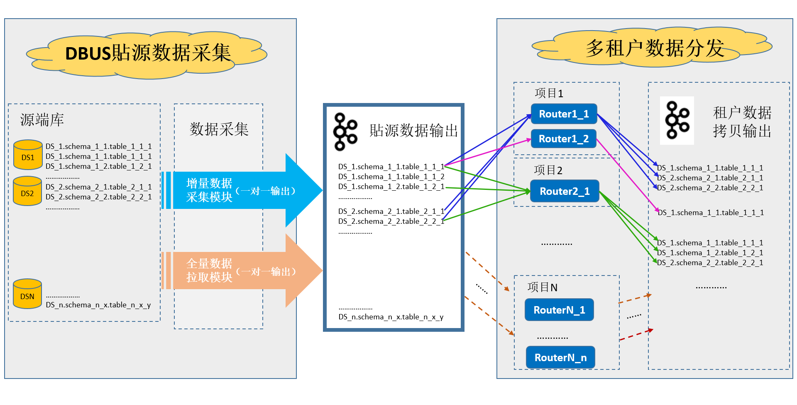
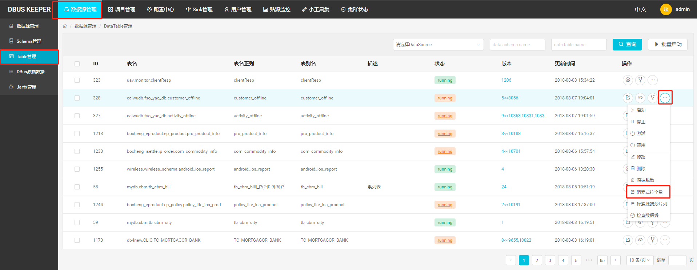

# 1. 总体说明

 DBUS主要由两大部分组成：貼源数据采集和多租户数据分发。两个部分之间以Kafka为媒介进行衔接。

貼源数据采集通过简单灵活的配置，以无侵入的方式对源端数据进行采集，实时获取增量数据，提供丰富、完备的数据采集、脱敏、转换、汇聚功能，并支持全量数据拉取，经过转换处理后成为统一JSON的数据格式（UMS）。每张表只接入一次，只有一个数据流及一份输出数据与之对应。

多租户数据分发，是为限制不同租户，只能访问分配给他的数据资源；以及，如果两个租户有不同的数据处理逻辑（例如：不同的脱敏需求），也能区别对待处理，从而灵活满足多条业务线租户的不同需求。

因此，一张表如果被分给N个租户，就至少会被拷贝分发N次。这个拷贝过程中，还能加入一些个性化的处理，例如脱敏策略。此外，如果一个租户需要对同一张表进行不同的处理，再输出，也是可以的。方法是，再建一个处理逻辑不同的Topology来接入、“拷贝分发”该表的数据，例如下图中的Router1_2。这种情况下，表被“拷贝分发”的次数就更多了。但同一张表在一个Topology上只能接入一份。

由图我们可以清楚的看到，貼源数据采集与多租户模块是解耦的。也就是说，如果没有多租户需求（数据隔离、资源隔离、不同脱敏策略等），可以忽略多租户这一级，加完貼源数据线，直接消费源端数据采集这一级输出到kafka的数据即可。

## 1.1 拉全量总体说明

有的用户只需要实时采集的增量数据数据即可。但更多用户需要的是全部的数据。所以一般在拉增量数据前，都会进行一次“初始化加载”，拉取当前目标表的全量数据，然后在此基础上，消费实时流入的增量数据，供业务使用。增量数据流出现问题时，常常也需要拉一次全量数据，再走增量，以确保后续的业务都是在全量的数据上进行。

DBUS提供了高效的初始化加载全量数据加载，支持指定输出topic及是否升版本号等，灵活应对客户需求。

### 1.1.1 貼源全量数据拉取 

前面我们提到，貼源数据采集独立于多租户数据分发。所以，“貼源数据采集”是一套功能完备的数据采集平台，亦提供了“全量数据拉取”功能。这一级拉取的数据，会吐到“貼源数据输出Kafka”，即：衔接貼源数据采集和租户数据分发的kafka。

貼源数据采集拉全量入口（未引入多租户的，在此拉全量）

### 1.1.2 租户全量数据拉取

租户需要的数据，全量和增量得逻辑一致，不能直接用貼源级别的全量数据，所以租户这一级也提供了“全量数据拉取”功能。租户“全量数据拉取”和“增量数据采集”数据转换、处理逻辑一致，比如：两者会共享相同的”输出列“定义、相同的脱敏策略等。这一级拉取的数据，会吐到租户指定的kafka，可能和“貼源数据输出Kafka”相同，也可能是租户自建的一套kafka集群。

租户拉全量入口（引入多租户的，每个租户可根据需求，对目标表拉全量）

### 1.1.3 DBUS其他有关全量数据加载的介绍

DBUS生态里关于全量，有貼源拉全量、租户拉全量、独立拉全量、阻塞式拉全量等等概念。从实用的角度来说，你知道上面两个入口就够用了，无需去研究这些概念，并可完全跳过本小节的介绍。但为了您对DBUS拉全量有一个更全面的了解，必要时参考，下面做些补充性介绍。不感兴趣的可以跳过。

#### 1.1.3.1  阻塞式拉全量

是最早的设计。当时下游的幂等不够成熟，所以需要源端数据采集端确保顺序性。因此，拉全量动作会阻塞增量，全量拉完，通知增量，增量再继续处理实时进来的数据。另外，阻塞式拉全量默认输出的topic和增量数据输出的topic一致，不能随意调整、指定。入口在此：

#### 1.1.3.2 独立拉全量

即貼源全量数据拉取入口，当前貼源数据采集默认推荐的全量拉取模式。

所以入口同[1.1.1 貼源全量数据拉取](#independent-fullpull) ：

独立拉全量和增量数据流相互独立，不会阻断增量，增量和全量的数据可同时并行往外吐，且独立拉全量可以随意指定输出topic。吐到不同topic的情况下，下游的消费者（如DBUS最佳伴侣Wormhole）需要同时监听两个topic才能拿到完整的数据。下游消费者可根据UMS里的uid来判断数据的新旧程度，幂等地处理是否覆盖数据，所以对增量和全量数据的顺序性没有了要求和约束。根据幂等覆盖策略，总会用新数据覆盖旧数据。

由于下游幂等覆盖数据策略已经成熟稳定，总能保证用新的数据覆盖旧数据，即：能处理任意顺序来的数据，保证不错乱。阻塞式会阻断用户增量数据，影响体验，所以0.5.0以后，我们建议用户默认采用独立拉全量的方式来进行数据初始化加载。

#### 1.1.3.3 Global拉全量

主要用于管理员排查问题。可以任意选择目标表，任意指定输出topic。Global拉全量跑在一个独立部署的topology上，所以完全不干扰业务。而阻塞式拉全量和独立拉全量都跑在对应业务线的full pull topology上。

## 1.2 脱敏配置机制总体说明

DBUS提供了灵活的脱敏策略支持。DBUS内置了一些常用的脱敏策略，并允许用户通过Jar包的形式提供丰富的、个性化的自定义脱敏策略。

但脱敏是一个独立的、辅助的功能。若无脱敏需求，本章节有关脱敏的部分可一律跳过，不影响使用。另，即便有脱敏需求，亦可数据线搭建起来跑通后，再行根据指南配置脱敏事宜。

点击查看DBUS脱敏机制详细介绍

# 2. 貼源数据库管理

## 2.1 新增Oracle数据线

## 2.2 新增MySql数据线

## 2.3 新增LogStash数据线

## 2.4新增FileBeat数据线

## 2.5新增Flume数据线

# 3.租户管理

可忽略租户相关的功能说明。

#### 多租户数据分发

对于不同租户对不同源端数据有不同访问权限、脱敏需求的情形，需要引入Router分发模块，将源端貼源数据，根据配置好的权限、用户有权获取的源端表、不同脱敏规则等，分发到分配给租户的Topic。这一级的引入，在DBUS管理系统中，涉及到用户管理、Sink管理、资源分配、脱敏配置等。不同项目消费分配给他的topic。