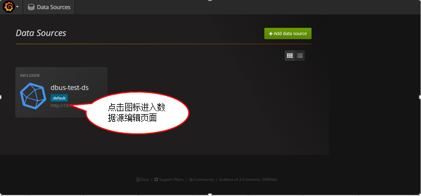
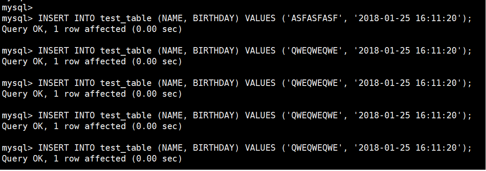

# 1. 环境说明


<u>*TBD补充：说明快速体验跟 集群部署不一样，配置不等同不能混用。。。*</u>

说明 all in one是一个单机版本dbus环境，具体包括：

- 集群环境：
  - zookeeper  3.6.8
  - kafka 0.10.0
  - storm 1.0.0
  - granfana 
  - influxdb （需要单独安装， 参考如下步骤3）
  - mysql （需要单独安装，参考如下步骤2）
- dbus相关包：
- mysql数据源所需：
  - canal 
- logstash的日志数据源所需：
  - logstash

### 1.1 环境依赖

安装dbus-allinone环境的建议配置如下

- JDK 1.8.181 或 以上

- CPU 2核 或以上

- 内存 16GB或以上

- 磁盘 20GB或以上

注：一台Linux centos服务器， 该服务器最好是空机器，上面不要安装dbus所依赖的zk，kafka，storm等

### 1.2 修改域名

注：ip是您的具体ip，这里用192.168.0.1为例子

修改服务器/etc/hosts文件设置相应的域名信息如下：

```
192.168.0.1 dbus-n1
```

修改服务器hostname命令如下：

```
hostname dbus-n1
```

配置好后，服务器IP和域名信息如下：

| No   | IP                                       | 域名      |
| ---- | ---------------------------------------- | ------- |
| 1    | 192.168.0.1（该ip是您的具体ip，这里用192.168.0.1为例子） | dbus-n1 |


# 2. 安装Mysql

### 2.1 下载

推荐下载Mysql版本：5.7.19 地址：[https://dev.mysql.com/downloads/mysql/](https://dev.mysql.com/downloads/mysql/)

### 2.2 安装

解压mysql-5.7.19-1.el6.x86_64.rpm-bundle.tar包后，执行以下命令安装：

```
rpm -ivh mysql-community-server-5.7.19-1.el6.x86_64.rpm --nodeps
rpm -ivh mysql-community-client-5.7.19-1.el6.x86_64.rpm --nodeps
rpm -ivh mysql-community-libs-5.7.19-1.el6.x86_64.rpm --nodeps
rpm -ivh mysql-community-common-5.7.19-1.el6.x86_64.rpm --nodeps
rpm -ivh mysql-community-libs-compat-5.7.19-1.el6.x86_64.rpm --nodeps
```

### 2.3 配置

在/etc/my.cnf配置文件中，只是增加bin-log相关配置，其他不用修改，关注以下汉字注释部分

```
[mysqld]
# dbus相关配置开始
log-bin=mysql-bin
binlog-format=ROW
server_id=1
# dbus相关配置结束
```

### 2.4 启动

执行以下命令启动mysql:

```
service mysqld start
```


# 3. 安装InfluxDB

### 3.1 下载

推荐下载InfluxDB版本：influxdb-1.1.0.x86_64
地址：[https://portal.influxdata.com/downloads](https://portal.influxdata.com/downloads)

### 3.2 安装

在dbus-n1上切换到root用户，在influxdb-1.1.0.x86_64.rpm的存放目录下执行如下命令：

```
rpm -ivh influxdb-1.1.0.x86_64.rpm
```

### 3.3 启动

在dbus-n1上执行如下命令：

```
service influxdb start
```

### 3.4 初始化配置

在dbus-n1上执行如下命令：

```
#登录influx
influx

#执行初始化脚本
create database dbus_stat_db
use dbus_stat_db
CREATE USER "dbus" WITH PASSWORD 'dbus!@#123'
ALTER RETENTION POLICY autogen ON dbus_stat_db DURATION 15d
```


# 4. 安装Dbus-allinone包

### 4.1 下载

在百度网盘提供dbus-allinone.tar.gz  包，访问 [release 页面下载最新包](https://github.com/BriData/DBus/releases)

### 4.2 安装

将下载的dbus-allinone包上传到服务器 /app目录下，且必须在此目录下

```
# 如果没有app目录，要先创建app目录
mkdir /app
cd /app
tar -zxvf dbus-allinone.tar.gz
```

### 4.3 初始化数据库

以root身份登录mysql客户端，执行以下命令进行数据库初始化，会创建dbmgr库以及用户、canal用户、dbus库以及用户、testschema库以及用户：

```
source /app/dbus-allinone/sql/1_init_database_user.sql
source /app/dbus-allinone/sql/2_dbusmgr_tables.sql
source /app/dbus-allinone/sql/3_dbus.sql
source /app/dbus-allinone/sql/4_test.sql
source /app/dbus-allinone/sql/5_canal.sql
```

### 4.4 启动

执行start.sh一键启动dbus所有服务，启动项比较多。

```
cd /app/dbus-allinone
./start.sh
```

请耐心等待，正确的启动日志如下：
```
check。。。。

check。。。。

check。。。。

check。。。。
```


### 4.5 生成检查报告

如果出错，请执行 xxx sh 生成检查报告。

检查报告输出路径信息、ip信息、复制相关日志文件、

检查 ：
域名
mysql库（dbusmgr，canal，dbus，testschema几个账号）
mysql心跳表中数据？
show slave status，
zk启动
storm启动
kafka启动
topoglogy检查
topic中offset数据检查。。
heartbeat启动检查
canal 启动，canal zk中目录
influxDB启动
infuxdb中数据？
grafana启动


# 5. Grafana配置

### 5.1 登录到http://dbus-n1:3000/login


### 5.2 修改grafana数据源





# 6. 验证Mysql是否安装成功

### 6.1 插入数据验证


<u>TBD:这里需要直接给出密码</u>

```
#登录测试用户
mysql -utestschema -p     #testschema账户密码参考/app/dbus-allinone/sql/4_test.sql
#执行测试脚本
use testschema;
INSERT INTO test_table (NAME, BIRTHDAY) VALUES ('ASFASFASF', '2018-01-25 16:11:20');
INSERT INTO test_table (NAME, BIRTHDAY) VALUES ('QWEQWEQWE', '2018-01-25 16:11:20');
INSERT INTO test_table (NAME, BIRTHDAY) VALUES ('QWEQWEQWE', '2018-01-25 16:11:20');
INSERT INTO test_table (NAME, BIRTHDAY) VALUES ('QWEQWEQWE', '2018-01-25 16:11:20');
INSERT INTO test_table (NAME, BIRTHDAY) VALUES ('QWEQWEQWE', '2018-01-25 16:11:20');
```



### 6.2 查看DBus是否实时获取到数据


# 7. 验证logstash是否安装成功


总体说明

all in one的logstash是抓取 dbus heartbeat产生的心跳日志。

dbus-heartbeat心跳模块儿产生日志位置在：/app/dbus-allinone/dbus-heartbeat-0.4.0/logs/heartbeat/heartbeat.log，利用logstash抽取该日志文件，把非结构化的数据，提取成结构化的数据。


### 7.1 日志中原始非结构化数据如下：

通过如下命令，查看要提取的非结构化数据，如下图所示，每一分钟产生3条包含"插入心跳包成功"的日志

```
cd /app/dbus-allinone/dbus-heartbeat-0.4.0/logs/heartbeat/
tail -f heartbeat.log | grep "插入心跳包成功"
```


### 7.2 在Dbus-web上配置相应的结构化规则

提取规则


通过执行规则后的结果


### 7.3 在grafana查看实时提取流量

选择log table deatil board


选择table：testlog.testlog_schema.t_dbus_heartbeat


可以很清楚的看到实时抽取的数量都是3