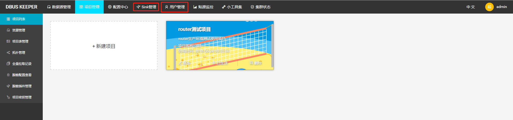
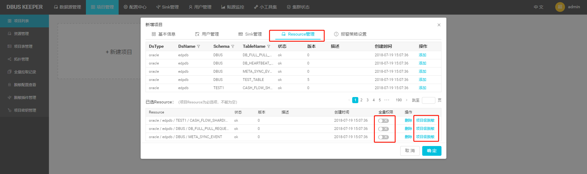
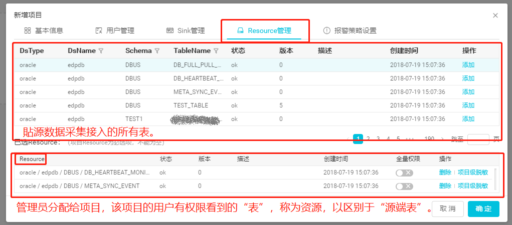
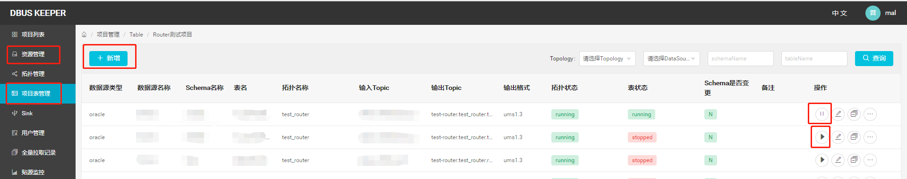

 {:toc}

# 1. 总体说明

## 1.1 总体模块概览

DBUS主要由两大部分组成：贴源数据采集和多租户数据分发。两个部分之间以Kafka为媒介进行衔接。

贴源数据采集通过简单灵活的配置，以无侵入的方式对源端数据进行采集，实时获取增量数据，提供丰富、完备的数据采集、脱敏、转换、汇聚功能，并支持全量数据拉取，经过转换处理后成为统一JSON的数据格式（UMS）。每张表只接入一次，只有一个数据流及一份输出数据与之对应。

多租户数据分发，是为限制不同租户，只能访问分配给他的数据资源；以及，如果两个租户有不同的数据处理逻辑（例如：不同的脱敏需求），也能区别对待处理，从而灵活满足多条业务线租户的不同需求。

由图我们可以清楚的看到，贴源数据采集与多租户模块是解耦的。也就是说，如果没有多租户需求（数据隔离、资源隔离、不同脱敏策略等），可以忽略多租户这一级，加完贴源数据线，直接消费源端数据采集这一级输出到kafka的数据即可。

一张表如果被分给N个租户，就至少会被拷贝分发N次。这个拷贝过程中，可加入一些个性化的处理，例如脱敏策略。此外，如果一个租户需要对同一张表进行不同的处理，再输出，也是可以的。方法是，再建一个处理逻辑不同的Topology来接入、“拷贝分发”该表的数据，例如下图中的Router1_2。这种情况下，表被“拷贝分发”的次数就更多了。但同一张表在一个Topology上只能接入一份。

## 1.2 数据接入操作流程概览

引入多租户后，接入条数据线的工作分为“管理员”和“租户”操作两个部分。为了让用户有一个清晰的了解，在此先把加入一条线的流程简明扼要地介绍一下。后续的章节再详述具体步骤。

### 1.2.1 管理员

（1）找源端Owner方开放相关数据访问权限。

（2）接入源端数据。根据不同的数据线，安装配置不同的组件来接入源端数据，例如Canal、Oracle、Filebeat、LogStash、Flume等。

（4）管理员在DBUS Keeper中新增一条数据线，并将目标Schema/Table添加进来。

（5）如果有脱敏需求，在表列表页面对表进行脱敏配置。

（6）管理员启动对应数据线Topology，并启动新加入表的“数据流”。

如果没有多租户需求，到这一步，直接消费贴源端采集输出的数据即可。

如果有多租户需求，继续下面步骤。

（7）创建用户、Sink等资源，如果现有资源不能满足需求。

（8）在项目管理模块，创建项目、分配资源、配置脱敏等。

### 1.2.2 租户

租户拿到管理员分配的账号，登入系统，能看到自己有权限看到的项目。

（1）点击“拓扑管理”菜单，新增Topology。

（2）点击“项目表管理”菜单，“新增”表，选择表数据在哪个流（Topology）上流转、指定输出Sink端、选择输出列、配置脱敏规则等。

（3）点击“启动”按钮，启动流。

添加表的工作就完成了。

需要的话，租户可以通过“拉全量”操作进行数据初始化。。

# 2. 管理员手册

说明：DBUS提供了灵活的脱敏策略支持。但若无脱敏需求，本章节有关脱敏的部分可一律忽略，不影响使用。另，即便有脱敏需求，亦可数据线搭建起来跑通后，再行根据指南补充配置脱敏事宜。脱敏详细介绍参见：[脱敏配置介绍](#encode-intro)

## 2.1 贴源数据采集

下面分别介绍不同类型数据源的接入步骤。每一部分都包含了完整的，新增该类型数据源的步骤。您只用关注您想要接入的数据源即可。

### 2.1.1 Oracle数据线接入

点击[Oracle数据线接入](install-oracle-source.html)，了解Oralce类型数据源加线、加表步骤。

### 2.1.2 MySql数据线接入

点击[MySql数据线接入](install-mysql-source.html)，了解MySql类型数据源加线、加表步骤。

### 2.1.3 LogStash数据线接入

点击[LogStash数据线接入](install-logstash-source.html)，了解LogStash类型数据源加线、加表、规则配置及应用步骤。

### 2.1.4 FileBeat数据线接入

点击[FileBeat数据线接入](install-filebeat-source.html.html)，了解FileBeat类型数据源加线、加表、规则配置及应用步骤。

### 2.1.5 Flume数据线接入

点击[Flume数据线接入](install-flume-source.html.html)，了解Flume类型数据源加线、加表、规则配置及应用步骤。

## 2.2 租户管理

注：如果没有多租户需求，可跳过此章节。

项目是DBus Keeper进行租户隔离、资源分配的基本单元。创建项目时，会涉及到项目**用户分配**及**Sink分配**。管理员可通过顶部的“**用户管理**”和“**Sink管理**”两个菜单入口创建、管理用户及Sink，准备好项目所需的用户及Sink资源。

Sink即数据输出目标端，现阶段一般为Kafka集群。Sink既可借用DBUS贴源数据采集输出使用的Kafka集群，也可使用完全独立的一套Kafka集群。

### 2.2.1 新建项目

管理员新建项目时，可对项目进行资源分配、报警策略设置等。

特别注意下，“Resource管理”界面，管理员可控制租户是否有对目标表拉全量的权限。只有这里放开了全量权限，租户在其项目表界面才能看到“拉全量”按钮。

管理员也可在此配置该项目需强制遵守的列脱敏规则。关于脱敏细节，请参考：………………

### 2.2.1 重要易混淆概念介绍

**2.2.1.1 源端表 vs 资源**

 一张源端表可通过“Resource管理”，被分发给多个项目。

**2.2.1.2 资源 vs 项目表** 

如上所述，“资源”是管理员分配给租户，租户有权限看到的表，是一个偏静态的概念。

“项目表”是租户从管理员分配给他的资源中选出来，通过下图的“新增”按钮添加、配置，并通过下图的“启动”操作，使其数据在“流”上流转起来的表，是用户已经从“资源”中纳入使用的、跟项目走的“表”。

同一份“资源”可被同一个租户引用多次，但必须跑在不同的流（topology）上。同一张表在同一个流（topology）上只能出现一次。

# 3. 租户手册

资源、sink、全量拉取记录、贴源监控，用户均只有只读权限。

租户能操作的模块有Topology管理、项目用户增减、表管理等。

## 3.1 Topology管理

加Topology、起停topo

重点说下拖回重跑机制。什么情况下不能拖回重跑？

如果拖回重跑，会发生什么？

（a）    正产品：能从指定offset重新消费数据…………

（b）   副产品：该topo上跑的表都会受影响，……

## 3.2 租户表管理

### 3.2.1 添加表

重点介绍脱敏配置弹框里 输出固定列/输出所有列的含义和区别。

### 3.2.2 操作

重点介绍生效的含义。

拉全量  拉全量历史：注明下只有管理员赋予了拉全量权限，才可以能看到拉全量及查看拉全量历史查看按钮。超链到管理员手册对应说明。

# 附录. 重要设计介绍

## 1 拉全量总体说明

有的用户只需要实时采集的增量数据即可。但更多用户需要的是全部的数据。所以一般在拉增量数据前，都会进行一次“初始化加载”，拉取当前目标表的全量数据，然后在此基础上，消费实时流入的增量数据，供业务使用。增量数据流出现问题，尤其是有数据丢失时，常常也需要拉一次全量数据，补齐数据后，再走增量，以确保后续的业务都是在完整的数据上进行。

DBUS提供了高效的初始化加载全量数据加载，支持指定输出topic及是否升版本号等，灵活应对客户需求。

### <a name="faq_grafana_err" id="independent-fullpull">1.1 贴源全量数据拉取</a>

前面我们提到，贴源数据采集独立于多租户数据分发。所以，“贴源数据采集”是一套功能完备的数据采集平台，亦提供了“全量数据拉取”功能。这一级拉取的数据，会吐到“贴源数据输出Kafka”，即：衔接贴源数据采集和租户数据分发的kafka。

贴源数据采集拉全量入口（未引入多租户的，在此拉全量）

### 1.2 租户全量数据拉取

租户需要的数据，全量和增量得逻辑一致，不能直接用贴源级别的全量数据，所以租户这一级也提供了“全量数据拉取”功能。租户“全量数据拉取”和“增量数据采集”数据转换、处理逻辑一致，比如：两者会共享相同的”输出列“定义、相同的脱敏策略等。这一级拉取的数据，会吐到租户指定的kafka，可能和“贴源数据输出Kafka”相同，也可能是租户自建的一套kafka集群。

租户拉全量入口（引入多租户的，每个租户可根据需求，对目标表拉全量）

### 1.3 DBUS其他有关全量数据加载的介绍

DBUS生态里关于全量，有贴源拉全量、租户拉全量、独立拉全量、阻塞式拉全量等等概念。从实用的角度来说，你知道上面两个入口就够用了，无需去研究这些概念，并可完全跳过本小节的介绍。但为了您对DBUS拉全量有一个更全面的了解，必要时参考，下面做些补充性介绍。不感兴趣的可以跳过。

#### 1.3.1  阻塞式拉全量

是最早的设计。当时下游的幂等不够成熟，所以需要源端数据采集端确保顺序性。因此，拉全量动作会阻塞增量，全量拉完，通知增量，增量再继续处理实时进来的数据。另外，阻塞式拉全量默认输出的topic和增量数据输出的topic一致，不能随意调整、指定。入口在此：

#### 1.3.2 独立拉全量

即贴源全量数据拉取入口，当前贴源数据采集默认推荐的全量拉取模式。

所以入口同[1.1 贴源全量数据拉取](#independent-fullpull) ：

独立拉全量和增量数据流相互独立，不会阻断增量，增量和全量的数据可同时并行往外吐，且独立拉全量可以随意指定输出topic。吐到不同topic的情况下，下游的消费者（如DBUS最佳伴侣Wormhole）需要同时监听两个topic才能拿到完整的数据。下游消费者可根据UMS里的uid来判断数据的新旧程度，幂等地处理是否覆盖数据，所以对增量和全量数据的顺序性没有了要求和约束。根据幂等覆盖策略，总会用新数据覆盖旧数据。

由于下游幂等覆盖数据策略已经成熟稳定，总能保证用新的数据覆盖旧数据，即：能处理任意顺序来的数据，保证不错乱。阻塞式会阻断用户增量数据，影响体验，所以0.5.0以后，我们建议用户默认采用独立拉全量的方式来进行数据初始化加载。

#### 1.3.3 Global拉全量

主要用于管理员排查问题。可以任意选择目标表，任意指定输出topic。Global拉全量跑在一个独立部署的topology上，所以完全不干扰业务。而阻塞式拉全量和独立拉全量都跑在对应业务线的full pull topology上。

## <a id="encode-intro">4.2 脱敏配置介绍</a>

DBUS提供了灵活的脱敏策略支持。DBUS内置了一些常用的脱敏策略，并允许用户通过Jar包的形式提供丰富的、个性化的自定义脱敏策略。

系统级强制脱敏、项目级强制脱敏、项目级自定义脱敏……区别与联系。

默认脱敏、内部脱敏及jar包提供的自定义脱敏事宜……可能涉及介绍“脱敏插件管理”页面。

 

脱敏的级别： topo级。同一张表可被分别放到不同topo上，但一个表在同一个topo只能出现一次。同一张表在不同的topo上可配置不同的脱敏等策略）。

encode plugin 开发说明 规约

脱敏jar包上传入口。